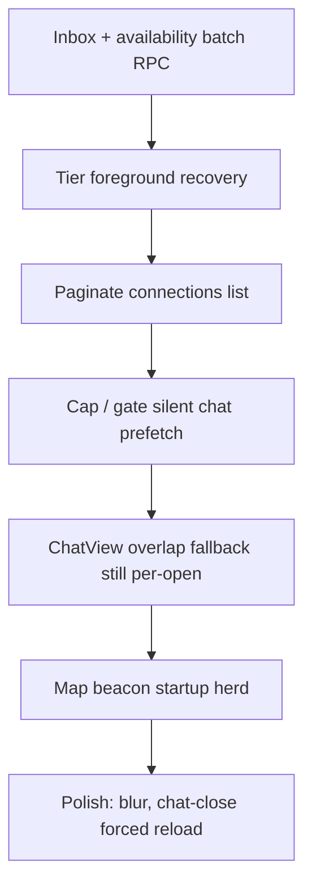

# Click — Performance audit

Performance hotspots in the Click KMP app (`composeApp/`), ordered by impact. This doc tracks what was fixed in the **andorid-bugfix → main** merge (PR #40), what still risks failure at scale, and how to prevent it.

**Platforms:** `click` compiles for **Android** and **iOS** (KMP). The browser dashboard lives in **`click-web`** (Next.js) — not a KMP web target.

---

## Post-merge status (andorid-bugfix → main)

| Area | Status | Implementation |
|------|--------|----------------|
| Per-row availability overlap N+1 | **Fixed (inbox)** | `ConnectionItem` reads `AvailabilityOverlapCache` only; `ConnectionsListView` + `HomeViewModel` batch via `prefetchAvailabilityOverlapsForPeers` (concurrency 8, max 48 peers) |
| Junction / connection snapshot re-fetch | **Improved** | `appDataJunctionSnapshot` + `seedConnectionJunctionCache`; TTL **5 min**; chat loads use `runStaleSweep = false` |
| Stale-connection sweep RPC | **Improved** | `sweepStaleConnectionsForUserIfDue` — at most once per user per **24h** |
| `fetchMessagesForChat` full-table reads | **Fixed** | SQL `LIMIT` + `DESC` when `limit` is set; ascending fetch only when unbounded |
| Snapshot disk writes | **Improved** | `schedulePersistSnapshot()` debounces **3s** (`PERSIST_SNAPSHOT_DEBOUNCE_MS`) |
| Inbox reload storms | **Improved** | `isInboxFeedFresh()` skips network when `AppDataManager` SSOT is <30s old |
| Chat open latency | **Improved** | Cache-fresh path uses `buildChatPayloadWithRetry` + `applyOpenedChatPayload`; stale cache refreshes in background |
| List recomposition | **Improved** | `activeChats` / `groupChats` / `filteredChats` wrapped in `remember` |
| Android header overlap | **Fixed** | `ScreenChrome` + `SideEffect` floating-header hide logic |
| Map discovery duplicate polling | **Partial** | `main` kept retry-aware `prefetchDiscoveryProximityData`; branch’s 45s polling loop was **not** merged (intentionally) |

---

## Scale remediation (July 2026)

Implemented after 100k+ DAU failure analysis. Symptom → fix mapping:

| Symptom | Root cause | Fix |
|---------|------------|-----|
| Slow inbox | N+1 latest-message queries | `get_inbox_previews()` RPC wired in `SupabaseChatRepository` |
| Availability stampede | 48 peer queries/inbox | `get_availability_overlaps()` batch RPC |
| Realtime saturation | Duplicate message + connection listeners | `RealtimeCoordinator` singleton |
| Stale inbox previews | Loose `isInboxFeedFresh()` | Disk restore + `inboxVersion` sync; Realtime bumps invalidate inbox network skip |
| Active chat DB load | Full-thread poll every 12s | Reactions-only poll; messages via Realtime + merge (never full replace) |
| Large thread egress | Full history on open | Initial window **80** msgs; scroll-up loads **40** older via cursor |
| Map/beacon herd | Cold-start prefetch for all users | `requestMapDiscoveryPrefetch()` on map tab only |
| Hub nearby latency | N+1 participant counts | `get_hubs_nearby` PostGIS RPC |
| Unbounded beacons | Full radius dump | `fetch_map_beacons_within` `p_limit` + SQL visibility |
| Group calls missing | 1:1-only signaling | `GroupCallInvite` + `startOutgoingGroupCall()` |

**Compile gates:** `./gradlew :composeApp:compileDebugKotlinAndroid`, `:composeApp:compileKotlinIosSimulatorArm64`; `click-web`: `npx tsc --noEmit`.

### Disk cache vs Realtime (July 2026 follow-up)

Cold-start disk cache is **egress-efficient paint only**. It must never block live delivery:

| Layer | Role | Realtime rule |
|-------|------|----------------|
| `CachedAppSnapshot` / `CachedChatThread` | Instant inbox + thread paint on cold start | Background fetch **merges** by message id; never replaces UI wholesale |
| `ChatTimelineCache` (hot RAM) | Survives back-navigation | Fed by `RealtimeCoordinator.messageInserts` + per-chat channel |
| `RealtimeCoordinator` | Single fan-in for inserts + junction changes | Bumps `inboxVersion` on inserts (not on listener startup) |
| Open chat UI | `applyInsertedMessage` | Global inserts vault media + patch open thread; per-chat channel handles updates/deletes/reactions |

**Message pagination (mobile):** `INITIAL_CHAT_MESSAGE_FETCH_LIMIT = 80`, `OLDER_MESSAGES_PAGE_SIZE = 40`, cursor=`beforeTimeCreated`. Reactions fetch scoped to loaded message ids.

**Inbox list pagination:** UI displays 50 rows at a time (`CONNECTIONS_PAGE_SIZE`); server-side `get_inbox_feed` RPC available for future cursor paging.

---

If this system were deployed at hundreds of thousands of DAU, these are the most likely **production** failure modes — not single-device bugs, but aggregate load / correctness under pressure.

### 1. Supabase / Postgres read amplification (most likely)

**Symptom:** Elevated p95 on `messages`, `connections`, `profile_availability_*` queries; rate limits; rising egress bills; slow cold starts.

**Causes:**

- **Startup thundering herd:** Every cold start still runs `loadAllData()` → connection snapshot + silent chat prefetch (12 chats × up to 80 messages) + beacon prefetch for users with location.
- **Per-device fan-out:** Availability overlap still issues up to **48 peer queries** per inbox visit (8 concurrent). At 100k DAU opening Clicks twice/day → millions of reads/day from one feature.
- **No server-side inbox RPC:** Chat list still assembles junction data client-side (connections + archives + hidden + group batch).
- **Power users:** Users with 500+ connections still load the full list into memory; no pagination.

**Prevention:**

- Add a **single inbox RPC** (connections + last message + unread + archive flags).
- Add a **batch availability-overlap RPC** (peer IDs in → overlap bitmap out).
- Gate silent prefetch behind Wi‑Fi / charging / “prefetch enabled” setting.
- Paginate connections (cursor by `last_message_at`).
- CDN-cache static profile fragments; cap client prefetch counts further by network type.

### 2. Realtime / presence saturation

**Symptom:** Missed message inserts, stale online indicators, reconnect loops, Supabase Realtime connection limits.

**Causes:**

- Global presence heartbeat every **30s** × concurrent users.
- `isInboxFeedFresh()` skips network fetches — correctness depends on Realtime updating `AppDataManager` inbox rows.
- Foreground recovery still triggers full `loadAllData()` when stale.

**Prevention:**

- Tier foreground recovery (session + channels first; full snapshot only if stale >30s or recovery failed).
- Scope presence channels per active chat, not global room where possible.
- Invalidate `isInboxFeedFresh` explicitly on push notification / Realtime inbox event (not only time-based).
- Monitor Realtime connection count and add backoff on channel subscribe failures.

### 3. Stale UI under cache hits (correctness at scale)

**Symptom:** User sees old last-message preview, missing new connection, wrong archive tab count.

**Causes:**

- `isInboxFeedFresh()` returns true when `_connections` is non-empty even if `_inboxFeedChats` is empty or stale.
- Junction cache (5 min) may serve archived/hidden IDs from memory after server-side lifecycle change on another device.
- `chatListRefreshEpoch` forces reload, but ordinary navigation within 30s cooldown does not.

**Prevention:**

- Tighten freshness: require `_inboxFeedChats` non-empty **and** `lastRefreshTime` within cooldown, or track `inboxVersion` bumped by Realtime.
- Call `clearChatListLocalCaches()` whenever `applyFetchedConnectionSnapshot` detects a diff.
- Expose manual pull-to-refresh that always passes `isForced = true`.

### 4. Client memory / disk pressure (tail latency)

**Symptom:** OOM kills on low-RAM Android, slow resume, ANRs during `persistSnapshot()`.

**Causes:**

- `CachedAppSnapshot` still serializes full connections + up to 12×80 messages + map beacons every debounced write.
- Unbounded in-memory profile timeline cache in `SupabaseRepository` companion.
- Large group threads decrypted on main thread paths.

**Prevention:**

- Split snapshot files (connections vs threads vs map).
- LRU-cap profile timeline cache.
- Move decrypt + JSON encode off main thread; skip persist when only ephemeral presence changed.

### 5. Map / beacon API storms

**Symptom:** Edge function timeouts on `fetch-local-beacons`, map feed empty, battery drain.

**Causes:**

- `startBeaconPrefetch()` on every cold start for non-ghost users with location permission.
- Discovery prefetch queries multiple GPS/camera centers per session.

**Prevention:**

- Debounce beacon prefetch globally (one job per session unless map opened).
- Server-side geo tile caching; return deltas only.
- Skip prefetch when on cellular + low battery (Android `WorkManager` constraints).

---

## Remaining hotspots (priority order)

### Availability overlap — inbox fixed, chat header not

- **Inbox:** `ConnectionItem` → cache only ✅
- **Chat header:** `ChatView` still falls back to per-open `fetchPeerProfileAvailabilityBubbles` when cache miss ❌
- **Fix:** Reuse `prefetchAvailabilityOverlapsForPeers` when opening chat, or batch on chat list load.

### Map discovery

- `main` uses retry-aware `prefetchDiscoveryProximityData(showPulse, markInitialComplete)` with `discoveryPrefetchRetryJob`.
- Branch’s `startDiscoveryProximityPolling()` (45s loop) was dropped to avoid duplicate fetches with `MapScreen` / `AppDataManager.startBeaconPrefetch()`.
- **Remaining risk:** Multiple entry points still call prefetch (map enter, camera init, pull-to-refresh).

### Foreground resume

`handleApplicationForegrounded()` can still run full `loadAllData()` when data is considered stale.

**Fix:** Tier recovery — Realtime reconnect first; snapshot only if `!isInboxFeedFresh()` or auth recovery failed.

### Compose list scope

`ConnectionsListView` still collects ~10 `StateFlow`s at list scope; presence heartbeats can recompose all rows.

**Fix:** Pass `isOnline: Boolean` into `ConnectionItem`; use `derivedStateOf` for peer online lookup.

---

## What is already done well (keep and extend)

| Area | What the code does |
|------|-------------------|
| Cold start | `restoreCachedSnapshot()` paints inbox before network |
| Chat open | Prefetch map + disk thread cache; cache-fresh fast path |
| Chat scroll | `ChatMessageTimeline` isolated from IME/layout churn |
| Mesh background | `animateMesh = false` avoids N infinite animations |
| Group inbox | Batched queries in `fetchGroupUserChatsWithDetails` |
| List keys | `LazyColumn` uses `key = { it.connection.id }` |
| Load UX | `loadChats` keeps Success state while refreshing in background |
| Overlap batching | `util/AvailabilityOverlapPrefetch.kt` + `ViewerAvailabilityBubblesCache` |
| Junction SSOT | `seedConnectionJunctionCache` after every snapshot apply |

---

## Quick measurement checklist

1. **Cold start:** launch → Clicks list painted (with/without network).
2. **Clicks tab:** scroll 50 rows; Supabase requests after first batch should be **~0** (overlap prefetch once, capped at 48 peers).
3. **Open chat:** first message paint for 500+ message thread (should use SQL LIMIT).
4. **Map tab:** `fetchNearbyCommunityHubs` / beacon calls in 60s (target 1–2, not 10+).
5. **Compose:** recomposition logging — `ConnectionItem` should not recompose on unrelated presence changes.
6. **Scale drill:** simulate 200-connection account; verify overlap prefetch stops at 48 peers.

---

## Backend / DB improvements (Supabase + click-web)

- **Single inbox RPC** — replace multi-query junction assembly.
- **Batch availability overlap RPC** — `peer_ids[]` → overlap flags.
- Indexes on `messages(chat_id, time_created DESC)`, connection junction tables.
- Move `sweep_stale_connections_for_user` to **cron/edge** (client now throttles to 24h, but cron is safer).
- Rate-limit per-user read endpoints at API gateway when moving logic to click-web BFF.

---

## Key file references

| Concern | Location |
|---------|----------|
| Overlap batch prefetch | `composeApp/.../util/AvailabilityOverlapPrefetch.kt` |
| Inbox overlap orchestration | `composeApp/.../ui/screens/ConnectionsListView.kt` |
| Row overlap read (cache only) | `composeApp/.../ui/chat/ConnectionItem.kt` |
| Chat header overlap fallback | `composeApp/.../ui/screens/ChatView.kt` |
| Home overlap cards | `composeApp/.../viewmodel/HomeViewModel.kt` |
| Map discovery prefetch | `composeApp/.../viewmodel/MapViewModel.kt` |
| Connection snapshot + sweep | `composeApp/.../data/repository/SupabaseRepository.kt` |
| Junction cache + message LIMIT | `composeApp/.../data/repository/SupabaseChatRepository.kt` |
| Inbox freshness + debounced persist | `composeApp/.../data/AppDataManager.kt` |
| Cache-fresh chat open | `composeApp/.../viewmodel/ChatViewModel.kt` |
| Floating header / Android chrome | `composeApp/.../ui/components/ScreenChrome.kt`, `AppScreenScaffold.kt` |
| Data layer overview | `composeApp/.../data/README.md` |
