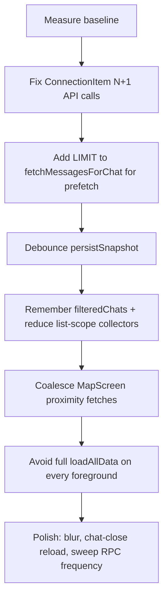

# Click — Performance audit

This document summarizes performance hotspots in the Click KMP app (`composeApp/`), ordered by likely impact. The codebase already has several good patterns (disk snapshot restore, chat prefetch, batched group queries, isolated `ChatMessageTimeline`); the items below are the highest-leverage fixes.

---

## 1. Biggest wins: stop N× network work in lists

### Per-row availability overlap in `ConnectionItem` (critical)

Every connection row runs its own `LaunchedEffect` and makes **two Supabase calls** (yours + peer’s availability bubbles):

```kotlin
// composeApp/.../ui/chat/ConnectionItem.kt
val overlapRepo = remember { SupabaseRepository() }
LaunchedEffect(chatDetails.otherUser.id, viewerUserId, isGroup) {
    ...
    val mine = overlapRepo.fetchPeerProfileAvailabilityBubbles(v, v)
    val theirs = overlapRepo.fetchPeerProfileAvailabilityBubbles(v, theirsPeer)
    hasActiveAvailabilityIntentOverlap(mine, theirs)
}
```

For each peer call, `fetchPeerProfileAvailabilityBubbles` can also run `fetchSharedConnectionBetween` (another DB round-trip). With 30 connections visible, that is easily **60–90 requests** just to show a bolt icon.

**Fix:**

- Move overlap computation to a ViewModel (like `HomeViewModel` already does), batch peers in one job, fetch “mine” once, and only read from `AvailabilityOverlapCache` in the row composable.
- Do not create a `SupabaseRepository` per row.

### Same pattern on Home

`HomeViewModel.loadHomeAvailabilityOverlapMessages` loops connections sequentially:

```kotlin
// composeApp/.../viewmodel/HomeViewModel.kt
val mine = supabaseRepository.fetchPeerProfileAvailabilityBubbles(userId, userId)
for (conn in activeConnections) {
    val theirs = supabaseRepository.fetchPeerProfileAvailabilityBubbles(userId, peerId)
    ...
}
```

**Fix:** One batch RPC or parallel `async` with a concurrency limit (e.g. 8), and skip peers already in `AvailabilityOverlapCache`.

---

## 2. Map screen: duplicate proximity fetches

`MapScreen` triggers `prefetchDiscoveryProximityData()` from **five separate places**:

- `onMapScreenEntered()`
- `startDiscoveryProximityPolling()` (every 45s)
- An 8s location poll loop
- `LaunchedEffect(userLat, userLon)`
- `LaunchedEffect(mapState)` when `MapState.Success`

Plus `getHighAccuracyLocation(3_500L)` inside bounds resolution in `MapViewModel`.

**Fix:** One debounced entry point in `MapViewModel` (debounce already exists for viewport beacons). Coalesce discovery + viewport fetches, cancel stale jobs, and avoid the 8s location loop if polling already runs.

---

## 3. Startup and background sync: too much work at once

### Connection snapshot is heavy and repeated

Every `fetchUserConnectionsSnapshot` runs a stale-connection sweep RPC plus several queries:

```kotlin
// composeApp/.../data/repository/SupabaseRepository.kt
suspend fun fetchUserConnectionsSnapshot(userId: String): UserConnectionsSnapshot {
    sweepStaleConnectionsForUser(userId)
    val archivedIds = getArchivedConnectionIds(userId)
    val hiddenIds = getHiddenConnectionIds(userId)
    ...
}
```

This runs on app startup **and again** when `ChatViewModel.loadChats()` hits `getOrFetchJunctionData()` (junction cache TTL is only **5 seconds**).

**Fix:**

- Reuse `AppDataManager.connections` in chat loads instead of re-fetching the full snapshot.
- Run `sweep_stale_connections` on a schedule (e.g. once per session or daily), not every list refresh.
- Extend junction cache TTL or invalidate only on realtime events.

### Silent chat prefetch downloads full histories

Prefetch fetches **all messages** per chat, then truncates in memory:

```kotlin
// AppDataManager.startSilentChatPrefetch
val decryptedMessages = chatRepository.fetchMessagesForChat(chatId, userId)?.takeLast(limit)
```

But `fetchMessagesForChat` has no SQL `LIMIT`:

```kotlin
// SupabaseChatRepository.fetchMessagesForChat
supabase.from("messages").select {
    filter { eq("chat_id", chatId) }
    order("time_created", Order.ASCENDING)
}.decodeList<Message>()
```

**Fix:** Add `limit(N)` + `order DESC` at the DB layer for prefetch and initial chat open. High impact for users with long threads.

### Snapshot persistence is frequent and expensive

`persistSnapshot()` JSON-encodes the entire app state (connections, users, inbox, up to 12×80 cached messages) and is called from many paths—profile prefetch batches, realtime message inserts, inbox updates, etc.

**Fix:** Debounce writes (e.g. 2–5s coalescing job), persist incrementally (threads separate from connections), or skip persisting on every background message if the thread cache already updated in memory.

### Foreground resume reloads everything

`handleApplicationForegrounded()` cancels in-flight work and runs a full `loadAllData()` again. That helps correctness after iOS backgrounding, but it hurts resume latency.

**Fix:** Tier recovery: refresh session + realtime first; only refresh connections/chats if stale (>30s) or if recovery failed.

---

## 4. Compose UI: list jank and unnecessary recomposition

### `ConnectionsListView` recomputes the list on every frame

Tab filtering/sorting runs inline during composition (not in `remember`):

```kotlin
// ConnectionsListView — inside composable body
val activeChats = effectiveChats.filter { ... }
val filteredChats = if (searchQuery.isBlank()) sortedTabChats else sortedTabChats.filter { ... }
```

Any state change (`onlineUsers`, `cachedChatThreads`, `coreConnectionIds`, tab animation) recomputes filters and re-lays out the whole list.

**Fix:** Wrap `filteredChats`, tab counts, and header subtitle in `remember(...)` or hoist into `ChatViewModel` as derived `StateFlow`s.

### Too many `collectAsState()` collectors at list scope

`ConnectionsListView` collects ~10 flows at the top. When `onlineUsers` updates (presence heartbeat every 30s), **every row** can recompose.

**Fix:**

- Pass `isOnline` as a stable boolean into `ConnectionItem`.
- Use `@Stable` row models or item-level state in `LazyColumn`.
- Consider `derivedStateOf` for “is this peer online” lookups.

### Full inbox reload when closing a chat

`ConnectionsScreen.finalizeChatClose` defaults to `viewModel.loadChats()` (forced refresh) even though realtime + local cache already have the latest row.

**Fix:** Default to `loadChats(isForced = false)` or patch the single row from chat state instead of refetching the inbox.

### Expensive visual effects

- `ChatLiquidGlassPlate` applies `blur(18.dp)` on header/composer chrome.
- Group chat bubbles load peer avatars via Coil per message row.

**Fix:** Use a static translucent tint on mid/low-end devices, reduce blur radius, or gate blur behind a performance flag. Lazy-load group avatars only for visible messages.

---

## 5. What is already done well (keep and extend)

| Area | What the code does |
|------|-------------------|
| Cold start | `restoreCachedSnapshot()` paints inbox before network |
| Chat open | Prefetch map + disk thread cache in `ChatViewModel` |
| Chat scroll | `ChatMessageTimeline` isolated from IME/layout churn |
| Mesh background | `animateMesh = false` avoids N infinite animations |
| Group inbox | Batched queries in `fetchGroupUserChatsWithDetails` |
| List keys | `LazyColumn` uses `key = { it.connection.id }` |
| Load UX | `loadChats` keeps Success state while refreshing in background |

---

## 6. Suggested priority order



### Quick measurement checklist

1. **Cold start:** time from launch → Clicks list painted (with/without network).
2. **Clicks tab:** scroll 50 rows; count Supabase requests (should be ~0 after first batch).
3. **Open chat:** time to first message paint for a 500+ message thread.
4. **Map tab:** count `fetchNearbyCommunityHubs` / beacon calls in 60s (should be 1–2, not 10+).
5. **Compose:** enable recomposition logging; `ConnectionItem` should not recompose when unrelated rows’ presence changes.

---

## 7. Backend / DB improvements (if you control Supabase)

- Add a **single inbox RPC** (connections + last message + unread + archive flags) to replace multiple client round-trips.
- Add a **batch availability overlap RPC** for all peer IDs.
- Ensure indexes exist for hot filters (messages by `chat_id`, unread partial index—see `database/migrate_to_python_schema.sql`).
- Move `sweep_stale_connections_for_user` off the hot path (cron/edge function).

---

## Key file references

| Concern | Location |
|---------|----------|
| Per-row overlap API calls | `composeApp/.../ui/chat/ConnectionItem.kt` |
| Home overlap batching | `composeApp/.../viewmodel/HomeViewModel.kt` |
| Map duplicate prefetch | `composeApp/.../ui/screens/MapScreen.kt`, `MapViewModel.kt` |
| Connection snapshot + sweep | `composeApp/.../data/repository/SupabaseRepository.kt` |
| Chat prefetch + snapshot persist | `composeApp/.../data/AppDataManager.kt` |
| Full message fetch (no LIMIT) | `composeApp/.../data/repository/SupabaseChatRepository.kt` |
| List filtering / recomposition | `composeApp/.../ui/screens/ConnectionsListView.kt` |
| Chat close reload | `composeApp/.../ui/screens/ConnectionsScreen.kt` |
| Glass blur chrome | `composeApp/.../ui/chat/ChatLiquidGlassChrome.kt` |
| Junction cache TTL (5s) | `SupabaseChatRepository.kt` (`junctionCacheTtlMs`) |
