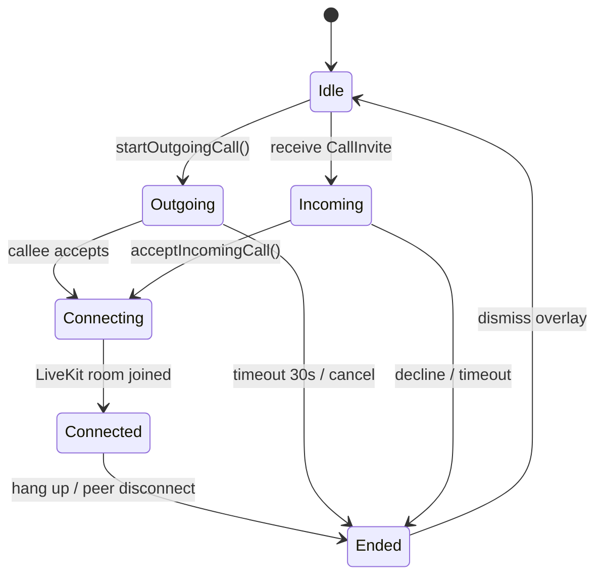

# Calls — Voice & Video (LiveKit)

> Architectural reference for the `compose.project.click.click.calls` package.  
> Sourced from the Click Platforms KMP codebase and DeepWiki index (July 1, 2026).

---

## Module Purpose

The calls module implements **real-time voice and video** between Click connections. It coordinates:

1. **Signaling** over Supabase Realtime (invite / accept / decline / cancel)
2. **Token fetch** from the companion web API (`/api/livekit/token`)
3. **Media transport** via LiveKit (Android SDK in Kotlin; iOS via Swift `ClickLiveKitBridge`)
4. **System telephony UX** on iOS (CallKit + PushKit) and Android incoming-call UI
5. **Call history** as `call_log` messages inserted into the connection chat

Users initiate calls from chat or connection profiles; callees receive in-app overlays plus push/VoIP notifications.

---

## Architecture & Key Classes

### State machine overview



### `CallSessionManager` — orchestrator

Singleton `object` wiring signaling, UI overlay state, and `CallManager`:

| State (`CallOverlayState`) | Meaning |
|----------------------------|---------|
| `Idle` | No active call UI |
| `Outgoing(invite)` | Caller ringing, waiting for answer |
| `Incoming(invite)` | Callee presented with accept/decline |
| `Connecting(invite)` | Token fetched, joining LiveKit room |
| `Ended(invite, reason)` | Terminal; shows missed/ended reason |

**Internal jobs:** `inviteJob`, `responseJob`, `cancelJob`, `connectedJob`, `timeoutJob`.

**Key flows:**

- `initialize(userId, userName)` → subscribes inbound Realtime channel
- `startOutgoingCall(...)` → builds `CallInvite`, sends invite broadcast + push, starts **30 s** timeout
- `acceptIncomingCall()` → sends `CallResponse(accepted=true)`, fetches token, starts LiveKit
- `declineIncomingCall()` → `CallResponse(accepted=false)` + cancel broadcast
- `cancelCurrentCall()` → `CallCancel` to peer

### Signaling: Supabase Realtime

Channel naming: **`calls:user:{userId}`**

| Event type | Payload | Direction |
|------------|---------|-----------|
| `CallInvite` | `callId`, `connectionId`, `roomName`, caller/callee ids & names, `videoEnabled` | Caller → callee channel |
| `CallResponse` | `callId`, `accepted`, optional `busy` | Callee → caller outbound channel |
| `CallCancel` | `callId`, `senderId`, `reason` | Either party |
| `CallRoomConnected` | `callId`, `userId` | After LiveKit join (coordination) |

Outbound invites use per-peer channels stored in `outboundChannels`; inbound uses a single `inboundChannel` per logged-in user.

### `CallCoordinator` — token fetch

```kotlin
class CallCoordinator(private val apiClient: ApiClient = ApiClient()) {
    suspend fun fetchCallToken(
        connectionId: String,
        roomName: String,
        participantName: String,
    ): Result<LiveKitTokenResponse>
}
```

- POST body: `LiveKitTokenPostBody` → companion **`/api/livekit/token`**
- Returns JWT + `wsUrl` for LiveKit room join
- Called from `CallSessionManager` after accept/outgoing answer path

### Timeout: 30 seconds

```kotlin
timeoutJob = scope.launch {
    delay(30_000)
    if (activeInvite matches outgoing) {
        sendCancel(invite, invite.calleeId, "missed")
        insertCallChatLogAsync(invite.connectionId, "missed", 0)
        failCall(invite, "No answer")
    }
}
```

### `CallManager` — expect/actual media

| Platform | Implementation |
|----------|----------------|
| **commonMain** | `expect class CallManager` — `callState`, `startCall`, mic/speaker/camera toggles, `endCall` |
| **Android** | `CallManager.android.kt` — `io.livekit:livekit-android` SDK |
| **iOS** | Kotlin stub + **`ClickLiveKitBridge.swift`** (Swift Package) — room events bridged via `NSNotificationCenter` |

`createCallManager()` factory initialized from `MainActivity.initCallManager` (Android).

### `CallState` — media session states

Tracks LiveKit connection lifecycle: `Idle` → `Connecting` → `Connected` → `Disconnected` / `Failed`.

`CallSessionManager.callConnectedAtMs` records wall time at `Connected` for **`call_log` duration** on hang-up.

### Platform incoming-call UI

| Type | Role |
|------|------|
| **`PlatformIncomingCallUi`** | expect/actual — surfaces full-screen incoming call on Android; iOS defers to CallKit |
| **iOS CallKit / PushKit** | `iosApp/iosApp/` Swift — VoIP push wakes app, CallKit presents native call UI |
| **`CallPushNotifier`** | Dispatches VoIP/data push for incoming calls when app backgrounded |
| **`CallRingtonePlayer`** | Outgoing ringback + incoming ringtone (stopped on accept) |

### `call_log` chat messages

On session end, `CallSessionManager` inserts a message via `SupabaseChatRepository`:

- `messageType = "call_log"`
- Metadata: outcome (`completed`, `missed`, `declined`), duration seconds
- Ensures chat thread shows call history alongside text

### UI overlays

| File | Role |
|------|------|
| `CallOverlays.kt` | Compose overlays bound to `overlayState` |
| `CallOverlayTransitionPolicy.kt` | Animation policy between overlay states |
| `CallVideoSurface.kt` | expect/actual video renderer surface |
| `CallPushPayload.kt` | Push payload parsing helpers |

---

## E2EE / KMP Constraints

| Topic | Detail |
|-------|--------|
| **Signaling is not E2EE** | `CallInvite` metadata (names, room name) travels over Supabase Realtime in plaintext — media is separate |
| **LiveKit media** | SRTP-encrypted WebRTC inside LiveKit; tokens are short-lived JWTs from server |
| **Platform split mandatory** | LiveKit Android SDK cannot run on iOS; iOS requires Swift bridge — shared Kotlin owns **state machine + signaling only** |
| **Push on iOS** | VoIP pushes handled in Swift (PushKit); Kotlin `CallSessionManager` receives actions via bridge |
| **Chat integration** | `call_log` rows are plaintext system messages (not `e2e:` prefixed) |
| **Thread safety** | `CallSessionManager` runs on `Dispatchers.Main`; Realtime collectors on supervisor scope |

---

## Related Files

| Path | Role |
|------|------|
| `calls/CallSessionManager.kt` | Signaling state machine, overlay state, timeouts |
| `calls/CallCoordinator.kt` | LiveKit token HTTP fetch |
| `calls/CallManager.kt` | expect media manager |
| `calls/CallState.kt` | LiveKit connection states |
| `calls/CallOverlays.kt` | In-app call UI |
| `calls/CallPushNotifier.kt` | Incoming call push dispatch |
| `calls/PlatformIncomingCallUi.kt` | Platform incoming UI expect |
| `androidMain/.../CallManager.android.kt` | LiveKit Android SDK |
| `iosApp/iosApp/ClickLiveKitBridge.swift` | LiveKit Swift room |
| `androidMain/.../MainActivity.kt` | `initCallManager`, intent handling |
| `data/api/ApiClient.kt` | `postLiveKitToken` |
| `data/repository/SupabaseChatRepository.kt` | `call_log` message insert |
| `viewmodel/ChatViewModel.kt` | Call button entry point |

---

## What Click Users Experience

- **Connect in person (Tri-Factor):** Tap phones together using Bluetooth, inaudible sound, and GPS to prove you're in the same room.
- **Scan a QR code:** Point your camera at someone's Click QR to connect instantly.
- **Group connect (Multi-Tap):** Three or more people can connect at once and land in a verified group chat.
- **Private encrypted chat:** Messages are end-to-end encrypted—only you and your connection can read them.
- **Send photos, files & voice notes:** Share media in chat; files are encrypted before upload.
- **Emoji reactions:** React to messages with emoji.
- **Typing indicators & read receipts:** See when someone is typing and when they've read your message.
- **Voice & video calls:** Call any connection with high-quality audio/video.
- **Memory Capsules:** Optionally save the "feel" of how you met—noise level, elevation, tags like "after class."
- **48-hour gentle archive:** New connections you don't act on move to archive after 48 hours (not deleted).
- **Connection map & timeline:** See where and when you met people on a map and journal timeline.
- **Rate the vibe:** After meeting, optionally rate the venue vibe.
- **Your QR identity card:** Show your personal QR for others to scan.
- **Availability intents:** Broadcast short plans ("coffee?", "live music tonight") to connections for 24 hours.
- **Match alerts:** Get notified when a connection has overlapping availability.
- **Community Hubs:** Join temporary venue chats when you're physically at a location (24-hour TTL).
- **Map beacons:** Discover pop-up events and venues on the map.
- **Global search:** Find connections, chats, and hubs across the app.
- **Core connections:** Pin your most important people.
- **Collaboration sessions & disposable rolls:** Fun timed photo reveals with friends after connecting.
- **Ghost mode:** Browse with reduced presence visibility when enabled.
- **Block & report:** Safety tools to block or report users.
- **Profile & interests:** Set your display name, avatar, and interest tags.
- **Onboarding:** Welcome flow with interest tagging after sign-up.
- **Google sign-in & email auth:** Sign up with Google or email/password.
- **Push notifications:** Alerts for messages, calls, matches, and reveals.
- **Deep links & App Clip:** Open connections and hubs from links without friction.
- **Web dashboard:** Use click-web in a browser for chat, calls, and connection management.
- **Business insights (venues):** Venue operators see anonymized crowd analytics, Vibe Radar, and Social Sticky Score.
- **Event reminders:** Calendar-linked reminders for upcoming events.
- **Achievements & stats:** Track connection milestones on your profile.
