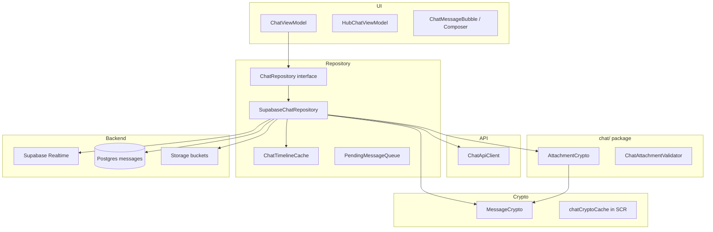

# Chat — Real-Time Messaging & Attachments

> Architectural reference for the `compose.project.click.click.chat` package and its repository integration.  
> Sourced from the Click Platforms KMP codebase and DeepWiki index (July 1, 2026).

---

## Module Purpose

The chat module covers **client-side messaging infrastructure**: encrypted text/media transport, attachment handling, and validation helpers. The live chat **orchestration layer** lives primarily in `SupabaseChatRepository` (`data/repository/`) because it couples Supabase Realtime, PostgREST, storage buckets, and E2EE key resolution—but this package owns the **attachment crypto pipeline** and attachment policy that `SupabaseChatRepository` calls into.

End users get private 1:1 and group threads with typing indicators, read receipts, reactions, voice notes, photos, and files—all with ciphertext on the wire and in Postgres.

---

## Architecture & Key Classes

### Layered design



### Repository layer (primary integration point)

| Class | Location | Responsibility |
|-------|----------|----------------|
| **`ChatRepository`** | `data/repository/ChatRepository.kt` | Interface: send/fetch messages, subscribe, typing, presence, reactions, media |
| **`SupabaseChatRepository`** | `data/repository/SupabaseChatRepository.kt` | Concrete implementation: Realtime + REST + E2EE + storage |
| **`ChatApiClient`** | `data/api/ChatApiClient.kt` | HTTP companion API for delivery receipts, some CRUD fallbacks |
| **`ChatTimelineCache`** | `data/repository/ChatTimelineCache.kt` | Hot in-memory timelines keyed by `connectionId` |
| **`ChatRepositoryEvents`** | `data/repository/ChatRepositoryEvents.kt` | Shared event types for realtime merges |

### Ephemeral session lifecycle

Per-chat Realtime sessions are **short-lived** and torn down when the user leaves a thread:

| Phase | Behavior |
|-------|----------|
| **Join** | `joinChatEphemeral(chatId, peerUserId)` creates a `ChatEphemeralSession`: single Realtime channel, typing `broadcastFlow`, peer presence `track` |
| **Typing** | `TypingBroadcastPayload` broadcast on the channel; exposed as `Flow<TypingStatus>` |
| **Presence refresh** | Presence `track` refreshed every **25 s** (`PRESENCE_TRACK_REFRESH_MS = 25_000L`) |
| **Leave** | `leaveChatEphemeral(chatId)` cancels jobs, `untrack()`, `unsubscribe()`, removes from `ephemeralSessions` map |
| **Global presence** | Separate `room:presence` channel for app-wide online dots (`startGlobalPresence`) |

`ChatEphemeralSession` structure:

```kotlin
private data class ChatEphemeralSession(
    val channel: RealtimeChannel,
    val peerUserId: String,
    val typingFlow: MutableSharedFlow<TypingStatus>,
    val peerOnline: MutableStateFlow<Boolean>,
    val scope: CoroutineScope,
    val jobs: List<Job>,
)
```

### `ChatTimelineCache`

- Retains message lists for up to **48 connections** (`maxConnections = 48`).
- LRU-style prune by most recent `timeCreated` when over capacity.
- `peek` / `store` / `mergeMessage` / `removeMessage` — instant paint on chat re-entry while network sync runs.

### Inbox fetch concurrency

Bulk inbox hydration uses `Semaphore(12)` (`limitParallel`) to cap parallel connection message fetches and avoid thundering herds on cold start.

### Realtime: `postgresChangeFlow`

`subscribeToMessages` registers **one** Realtime channel per `chatId` with merged Postgres change streams:

| Table | Actions | Client handling |
|-------|---------|-----------------|
| `messages` | INSERT / UPDATE / DELETE | Decrypt via `chatCryptoCache`, emit `MessageChangeEvent` |
| `message_reactions` | INSERT / DELETE | Emit `ReactionChangeEvent` |

Decrypt path: `resolveChatCrypto(chatId, viewerUserId)` → `ResolvedChatCrypto.Pairwise` or `GroupMaster` → `decryptMessage`.

### E2EE via `chatCryptoCache`

`SupabaseChatRepository` maintains a **session-scoped** in-memory map:

```kotlin
private sealed class ResolvedChatCrypto {
    data class Pairwise(val keys: MessageCrypto.DerivedKeys) : ResolvedChatCrypto()
    data class GroupMaster(val masterKey: ByteArray) : ResolvedChatCrypto()
}
private val chatCryptoCache = mutableMapOf<String, ResolvedChatCrypto>()
```

- Keys derived on connection open / first message (`deriveKeysForConnection`, group master unwrap).
- **Must** be cleared on sign-out via `clearSessionCaches()` (R0.4 audit).
- Full primitive details: [`crypto/README.md`](../crypto/README.md) and `crypto/CRYPTO_README.md`.

### Attachment pipeline (`chat/attachments/`)

| Class | Role |
|-------|------|
| **`AttachmentCrypto`** | Per-file random 32-byte master; AES-256-CBC + HMAC-SHA256 (parity with `MessageCrypto`); envelope prefix `ccx:v1:` inside decrypted message body |
| **`ChatAttachmentValidator`** | MIME/size policy before upload |

**Storage buckets** (from `SupabaseChatRepository`):

- `CHAT_MEDIA_BUCKET` — images, voice notes, inline media
- `CHAT_ATTACHMENTS_BUCKET` — generic files

Upload flow: encrypt bytes client-side → store ciphertext in Supabase Storage → envelope JSON (path, key, sha256) sent as E2EE message content.

### Offline: `PendingMessageQueue`

Path: `data/chat/PendingMessageQueue.kt`

- Architectural seam for future offline send/retry (R1.6).
- In-memory outbox keyed by `chatId`; stable `clientId` for optimistic UI reconciliation.
- **Not yet wired** into the live send path—documented for future product sign-off.

### ViewModels & UI (consumers)

| Component | Role |
|-----------|------|
| `ChatViewModel` | Thread state, send, reactions, typing, call overlay hooks |
| `HubChatViewModel` | Ephemeral hub broadcasts (`deriveKeysForHub`) |
| `ChatView.kt` / `ChatMessageBubble.kt` | Compose UI |
| `ConnectionChatMessageComposer.kt` | Input bar, attachments, voice note capture |

---

## E2EE / KMP Constraints

| Topic | Detail |
|-------|--------|
| **Encrypt-before-upload** | All message bodies and attachment blobs are encrypted in `commonMain` via `MessageCrypto` / `AttachmentCrypto` before PostgREST insert or Storage upload |
| **No keys in Keystore** | `chatCryptoCache` is process memory only; wiped on logout — see crypto threat model |
| **Group routing** | Messages prefixed `e2e_grp:` use group master from cache; 1:1 uses `e2e:` + pairwise derivation |
| **Hub chats** | `deriveKeysForHub(hubId)` — access control is geofence/RLS, not pairwise secrecy |
| **Platform crypto** | `PlatformCrypto` expect/actual supplies `secureRandomBytes`, AES-CBC, HMAC-SHA256 |
| **Push preview** | iOS `NotificationService` extension + Android FCM service decrypt previews using same KDF — see [`crypto/README.md`](../crypto/README.md) |
| **KMP boundary** | Chat **logic** stays in `commonMain`; platform code only for image compression (`compressOutgoingChatImageForUpload`), vault paths, and push services |

---

## Related Files

| Path | Role |
|------|------|
| `chat/attachments/AttachmentCrypto.kt` | Per-file E2EE envelope + encrypt/decrypt |
| `chat/attachments/ChatAttachmentValidator.kt` | Upload validation rules |
| `data/repository/SupabaseChatRepository.kt` | Main chat orchestration (~2400 lines) |
| `data/repository/ChatRepository.kt` | Repository interface |
| `data/repository/ChatTimelineCache.kt` | 48-connection hot cache |
| `data/api/ChatApiClient.kt` | HTTP companion client |
| `data/chat/PendingMessageQueue.kt` | Offline outbox foundation |
| `crypto/MessageCrypto.kt` | Message + media E2EE primitives |
| `viewmodel/ChatViewModel.kt` | Primary chat UI state |
| `viewmodel/HubChatViewModel.kt` | Community hub messaging |
| `ui/screens/ChatView.kt` | Chat screen |
| `ui/chat/*.kt` | Bubbles, composer, reactions UI |
| `database/chat_media_storage.sql` | Storage bucket RLS policies |
| `commonTest/.../ChatTimelineCacheTest.kt` | Cache unit tests |
| `commonTest/.../PendingMessageQueueTest.kt` | Outbox unit tests |

---

## What Click Users Experience

- **Connect in person (Tri-Factor):** Tap phones together using Bluetooth, inaudible sound, and GPS to prove you're in the same room.
- **Scan a QR code:** Point your camera at someone's Click QR to connect instantly.
- **Group connect (Multi-Tap):** Three or more people can connect at once and land in a verified group chat.
- **Private encrypted chat:** Messages are end-to-end encrypted—only you and your connection can read them.
- **Send photos, files & voice notes:** Share media in chat; files are encrypted before upload.
- **Emoji reactions:** React to messages with emoji.
- **Typing indicators & read receipts:** See when someone is typing and when they've read your message.
- **Voice & video calls:** Call any connection with high-quality audio/video.
- **Memory Capsules:** Optionally save the "feel" of how you met—noise level, elevation, tags like "after class."
- **48-hour gentle archive:** New connections you don't act on move to archive after 48 hours (not deleted).
- **Connection map & timeline:** See where and when you met people on a map and journal timeline.
- **Rate the vibe:** After meeting, optionally rate the venue vibe.
- **Your QR identity card:** Show your personal QR for others to scan.
- **Availability intents:** Broadcast short plans ("coffee?", "live music tonight") to connections for 24 hours.
- **Match alerts:** Get notified when a connection has overlapping availability.
- **Community Hubs:** Join temporary venue chats when you're physically at a location (24-hour TTL).
- **Map beacons:** Discover pop-up events and venues on the map.
- **Global search:** Find connections, chats, and hubs across the app.
- **Core connections:** Pin your most important people.
- **Collaboration sessions & disposable rolls:** Fun timed photo reveals with friends after connecting.
- **Ghost mode:** Browse with reduced presence visibility when enabled.
- **Block & report:** Safety tools to block or report users.
- **Profile & interests:** Set your display name, avatar, and interest tags.
- **Onboarding:** Welcome flow with interest tagging after sign-up.
- **Google sign-in & email auth:** Sign up with Google or email/password.
- **Push notifications:** Alerts for messages, calls, matches, and reveals.
- **Deep links & App Clip:** Open connections and hubs from links without friction.
- **Web dashboard:** Use click-web in a browser for chat, calls, and connection management.
- **Business insights (venues):** Venue operators see anonymized crowd analytics, Vibe Radar, and Social Sticky Score.
- **Event reminders:** Calendar-linked reminders for upcoming events.
- **Achievements & stats:** Track connection milestones on your profile.
