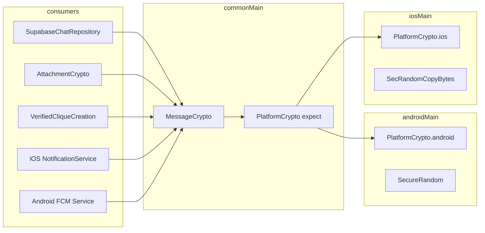

# Crypto — End-to-End Encryption

> Architectural reference for the `compose.project.click.click.crypto` package.  
> Sourced from the Click Platforms KMP codebase and DeepWiki index (July 1, 2026).

For the full **threat model** (limitations, salt rotation, audit checklist), see [`CRYPTO_README.md`](./CRYPTO_README.md) — internal security doc, not user-facing.

---

## Module Purpose

The crypto module is Click's **client-side E2EE layer**. It encrypts chat message bodies, group broadcasts, hub messages, and attachment blobs **before** they reach Supabase Postgres or Storage. Decryption happens only in the app (and in platform push extensions for notification previews).

Design goals:

- **Opaque ciphertext at rest** in `messages.content` and storage buckets
- **Shared KMP implementation** — one `MessageCrypto` object used by Android, iOS, and tests
- **Deterministic pairwise keys** for 1:1 UX (no manual key exchange UI)
- **Random group master keys** distributed by sealing over existing 1:1 channels

---

## Architecture & Key Classes

### Component overview



### `MessageCrypto` — core API

| API | Purpose |
|-----|---------|
| `deriveKeysForConnection(connectionId, userIds)` | 1:1 pairwise `DerivedKeys(encKey, macKey)` |
| `deriveKeysForHub(hubId)` | Ephemeral hub broadcast keys |
| `deriveMessageKeysFromGroupMaster(masterKey32)` | Per-message keys from 32-byte group master |
| `generateGroupMasterKey()` | CSPRNG 32-byte group master |
| `wrapGroupMasterKeyForMembers(...)` | Seal master to each member via 1:1 encrypt |
| `encryptContent` / `decryptContent` | Text messages with wire prefixes |
| `encryptMediaBytes` / `decryptMediaBytes` | Binary blobs (images, voice, files) |

### Primitives: AES-256-CBC + HMAC-SHA256 (Encrypt-then-MAC)

| Role | Implementation |
|------|----------------|
| Cipher | AES-256-CBC, PKCS#7 padding |
| MAC | HMAC-SHA256 over ciphertext |
| IV | 16 random bytes per message (`secureRandomBytes`) |
| Wire layout | `IV[16] \|\| HMAC[32] \|\| ciphertext` → Base64 after prefix |

**Why CBC+HMAC instead of GCM?** GCM is not available on all KMP `expect`/`actual` paths; CBC+HMAC is a conservative, audited substitute that avoids padding-oracle pitfalls via encrypt-then-MAC ordering.

### Key derivation

#### 1:1 pairwise keys

```
master  = SHA-256( SALT || sorted(userId_1, userId_2) || connectionId )
encKey  = SHA-256( master || 0x01 )
macKey  = SHA-256( master || 0x02 )
```

- **`SALT`** = `"click-platforms-e2ee-v1-2024"` (`E2EE_SALT`) — public version marker, not a secret
- **`userIds`** sorted → order-independent
- No device-bound private key material in v1

#### Wire format prefixes

| Prefix | Use |
|--------|-----|
| `e2e:` | 1:1 chat message body |
| `e2e_grp:` | Group clique message body |

Example: `e2e:` + Base64( IV ‖ HMAC ‖ ciphertext )

#### Group master keys (verified clique)

1. Creator generates 32 random bytes (`generateGroupMasterKey()`).
2. For each member, creator **seals** the master as a normal 1:1 message (`encryptContent` on Base64-encoded master bytes) using the pairwise key for `(creator, member)`.
3. Each member unwraps on first receipt, caches in `chatCryptoCache`, uses `deriveMessageKeysFromGroupMaster` for subsequent reads/writes.
4. Orchestrated by `VerifiedCliqueCreation.createVerifiedCliqueWithWrappedKeys` + server RPC `create_verified_clique`.

#### Hub broadcasts (`deriveKeysForHub`)

```
master = SHA-256( SALT || "hub-broadcast:" || hubId )
encKey / macKey derived identically to 1:1
```

Geofence / gatekeeper RLS on `hub_messages` limits who can read or post; crypto ensures server operators need `hubId` to decrypt.

### `PlatformCrypto` — expect/actual

| Function | Android | iOS |
|----------|---------|-----|
| `secureRandomBytes(n)` | `java.security.SecureRandom` | `SecRandomCopyBytes` |
| `aesCbcEncrypt/Decrypt` | `javax.crypto.Cipher` | CommonCrypto / platform bridge |
| `hmacSha256` | `Mac.getInstance("HmacSHA256")` | CommonCrypto HMAC |
| `sha256` | `MessageDigest` | Platform digest |

All heavy crypto runs on `Dispatchers.Default` via `*Async` helpers where needed.

### iOS NotificationService extension

Path: `iosApp/NotificationService/NotificationService.swift`

- `UNNotificationServiceExtension` modifies chat push payloads before display.
- `ChatPushNotificationBodyResolver` + `E2EChatMessageCrypto` mirror KMP `MessageCrypto` derivation.
- Decrypts `encrypted_content` from push `userInfo` using `connection_id`, `sender_user_id`, `recipient_user_id`.
- Incoming call pushes (`type == incoming_call`) pass through unchanged.
- Fallback: `"Open Click to view it"` on decrypt failure.

Android parity: `ClickFirebaseMessagingService` performs the same preview decryption on FCM data messages.

---

## E2EE / KMP Constraints

| Constraint | Detail |
|------------|--------|
| **Keys in memory only** | `chatCryptoCache` in `SupabaseChatRepository` — no Keychain/Keystore backing in v1 |
| **Sign-out wipe** | `clearSessionCaches()` must run on logout and foreground-recovery transitions |
| **Deterministic pairwise keys** | Backend with `connectionId` + `userIds` + public salt can derive keys — accepted trade-off for UX (see `CRYPTO_README.md` §4.1) |
| **No forward secrecy** | Static pairwise key per connection; Double-Ratchet planned |
| **Hub keys are hubId-derived** | Anyone with `hubId` + RLS access can decrypt hub broadcasts — by design |
| **Attachment isolation** | `AttachmentCrypto` uses a **fresh** 32-byte master per file — compromise of one file does not leak chat keys |
| **Test vectors required** | New wire prefixes must ship with golden ciphertext tests (`MessageCryptoVectorsTest`) |
| **Platform boundary** | Only `PlatformCrypto` and push extensions touch OS CSPRNG/cipher APIs; all key logic stays in `commonMain` |

### Cross-references

| Consumer | Usage |
|----------|-------|
| [`chat/README.md`](../chat/README.md) | `chatCryptoCache`, Realtime decrypt, attachment upload |
| [`proximity/README.md`](../proximity/README.md) | Post-handshake `cacheEncryptionKeys` |
| `domain/VerifiedCliqueCreation.kt` | Group master wrapping |
| `viewmodel/HubChatViewModel.kt` | `deriveKeysForHub` |

---

## Related Files

| Path | Role |
|------|------|
| `crypto/MessageCrypto.kt` | E2EE primitives, KDF, encrypt/decrypt |
| `crypto/PlatformCrypto.kt` | expect declaration |
| `crypto/CRYPTO_README.md` | Internal threat model & audit guide |
| `androidMain/.../PlatformCrypto.android.kt` | Android cipher actual |
| `iosMain/.../PlatformCrypto.ios.kt` | iOS cipher actual |
| `chat/attachments/AttachmentCrypto.kt` | Per-file E2EE (uses `MessageCrypto` media helpers) |
| `data/repository/SupabaseChatRepository.kt` | `chatCryptoCache`, encrypt-before-insert |
| `domain/VerifiedCliqueCreation.kt` | Group master seal/unwrap |
| `iosApp/NotificationService/NotificationService.swift` | Push preview decryption |
| `iosApp/NotificationService/E2EChatMessageCrypto.swift` | Swift crypto mirror |
| `androidMain/.../ClickFirebaseMessagingService.kt` | Android push preview decrypt |
| `commonTest/.../crypto/MessageCryptoVectorsTest.kt` | Golden KDF/ciphertext vectors |
| `commonTest/.../SupabaseChatRepositoryCryptoTest.kt` | Encrypt-before-REST assertions |

---

## What Click Users Experience

- **Connect in person (Tri-Factor):** Tap phones together using Bluetooth, inaudible sound, and GPS to prove you're in the same room.
- **Scan a QR code:** Point your camera at someone's Click QR to connect instantly.
- **Group connect (Multi-Tap):** Three or more people can connect at once and land in a verified group chat.
- **Private encrypted chat:** Messages are end-to-end encrypted—only you and your connection can read them.
- **Send photos, files & voice notes:** Share media in chat; files are encrypted before upload.
- **Emoji reactions:** React to messages with emoji.
- **Typing indicators & read receipts:** See when someone is typing and when they've read your message.
- **Voice & video calls:** Call any connection with high-quality audio/video.
- **Memory Capsules:** Optionally save the "feel" of how you met—noise level, elevation, tags like "after class."
- **48-hour gentle archive:** New connections you don't act on move to archive after 48 hours (not deleted).
- **Connection map & timeline:** See where and when you met people on a map and journal timeline.
- **Rate the vibe:** After meeting, optionally rate the venue vibe.
- **Your QR identity card:** Show your personal QR for others to scan.
- **Availability intents:** Broadcast short plans ("coffee?", "live music tonight") to connections for 24 hours.
- **Match alerts:** Get notified when a connection has overlapping availability.
- **Community Hubs:** Join temporary venue chats when you're physically at a location (24-hour TTL).
- **Map beacons:** Discover pop-up events and venues on the map.
- **Global search:** Find connections, chats, and hubs across the app.
- **Core connections:** Pin your most important people.
- **Collaboration sessions & disposable rolls:** Fun timed photo reveals with friends after connecting.
- **Ghost mode:** Browse with reduced presence visibility when enabled.
- **Block & report:** Safety tools to block or report users.
- **Profile & interests:** Set your display name, avatar, and interest tags.
- **Onboarding:** Welcome flow with interest tagging after sign-up.
- **Google sign-in & email auth:** Sign up with Google or email/password.
- **Push notifications:** Alerts for messages, calls, matches, and reveals.
- **Deep links & App Clip:** Open connections and hubs from links without friction.
- **Web dashboard:** Use click-web in a browser for chat, calls, and connection management.
- **Business insights (venues):** Venue operators see anonymized crowd analytics, Vibe Radar, and Social Sticky Score.
- **Event reminders:** Calendar-linked reminders for upcoming events.
- **Achievements & stats:** Track connection milestones on your profile.
