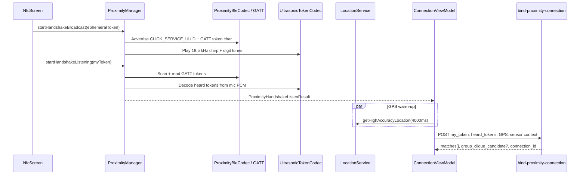

# Proximity — Tri-Factor Handshake

> Architectural reference for the `compose.project.click.click.proximity` package.  
> Sourced from the Click Platforms KMP codebase and DeepWiki index (July 1, 2026).

---

## Module Purpose

The proximity module implements **Click's Tri-Factor Handshake**: a simultaneous, multi-modal proof that two or more phones were in the **same physical room** at the same time. It is the client-side half of in-person connection discovery—complementing server-side matching in the `bind-proximity-connection` Edge Function.

Three corroborating signals run in parallel during a tap:

| Factor | Role | Client implementation |
|--------|------|----------------------|
| **Bluetooth Low Energy (BLE)** | Local radio presence; token exchange over GATT | `ProximityBleCodec`, `AndroidProximityManager` / `IosProximityManager` |
| **Ultrasonic audio (18.5 kHz)** | Inaudible chirp + digit tones for tight co-location | `UltrasonicTokenCodec` |
| **Progressive GPS** | High-accuracy location refined over the handshake window | `LocationService.getHighAccuracyLocation(4000L)` from `NfcScreen` / `ConnectionViewModel` |

Together these factors reduce reliance on a single OS proximity sandbox and feed **Memory Capsule** sensor payloads (noise, elevation, vibe tags) to the backend on successful bind.

**Entry points:** `NfcScreen` (primary UI for tap-to-connect), `rememberProximityManager()` (platform factory), `ConnectionViewModel` (orchestrates listen → GPS warm-up → `bind-proximity-connection` POST).

---

## Architecture & Key Classes

### High-level flow

### Core types (`commonMain`)

| Class / object | Responsibility |
|----------------|----------------|
| **`ProximityManager`** | `expect`/`actual` interface: `startHandshakeBroadcast`, `startHandshakeListening`, `stopAll`, capability helpers |
| **`ProximityBleCodec`** | BLE identifiers (`CLICK_SERVICE_UUID`, `CLICK_TOKEN_CHARACTERISTIC_UUID`), GATT payload encode/decode, legacy manufacturer frame helpers |
| **`UltrasonicTokenCodec`** | PCM synthesis (`buildHandshakeAudioPcm`) and Goertzel-based decode (`decodeAllHandshakeTokensFromPcmMono`); carrier at `HANDSHAKE_CARRIER_HZ` (18.5 kHz in production) |
| **`ProximityHandshakeListenResult`** | Separates `heardTokens` (audio) from `detectedDevices` (BLE) so the server can weight evidence independently |
| **`ProximityRuntime`** | `isSimulatorOrEmulatorRuntime()` — routes to `MockProximityManager` on simulators |
| **`MockProximityManager`** | Deterministic 2 s delay + synthetic token `5678` for emulator CI |
| **`ProximityHandshakeSyncScheduler`** | `expect fun scheduleProximityHandshakeSync()` — Android WorkManager one-shot; iOS defers to `AppDataManager` periodic sync |

### Platform implementations

| Platform | File | Notes |
|----------|------|-------|
| Android | `androidMain/.../AndroidProximityManager.kt` | BLE advertiser/scanner, GATT server + client reads, `AudioTrack`/`AudioRecord` for ultrasonic path; `PROXIMITY_DEBOUNCE_WINDOW_MS = 3000` |
| iOS | `iosMain/.../IosProximityManager.kt` | CoreBluetooth peripheral/central managers, `AVAudioSession` play/record, PCM file bridge |
| Factory | `rememberProximityManager()` | Returns `MockProximityManager` when `isSimulatorOrEmulatorRuntime()` |

### BLE design (`ProximityBleCodec`)

- **Service UUID:** `6f1c8c2a-1111-4000-8000-00cafe000001` — advertised alone to stay under the 31-byte legacy advertisement limit.
- **Token characteristic:** `6f1c8c2a-2222-4000-8000-00cafe000001` — 4-digit handshake token read over GATT (not stuffed in the adv packet).
- **Token normalization:** Last 4 digits, zero-padded (`normalizeHandshakeToken`).
- **Legacy:** Manufacturer payload `0x43 0x4B` + ASCII digits for codec tests and older scanners.

### Ultrasonic design (`UltrasonicTokenCodec`)

- **Carrier chirp:** 18.5 kHz sine, ~140 ms (production target; see `HANDSHAKE_CARRIER_HZ`).
- **Digit encoding:** Each digit adds `120 Hz` steps above carrier; 55 ms tone + 22 ms gap per digit.
- **Decode:** Sliding-window Goertzel over mono 44.1 kHz PCM; supports multiple tokens in one capture (multi-peer back-to-back chirps).

### GPS warm-up

`NfcScreen` and `ConnectionViewModel` call `locationService.getHighAccuracyLocation(4000L)` — a **4000 ms** progressive GPS refinement window that runs concurrently with the BLE/ultrasonic listen phase. `proximityBindLocationWaitMs()` in `ProximityRuntime.kt` further tunes wait time based on whether peer evidence was detected (1.8–2.5 s sensor waits).

### Server: `bind-proximity-connection` Edge Function

Path: `click/supabase/functions/bind-proximity-connection/index.ts`

| Mechanism | Constant / behavior |
|-----------|----------------------|
| **Ghost taps** | Unmatched handshake rows kept ~**5 min** (`GHOST_TTL_MS`) so delayed peers can still match |
| **Match window** | Same 5 min window for token/GPS/time overlap |
| **GPS proximity** | Haversine ≤ **15 m** when both sides have usable GPS (`PROXIMITY_MATCH_MAX_M`) |
| **Multi-tap / clique** | Builds token/GPS/time graph; **BFS** (`bfsComponent`) finds connected components; `group_clique_candidate` when ≥ 3 users |
| **Encounter debouncing** | Re-crossings within **50 m** and same **12-hour UTC block** append **"Extended Hangout"** tag instead of duplicate encounter rows |
| **proximity_confidence** | Base score on bind: **65** with GPS, **50** without; flagged when &lt; 20 |
| **Connection lifecycle** | Creates `connections` + `chats` rows; logs `connection_encounters` with sensor payload; seeds `collaboration_sessions` |

Client-side scoring (for QR/NFC paths) in `ConnectionRepository.computeProximityScore`:

| Signal | Points |
|--------|--------|
| NFC / proximity connection method | +50 |
| GPS available | +15 |
| QR token age &lt; 30 s | +10 |
| QR token age 30–60 s | +5 |

Full distance/BSSID scoring is server-side when using the web API.

### UI integration

- **`NfcScreen`**: Tap UX, permission requesters, sensor monitors (`AmbientNoiseMonitor`, `BarometricHeightMonitor`, `HardwareVibeMonitor`), hands off to `ConnectionViewModel.bindProximityHandshake`.
- **`App.kt`**: `val proximityManager = rememberProximityManager()` injected into navigation graph.

---

## E2EE / KMP Constraints

| Constraint | Implication for proximity |
|------------|---------------------------|
| **`expect`/`actual` for radios** | BLE, ultrasonic mic/speaker, and GPS **cannot** live in `commonMain`; only codecs and orchestration contracts do |
| **Simulator path** | `MockProximityManager` + `simulator_mock` body in Edge Function (`my_token=1234`, `heard_tokens=[5678]`) for CI without hardware |
| **Permissions** | `ProximityHardwarePermissionException` on Android when `BLUETOOTH_*` / `RECORD_AUDIO` missing; iOS uses `AVAudioSession` + CoreBluetooth authorization states |
| **Post-bind E2EE** | Successful bind creates a `connections` row; `ConnectionViewModel` calls `chatRepository.cacheEncryptionKeys` before first chat send — see [`crypto/README.md`](../crypto/README.md) |
| **Group clique keys** | Multi-tap `group_clique_candidate` triggers `VerifiedCliqueCreation` — group master sealed per member over 1:1 pairwise keys |

---

## Related Files

| Path | Role |
|------|------|
| `proximity/ProximityManager.kt` | Interface + `rememberProximityManager()` expect |
| `proximity/ProximityBleCodec.kt` | BLE UUIDs, GATT token codec |
| `proximity/UltrasonicTokenCodec.kt` | 18.5 kHz audio encode/decode |
| `proximity/ProximityRuntime.kt` | Listen-result helpers, location wait constants |
| `proximity/ProximityHandshakeSyncScheduler.kt` | Offline handshake sync expect |
| `proximity/MockProximityManager.kt` | Emulator/simulator stand-in |
| `androidMain/.../AndroidProximityManager.kt` | Android BLE + audio actual |
| `iosMain/.../IosProximityManager.kt` | iOS CoreBluetooth + AVAudio actual |
| `ui/screens/NfcScreen.kt` | Primary tap-to-connect UI |
| `viewmodel/ConnectionViewModel.kt` | Handshake orchestration, bind API call |
| `utils/LocationService.kt` | `getHighAccuracyLocation(timeoutMs)` default 4000 ms |
| `supabase/functions/bind-proximity-connection/index.ts` | Server match, BFS clique, encounters |
| `domain/VerifiedCliqueCreation.kt` | Post–multi-tap E2EE group key wrapping |
| `commonTest/.../ProximityHandshakeCodecTest.kt` | BLE/ultrasonic codec unit tests |

---

## What Click Users Experience

- **Connect in person (Tri-Factor):** Tap phones together using Bluetooth, inaudible sound, and GPS to prove you're in the same room.
- **Scan a QR code:** Point your camera at someone's Click QR to connect instantly.
- **Group connect (Multi-Tap):** Three or more people can connect at once and land in a verified group chat.
- **Private encrypted chat:** Messages are end-to-end encrypted—only you and your connection can read them.
- **Send photos, files & voice notes:** Share media in chat; files are encrypted before upload.
- **Emoji reactions:** React to messages with emoji.
- **Typing indicators & read receipts:** See when someone is typing and when they've read your message.
- **Voice & video calls:** Call any connection with high-quality audio/video.
- **Memory Capsules:** Optionally save the "feel" of how you met—noise level, elevation, tags like "after class."
- **48-hour gentle archive:** New connections you don't act on move to archive after 48 hours (not deleted).
- **Connection map & timeline:** See where and when you met people on a map and journal timeline.
- **Rate the vibe:** After meeting, optionally rate the venue vibe.
- **Your QR identity card:** Show your personal QR for others to scan.
- **Availability intents:** Broadcast short plans ("coffee?", "live music tonight") to connections for 24 hours.
- **Match alerts:** Get notified when a connection has overlapping availability.
- **Community Hubs:** Join temporary venue chats when you're physically at a location (24-hour TTL).
- **Map beacons:** Discover pop-up events and venues on the map.
- **Global search:** Find connections, chats, and hubs across the app.
- **Core connections:** Pin your most important people.
- **Collaboration sessions & disposable rolls:** Fun timed photo reveals with friends after connecting.
- **Ghost mode:** Browse with reduced presence visibility when enabled.
- **Block & report:** Safety tools to block or report users.
- **Profile & interests:** Set your display name, avatar, and interest tags.
- **Onboarding:** Welcome flow with interest tagging after sign-up.
- **Google sign-in & email auth:** Sign up with Google or email/password.
- **Push notifications:** Alerts for messages, calls, matches, and reveals.
- **Deep links & App Clip:** Open connections and hubs from links without friction.
- **Web dashboard:** Use click-web in a browser for chat, calls, and connection management.
- **Business insights (venues):** Venue operators see anonymized crowd analytics, Vibe Radar, and Social Sticky Score.
- **Event reminders:** Calendar-linked reminders for upcoming events.
- **Achievements & stats:** Track connection milestones on your profile.
