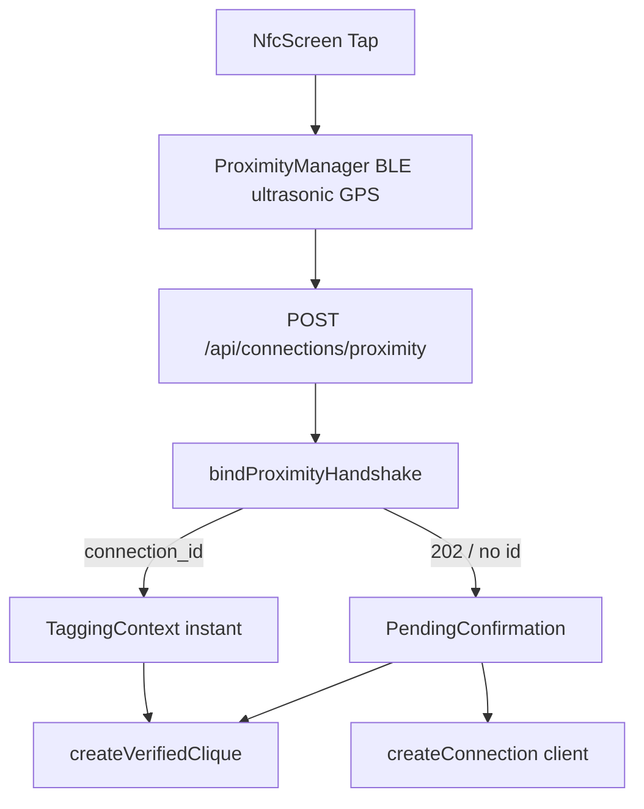

# Click — Known Issues Audit

**Date:** 2026-07-17 (updated)  
**Scope:** Codebase audit against the Issue Spec Sheet (#1–11) plus Track B+ device-filed issues (#12–25) and iOS Keychain.  
**Status legend:**

| Status | Meaning |
|--------|---------|
| **Confirmed** | Clear code path explains the reported failure |
| **Confirmed risk** | Failure mode is reachable; needs device/multi-phone repro to quantify |
| **Partial / misfiled** | Spec assumption incorrect; related UX/bug still exists |
| **Needs device repro** | Path exists; crash/UX not proven from static analysis alone |
| **Code fix landed — needs device repro** | Fix in tree; do not false-pass `[KNOWN-N]` until device confirms |
| **Open** | Broad category; use checklist to discover specifics |

Regression annotations: checklist rows tagged `[KNOWN-N]` link here.  
Continuation status (archived): [`../archive/handoff/functional-clarity-continuation.md`](../archive/handoff/functional-clarity-continuation.md).

---

## Summary

| # | Title | Type | Status | Priority |
|---|--------|------|--------|----------|
| 1 | Incomplete group registration (Bluetooth handshake) | Bug | Code fix landed — needs device repro (503 recover + host multi-select `awaiting_selection`) | P0 |
| 2 | Duplicate connections | Bug | Code fix landed — needs device repro (fetch-by-id + inbox/map peer collapse) | P0 |
| 3 | Handshake limited to groups (no 1:1 DM) | Feature / UX | Code fix landed — needs device repro (auto-clique + Message CTA) | P1 |
| 4 | Events missing from list view | Bug | Code fix landed — needs device repro | P1 |
| 5 | Map not rendering in color | Bug / design ambiguity | Confirmed (basemap code fixed — device confirm) | P2 |
| 6 | Android calls not working | Bug | Code fix landed — needs device repro | P0 |
| 7 | Voice message crashes Android | Bug | Code fix landed — needs device repro | P0 |
| 8 | Group chat creation crashes app | Bug | Code fix landed — needs device repro | P0 |
| 9 | Hazard beacon icon oversized | UI bug | Code fix landed — needs device repro (`BeaconPinMetrics`) | P2 |
| 10 | General visual bugs | UI | Open | P2 |
| 11 | Android-specific bugs (roll-up) | Bug | Open (see #6–7 + matrix) | P0–P2 |
| 12 | Add Click interactive-back card flicker | UI bug | Code fix landed — needs device repro | P1 |
| 13 | Profile sheets dark/light inconsistency | UI bug | Partial (profile OLED OK; UnifiedSearch forced dark) | P1 |
| 14 | Create verified click dialog crash (scroll/click) | Bug | Code fix landed — needs device repro | P0 |
| 15 | Segment tabs highlight covers text | UI bug | Code fix landed — needs device repro | P1 |
| 16 | Dark mode text contrast | UI | Code fix landed — needs device repro | P1 |
| 17 | Chat interactive-back LazyColumn duplicate key crash | Bug | Code fix landed — needs device repro | P0 |
| 18 | Verified click picker duplicate LazyColumn UUID keys | Bug | Code fix landed — needs device repro | P0 |
| 19 | Chat scroll lag / teleport on load-older | Bug | Code fix landed — needs device repro | P0 |
| 20 | Dark mode surfaces too light | UI | Partial (`surfaceContainer` not fully wired) | P2 |
| 21 | Chat timeline out-of-order days + duplicate bubbles | Bug | Code fix landed — needs device repro | P0 |
| 22 | Profile sheet OLED / avatar / top spacing | UI | Code fix landed — needs device repro | P1 |
| 23 | Nav bar opaque band (materials differ under nav) | UI | Code fix landed — needs device repro | P1 |
| 24 | Connections list flicker after chat interactive-back | UI | Code fix landed — needs device repro | P0 |
| 25 | Inbox preview jumps to old timestamp after scroll-up | Bug | Code fix landed — needs device repro | P0 |
| — | iOS Keychain `status: -50` | Bug | Code fix landed — needs device repro | P1 |

**Track B (2026-07-16):** Code fixes for P0 `#1`, `#2`, `#6`, `#7`, `#8` (and `#3` auto-clique side effect).  

**Track B+ UI (2026-07-16 → 2026-07-17):** `#12`–`#25` from device feedback (chat timeline, profile, transparent nav, inbox preview). Do **not** mark `[KNOWN-N]` pass until verified on device.

**Code audit hardenings (2026-07-17):** client 503 → `recoverPendingProximityHandshake`; confirm path fetch-by-`preflightConnectionId` + duplicate-key re-lookup; Success “Message” CTA; `BeaconPinMetrics` + SOS standalone; Keychain `SecItemUpdate` / `-50` retry.

**Handshake UX hardenings (docs synced):** host multi-select (`awaiting_selection`) for incomplete group registration; inbox/map peer collapse for duplicate UI chats/pins; `ReconnectEncounter` on reconnect; ~5s listen window; `at_event` requires RSVP **and** active check-in **per reporting user** (not all-or-nothing). Status remains **code fix landed — needs device repro**.

---

## 1. Bluetooth handshake: incomplete group registration

| Field | Detail |
|-------|--------|
| **Type** | Bug |
| **Area** | Connections / Bluetooth (Tri-Factor: BLE + ultrasonic + GPS) |
| **Status** | Code fix landed — needs device repro |
| **Priority** | P0 |

### Expected

Every participant present during a group handshake is registered on the group connection. Host multi-select (`awaiting_selection`) lets the initiator choose who to include before durable create.

### Evidence

1. **Pending handshakes marked matched even when connection creation fails**  
   In [`click-web/lib/server/proximity/bindProximityHandshake.ts`](../../../click-web/lib/server/proximity/bindProximityHandshake.ts), after `ensureConnectionForMemberSet` fails (connection unavailable path), `markPendingHandshakesMatched` still runs. GET poll recovery then returns **404 “Matched connection not found”** ([`app/api/connections/proximity/route.ts`](../../../click-web/app/api/connections/proximity/route.ts)).

2. **1.5s group coalesce**  
   Two-user matches without direct token evidence return HTTP 202 for `PROXIMITY_GROUP_COALESCE_MIN_MS` (~1.5s) to wait for a third tapper — can drop/split membership under timing races.

3. **Incomplete match on poll**  
   GET recovery returns **409** when `memberIds` does not include the caller or length &lt; 2.

4. **Client BLE window**  
   Android/iOS proximity managers use a short listen window (~**5s**); late joiners may miss mutual token hear.

### Suspected root cause

Server marks handshake rows matched without a durable connection for the full BFS component; coalesce + evidence graph can exclude a phone that was physically present but lacked mutual BLE/ultrasonic evidence within the window.

### Fix landed (code — 2026-07-16 Track B)

- `bindProximityHandshake`: on `ensureConnectionForMemberSet` failure, return 503 and **do not** call `markPendingHandshakesMatched` (leaves GET recovery viable).
- Pairwise clique edge ensure failures for N>2 return 503 instead of silent warn.
- Pairwise edges created during group bind use `forceActive: true` (promote `pending` → `active`).

### Client hardening (2026-07-17 code audit)

- `ApiClient.postProximityHandshake` treats HTTP **503** with `pending_handshake_id` as recoverable pending (same path as HTTP 202).
- `ConnectionViewModel` starts `recoverPendingProximityHandshake` instead of hard `Error` when the server leaves the handshake unmatched.

### Host multi-select (code — handshake UX fix)

- First-time multi-peer (≥3) returns `awaiting_selection` and **defers** durable create until host confirms via `confirmProximitySelection`.
- Combined sheet: people multi-select **above** context tags; selection size cap ≤12 (`PROXIMITY_HOST_SELECTION_MAX_MEMBERS`).
- Legacy `"Connect with everyone"` is no longer the primary multi-peer path (promoted to host pick sheet).

### Suggested regression cases

- [ ] 3 phones tap within ~5s listen window with BLE on → host picks people + tags → one group connection containing selected user IDs
- [ ] 4 phones, one with Bluetooth off → document who appears as candidate; no silent “matched but missing” state
- [ ] Force connection-create failure (e.g. DB constraint) → pending rows not stuck as matched without connection
- [ ] After 202 pending, poll until success → all members present on returned connection
- [ ] Host abandons selection (Skip/dismiss) → no partial group create; telemetry `host_selection_abandoned`

### Repro steps

TBD on device: 3+ Android/iOS phones, same room, Tap-to-Connect simultaneously; inspect `connections.user_ids` / Groups tab membership.

---

## 2. Duplicate connections created

| Field | Detail |
|-------|--------|
| **Type** | Bug |
| **Area** | Connections / Bluetooth |
| **Status** | Code fix landed — needs device repro |
| **Priority** | P0 |

### Expected

A connection between two users is created exactly once (for that member set), regardless of how many handshake events occur. Inbox and map must not show duplicate 1:1 UI rows/pins after Bluetooth reconnect.

### Evidence

1. **Dual create paths**  
   - Happy path: server `bindProximityHandshake` → `ensureConnectionForMemberSet`  
   - Fallback: client `ConnectionViewModel.confirmProximityConnection` → `ConnectionRepository.createConnection`  
   Race: server creates connection but client still shows `PendingConfirmation` and creates again (dedup usually wins, but encounters/tags can double-apply).

2. **Intentional multi-row for groups**  
   For 3+ users, server creates **1 group row + all pairwise 1:1 edges** (verified-clique E2EE prerequisite). Tests assert `1 + n*(n-1)/2` rows. Inbox may look like “duplicates” if UI does not distinguish group vs pair.

3. **Pair lookup matches group rows**  
   [`ConnectionRepository.findConnectionRowForUserPair`](../../composeApp/src/commonMain/kotlin/compose/project/click/click/data/repository/ConnectionRepository.kt) checks `userId1 in conn.user_ids && userId2 in conn.user_ids` **without requiring cardinality == 2**. A 3-person group can be treated as the existing “pair” connection.

### Suspected root cause

Dedup is incomplete across server/client paths and group-vs-pair cardinality; group taps produce multiple legitimate rows that may be reported as duplicates.

### Fix landed (code — 2026-07-16 Track B)

- Recent-connection lock now covers 1:1 as well as groups.
- Client: 12s re-tap debounce + in-flight guard; confirm path passes `preflightConnectionId` from bind.
- `findConnectionRowForUserPair` requires `user_ids.size == 2`.

### Client hardening (2026-07-17 code audit)

- `createConnectionOnline` restores by `preflightConnectionId` via `fetchConnectionById` **before** insert.
- Insert races that hit unique pair constraints re-lookup the pair and restore instead of failing/duplicating.

### UI collapse / upsert (code — handshake UX fix)

- Clicks inbox collapses 1:1 chats by peer (`collapseOneToOneChatsByPeer`) — Bluetooth reconnect must **not** spawn a second Active row.
- Map collapses connections by peer (`collapseOneToOneConnectionsByPeer`) — **single pin per peer** on reconnect.
- Reconnect path uses `ReconnectEncounter` presentation + encounter upsert rather than creating a new connection.

### Suggested regression cases

- [ ] 1:1 tap twice → still one Active 1:1 row for that pair (no duplicate inbox chat)
- [ ] 1:1 re-tap → one map pin for that peer (no duplicate pins)
- [ ] 3-person tap → host multi-select → exactly one group chat + expected pairwise edges (document expected count) — not two group chats
- [ ] Confirm fallback path after 202 → no second distinct 1:1 with same two members

### Repro steps

TBD: tap same two phones twice; query connections for `user_ids` containing both; check Clicks inbox and map for duplicate rows/pins.

---

## 3. Bluetooth handshake limited to groups (no 1:1 DM)

| Field | Detail |
|-------|--------|
| **Type** | Feature request / UX gap (partially misfiled as “groups only”) |
| **Area** | Connections / Bluetooth |
| **Status** | Partial / misfiled |
| **Priority** | P1 |

### Expected (from issue sheet)

Handshake flow should let users create a direct message connection, not just a group.

### Audit finding

**Server already supports 1:1 DMs:** for two matched users, `ensureConnectionForMemberSet` creates `is_group=false`. Client instant path uses `TaggingContext` when `!isGroup && users.size == 1`.

### Why it may feel “groups only”

1. Coalesce delays 2-user GPS-only matches (waiting for a third).  
2. After context save, success previously only snackbar’d / navigated to Connections Active — **no open-chat CTA**.  
3. Multi-phone rooms bias toward group clique UX.

### Suggested regression cases

- [ ] Exactly two phones tap → Active shows a **1:1** thread; chat is DM-shaped
- [ ] No unexpected “Groups” membership for a pure 1:1 tap (or document if 2-person clique is intentional)
- [ ] Three phones → group path as designed
- [ ] After 1:1 Success, snackbar **Message** opens the new chat

### Product clarification

Treat as **UX/product fix**: keep server 1:1; stop auto-clique for size==2 unless `tagging.isGroup`; optionally add explicit “Create DM vs Group” if product wants a chooser.

### Fix landed (code — 2026-07-16 Track B)

- `saveContextTags` auto-clique gated to `tagging.isGroup && memberUserIds.size >= 3` (no 2-person clique after 1:1 tap).

### UX hardening (2026-07-17 code audit)

- `ConnectionState.Success` snackbar offers **Message** action → `pendingChatId` deep-link into Connections chat.
---

## 4. Events missing from list view

| Field | Detail |
|-------|--------|
| **Type** | Bug |
| **Area** | Map / Events |
| **Status** | Code fix landed — needs device repro |
| **Priority** | P1 |

### Expected

Any event visible on the map appears in the list (discovery feed).

### Evidence

1. **Map clustering** — [`MapUtils.determineMapRenderData`](../../composeApp/src/commonMain/kotlin/compose/project/click/click/ui/utils/MapUtils.kt): at zoom &lt; 12, `standaloneKinds` previously included `SOUNDTRACK`, `HAZARD`, `UTILITY` but **not `EVENT`**. Events clustered with connections on the map while the feed listed them individually — counts/visibility diverged.

2. **Feed section gap** — [`MapDiscoveryLayout`](../../composeApp/src/commonMain/kotlin/compose/project/click/click/ui/screens/MapDiscoveryLayout.kt): `buildDiscoveryFeedItems` includes connections, but Connections section in `groupDiscoveryFeedIntoSections` is commented out (dead path; not events directly, but feed/map parity debt).

3. **Visibility rules** — Events use `isVisible` until `endEpochMs` ([`EventSchedule`](../../composeApp/src/commonMain/kotlin/compose/project/click/click/events/EventSchedule.kt)); `filterBeaconsForLayers` previously skipped `isVisibleEventBeacon` when `ALL` was selected, so ended events could remain on the map while the feed dropped them.

### Fix landed (code — 2026-07-17)

- `EVENT` added to `standaloneKinds` so zoomed-out events stay individual pins (not absorbed into connection clusters).
- `filterBeaconsForLayers` applies `isVisibleEventBeacon()` for `MapLayerFilter.ALL` as well as per-layer paths.
- Unit coverage: `MapRenderDataTest`.

### Suggested regression cases

- [ ] Drop event beacon → appears in list immediately and as pin (or cluster) on map
- [ ] Zoom out below 12 → event still findable in list; opening list item focuses map
- [ ] Layer filter Events off → hidden on **both** map and list

---

## 5. Map not rendering in color

| Field | Detail |
|-------|--------|
| **Type** | Bug / design ambiguity |
| **Area** | Map |
| **Status** | Confirmed |
| **Priority** | P2 |

### Expected

Map renders with full color styling as designed.

### Evidence

1. **Android normal mode** — [`MapView.android.kt`](../../composeApp/src/androidMain/kotlin/compose/project/click/click/ui/components/MapView.android.kt) always applies `DARK_MAP_STYLE` (zinc blacks/grays — “Glass & Neon”), not colorful Google basemap tiles.  
2. **Ghost mode** — switches to `GRAYSCALE_MAP_STYLE`; [`MapScreen`](../../composeApp/src/commonMain/kotlin/compose/project/click/click/ui/screens/MapScreen.kt) also applies alpha overlay.  
3. **iOS asymmetry** — ghost mode only hides user location; no grayscale JSON style parity.

### Suspected root cause

Either product expects colorful tiles and dark style is wrong, or “not in color” is users comparing to Google Maps default / ghost stuck on. Clarify design intent, then either ship a color style JSON or document dark-as-designed.

### Suggested regression cases

- [ ] Ghost **off** → map matches design reference (document expected palette)
- [ ] Ghost **on** → desaturated; user location hidden
- [ ] iOS and Android ghost visuals roughly match

---

## 6. Android calls not working

| Field | Detail |
|-------|--------|
| **Type** | Bug / feature gap |
| **Area** | Calls (Android) |
| **Status** | Code fix landed — needs device repro |
| **Priority** | P0 |

### Expected

Users can place and receive voice and video calls on Android.

### Evidence (historical)

[`CallManager.android.kt`](../../composeApp/src/androidMain/kotlin/compose/project/click/click/calls/CallManager.android.kt) previously ended the call immediately when permissions were missing. That path is replaced by `AndroidCallRuntime` + Activity Result (see **Fix landed** below).

Incoming: [`PlatformIncomingCallUi.android.kt`](../../composeApp/src/androidMain/kotlin/compose/project/click/click/calls/PlatformIncomingCallUi.android.kt) depends on `POST_NOTIFICATIONS` (API 33+).

### Suggested regression cases

- [ ] Fresh install → deny then grant mic/camera → **retry call succeeds without force-kill**
- [ ] Outgoing voice + video with permissions pre-granted
- [ ] Incoming call notification → accept → media connects
- [ ] Group call ≤8 members; >8 shows error message

### Fix direction (historical)

Await permission result, then continue `startCall`; or use Activity Result API + queue pending invite.

### Fix landed (code — 2026-07-16 Track B)

- `AndroidCallRuntime` queues pending call + Activity Result launcher in `MainActivity`; grant resumes `startCall` without ending first.
- Activity ref refreshed in `MainActivity.onResume`.
- Group call >8 surfaces `CallOverlayState.Ended` with limit message.

---

## 7. Voice message crashes Android app

| Field | Detail |
|-------|--------|
| **Type** | Bug |
| **Area** | Messaging (Android) |
| **Status** | Confirmed risk |
| **Priority** | P0 |

### Expected

Voice messages send and play without crashing.

### Evidence

1. **Record** — [`ChatMediaPickers.android.kt`](../../composeApp/src/androidMain/kotlin/compose/project/click/click/ui/chat/ChatMediaPickers.android.kt): `MediaRecorder.start()` is **not** wrapped in try/catch. IllegalStateException / RuntimeException crashes the UI thread if mic is busy (e.g. proximity ultrasonic also using `MediaRecorder`) or prepare failed.  
2. **Playback** — [`ChatAudioPlayer.android.kt`](../../composeApp/src/androidMain/kotlin/compose/project/click/click/media/ChatAudioPlayer.android.kt): setup in `runCatching` (soft fail); WebM/Opus from web may fail on `MediaPlayer` without ExoPlayer.  
3. Rapid re-record races if previous recorder not fully released.

### Suggested regression cases

- [ ] Record → preview → send → play (happy path)
- [ ] Record immediately after Tap-to-Connect (mic contention)
- [ ] Re-record twice quickly
- [ ] Play inbound WebM voice from web client (document format support)

### Repro steps

TBD: open chat on Android → hold voice → if crash, capture Logcat stack around `MediaRecorder.start`.

### Fix landed (code — 2026-07-16 Track B)

- `prepare`/`start` wrapped; failures toast and stay Idle (no UI-thread crash).
- Voice record blocked while call is Connecting/Connected.

---

## 8. Group chat creation crashes app

| Field | Detail |
|-------|--------|
| **Type** | Bug |
| **Area** | Messaging / Groups |
| **Status** | Needs device repro |
| **Priority** | P0 |

### Expected

Tapping group chat creation completes without crash.

### Evidence (static — no proven crash stack)

Path: Clicks FAB → `ConnectionMemberPickerSheet` → [`ChatViewModel.createVerifiedClique`](../../composeApp/src/commonMain/kotlin/compose/project/click/click/viewmodel/ChatViewModel.kt) → [`VerifiedCliqueCreation`](../../composeApp/src/commonMain/kotlin/compose/project/click/click/domain/VerifiedCliqueCreation.kt) → Supabase `create_verified_clique`.

Failure modes that are **handled as toast/null** rather than obvious crash:

- Missing 1:1 edges for key wrap (`VerifiedCliqueCreation` fails if member lacks active edge to anchor)
- Master key / `resolveChatIdForGroupId` null after create
- Eligibility race before `cliqueSheetEligibilityReady`

Proximity auto-create swallows failures via `getOrNull()`.

### Device repro protocol

1. Two+ mutual connections with completed 1:1 chats (keys warm).  
2. Tap FAB → select members → Create.  
3. If crash: save Logcat / Xcode exception + last screen.  
4. Retry with members who never chatted (crypto precondition) — expect toast, not crash.  
5. Note OS version and build flavor.

### Suggested regression cases

- [ ] Eligible clique create → group opens
- [ ] Ineligible selection disabled / toast, no crash
- [ ] Immediately after proximity multi-tap autofill create

### Fix landed (code — 2026-07-16 Track B)

- `createVerifiedClique` refreshes connections before wrap; requires chat id after RPC; failures stay `Result`/toast.
- Proximity pairwise edges promoted to `active` for clique eligibility (server).
- `decodeUuidScalarFromRpc` / wrap-key paths throw `IllegalStateException` instead of bare `error()`.

---

## 9. Hazard beacon icon oversized

| Field | Detail |
|-------|--------|
| **Type** | Bug (UI) |
| **Area** | Visual design / Map |
| **Status** | Confirmed inconsistency |
| **Priority** | P2 |

### Expected

Hazard icon sized consistently with other UI / map icons.

### Evidence

| Surface | Behavior |
|---------|----------|
| Web | MapLibre ⚠ glyph ~13px in ~26px circle ([`ConnectionMap.tsx`](../../../click-web/components/dashboard/ConnectionMap.tsx), [`mapBeacons.ts`](../../../click-web/lib/map/mapBeacons.ts)) |
| Android | Default / labeled pin with ~10.dp radius colored dot — no fixed ⚠ |
| iOS | `MKMarkerAnnotationView`; `glyphText` = first 3 chars of **caption**, not ⚠; title has ⚠️ but callout disabled |

Also: SOS shares high z-index with HAZARD but was **not** in `standaloneKinds` (could cluster away at low zoom).

### Fix landed (2026-07-17 code audit)

- Shared [`BeaconPinMetrics`](../../composeApp/src/commonMain/kotlin/compose/project/click/click/ui/utils/BeaconPinMetrics.kt): compact circle radius + alert glyph `⚠`.
- Hazard/SOS pins default caption to alert glyph so Android uses labeled compact circles (not oversized `defaultMarker`) and iOS `glyphText` shows `⚠`.
- `SOS` added to `standaloneKinds` alongside `HAZARD`.

### Suggested regression cases

- [ ] Drop hazard → pin size matches event/utility pins visually
- [ ] Compare Android / iOS / web side-by-side against design asset
- [ ] SOS remains standalone when zoomed out
---

## 10. General visual bugs

| Field | Detail |
|-------|--------|
| **Type** | Bug (UI) |
| **Area** | Visual design |
| **Status** | Open |
| **Priority** | P2 |

### Expected

UI renders cleanly and consistently across screens.

### Audit seeds (use §2 of full checklist)

- Platform-native sheet/button/ripple parity ([01-full-checklist.md](01-full-checklist.md) §2)
- Ghost mode overlay asymmetry iOS vs Android ([KNOWN-5](#5-map-not-rendering-in-color))
- Hazard / SOS clustering and glyph mismatch ([KNOWN-9](#9-hazard-beacon-icon-oversized))
- Map dark style vs colorful expectation ([KNOWN-5](#5-map-not-rendering-in-color))
- Composer / Functional Clarity chrome regressions after platform UI work

Capture screenshots per tab (Home, Add Click, Clicks, Map, Settings) + chat + sheets when filing specifics.

---

## 11. Android-specific bugs (roll-up)

| Field | Detail |
|-------|--------|
| **Type** | Bug |
| **Area** | Android |
| **Status** | Open roll-up |
| **Priority** | P0–P2 |

Open-ended investigation — track concrete items here and in [04-android-focus.md](04-android-focus.md).

| Item | Link | Notes |
|------|------|-------|
| Calls permission ends call | [#6](#6-android-calls-not-working) | Code fix landed — needs device repro |
| Voice record crash risk | [#7](#7-voice-message-crashes-android-app) | Confirmed risk |
| Activity null on call start | #6 | Cold start from notification |
| FCM / `POST_NOTIFICATIONS` | #6, checklist §18 | Incoming call UI |
| BLE GATT handshake | #1, Android focus | Device matrix |
| Map dark / grayscale | #5 | Style JSON |
| WorkManager proximity flush | checklist §19 | Offline tap sync |
| MediaRecorder mic contention | #7 vs proximity | Shared mic |

---

## 12. Add Click interactive-back card flicker

| Field | Detail |
|-------|--------|
| **Type** | Bug (UI) |
| **Area** | Add Click / navigation (iOS swipe-back; Android risk) |
| **Status** | Confirmed |
| **Priority** | P1 |

### Expected

Interactive back from My Code / Scan / Tap-to-Connect reveals a stable Add Click screen without per-card flashes.

### Evidence

`App.kt` swaps `AnimatedContent` to `my_qr` / `qr_scanner` / `nfc`, destroying `AddClickScreen`. `InteractiveSwipeBackContainer` then remounts `previousContent = { renderScreen("add_click") }` mid-gesture, so the three `AdaptiveCard` boxes compose from scratch under the scrim.

### Fix direction

Persistent Add Click underlay + overlay sub-routes (same pattern as `ConnectionsScreen` chat overlay): empty `previousContent`, parallax mirrored onto the base layer.

---

## 13. Profile bottom sheets dark/light inconsistency

| Field | Detail |
|-------|--------|
| **Type** | Bug (UI) |
| **Area** | Profile sheets |
| **Status** | Confirmed |
| **Priority** | P1 |

### Expected

Profile sheets match app dark/light on every entry point (Clicks tab and Map).

### Evidence

`TabbedUserProfileSheet` wraps `OledSheetTheme`; Map pin path (`MapScreen`) uses `ClickSheetDialogChrome` without `OledSheetTheme`. Picker search bar hard-codes `Color.White.copy(alpha = 0.08f)`.

### Fix direction

Apply `OledSheetTheme` on Map profile path; theme-aware search field fill; drop light-only hard-codes.

---

## 14. Create verified click dialog crash (scroll / click)

| Field | Detail |
|-------|--------|
| **Type** | Bug |
| **Area** | Groups / FAB picker |
| **Status** | Code fix landed — needs device repro |
| **Priority** | P0 |

### Expected

Scrolling and tapping members in Create verified click never crashes. Focusing Search connections must not dismiss the sheet / bounce to Home. After content is scrolled back to top, a downward drag from anywhere in the sheet body must dismiss (surface-drag), including with the keyboard open without map glitch bands.

### Evidence

`ConnectionMemberPickerSheet` uses `Column(fillMaxHeight)` + `LazyColumn(weight(1f))` while `ClickFormBottomSheet`’s intermediate `Column` is only `fillMaxWidth()` → unbounded max height → classic LazyColumn infinity crash on measure. Later native-sheet work keyed iOS sheet lifecycle on `LocalUIViewController`, so keyboard focus recreated/dismissed the page sheet. A follow-up removed `ProvideSheetSurfaceDrag`/`SheetFingerDismissHost` from iOS fill sheets to stop grabber flicker, which also removed body swipe-dismiss.

### Fix landed (2026-08-10)

- `ClickFormBottomSheet` defaults: `useUiKitScrollHost=true` for Column/`sheetBodyScroll` wrap-content (native UIKit scroll-host like which-pin / view-event).
- **LazyColumn / HorizontalPager / sticky-IME sheets must set `useUiKitScrollHost=false`** (Compose fill). UIKit unbounded wrap caused infinity-height crashes (profile Beacons/Media), empty search results, and empty verified-click contact lists.
- Text-input fill sheets use `sheetImePadding` + `ClickSheetDefaults.ContentTopPaddingUnderGrabber` (global search + availability intent).
- iOS `MapBeaconSheetRoot` no longer recreates the sheet manager when the local VC changes; does not dismiss unrelated presented VCs on re-show.
- `prefersScrollingExpandsWhenScrolledToEdge` only when `useUiKitScrollHost`.

### Fix landed (2026-08-10 earlier fill-sheet attempt)

- Temporary fill-sheet defaults (`useUiKitScrollHost=false`) + surface-drag restored dismiss but flickered on full-body swipe; superseded by selective UIKit scroll-host (Column forms) vs Compose fill (lazy/pager/IME) above.

---

## 15. Segment tab highlight covers text

| Field | Detail |
|-------|--------|
| **Type** | Bug (UI) |
| **Area** | Clicks + Map headers |
| **Status** | Confirmed |
| **Priority** | P1 |

### Expected

Selected Active / Groups / Archived and Distance / Recent labels stay readable.

### Evidence

`ConnectionsSegmentBar` / `DiscoverySortSegmentBar` use `primaryContainer` fill with `LightBlue` text. In dark mode `primaryContainer == LightBlue`, so label vanishes into the highlight.

### Fix direction

Selected text → `onPrimaryContainer` (or `onPrimary` on solid primary fill).

---

## 16. Dark mode text contrast

| Field | Detail |
|-------|--------|
| **Type** | Bug (UI) |
| **Area** | Theme / typography |
| **Status** | Confirmed |
| **Priority** | P1 |

### Expected

Secondary and variant text remains clearly readable on dark surfaces.

### Evidence

Dark `onSurfaceVariant` was tied to purple-tinted `OutlineVariant`; muted labels and segment bugs compound low contrast.

### Fix direction

Brighter dark `onSurfaceVariant`; ensure sheets/segments use scheme on-surface tokens.

---

## 17. Chat interactive-back LazyColumn duplicate key crash

| Field | Detail |
|-------|--------|
| **Type** | Bug |
| **Area** | Chat / iOS swipe-back |
| **Status** | Code fix landed — needs device repro |
| **Priority** | P0 |

### Expected

Interactive back from an open chat never crashes.

### Evidence

`IllegalArgumentException: Key "separator-nf-2026-4-22" was already used` in the chat `LazyColumn`. [`buildChatTimelineEntriesNewestFirst`](../../composeApp/src/commonMain/kotlin/compose/project/click/click/ui/chat/ChatTimeline.kt) used day-only separator keys (`separator-nf-$dayKey`); unsorted or oscillating day buckets reused the same key and crashed Compose during swipe-back remasure.

### Fix landed (2026-07-17)

- Separator keys include a monotonic seq (`separator-nf-$seq-$dayKey`).
- `ensureUniqueTimelineKeys` last-resort dedupe before LazyColumn.

---

## 18. Verified click picker duplicate LazyColumn UUID keys

| Field | Detail |
|-------|--------|
| **Type** | Bug |
| **Area** | Groups / Create verified click |
| **Status** | Code fix landed — needs device repro |
| **Priority** | P0 |

### Expected

Opening Create verified click and scrolling the member picker never crashes.

### Evidence

`IllegalArgumentException: Key "<uuid>" was already used`. Multiple 1:1 inbox rows for the same peer produced duplicate `User.id` keys in `ConnectionMemberPickerSheet`’s `LazyColumn`.

### Fix landed (2026-07-17)

- `cliquePickerCandidates` / sheet candidates `distinctBy { it.id }`.
- Lazy keys `picker-${user.id}-$index` via `itemsIndexed`.

---

## 19. Chat scroll lag / teleport on load-older

| Field | Detail |
|-------|--------|
| **Type** | Bug |
| **Area** | Chat timeline |
| **Status** | Code fix landed — needs device repro |
| **Priority** | P0 |

### Expected

Scrolling older messages stays where you are; new peer messages only auto-scroll when near the bottom. Disk/hot cache still used (no extra Supabase egress).

### Evidence

`LaunchedEffect(newestId to size)` called `scrollToItem(0)` on every size change (including load-older). Prefetch also overwrote a longer live window with a bounded ~80-msg cache.

### Fix landed (2026-07-17)

- Open once + peer-newest-while-near-bottom scroll policy (hub-style).
- Prefetch merges via `mergeMessageTimelinesPreservingLiveState` (cache preserved).

---

## 20. Dark mode surfaces too light

| Field | Detail |
|-------|--------|
| **Type** | UI |
| **Area** | Theme |
| **Status** | Code fix landed — needs device repro |
| **Priority** | P2 |

### Expected

Dark mode uses a deeper gray (not pure black).

### Fix landed (2026-07-17)

- `BackgroundDark` `#101212`, `SurfaceDark` `#1A1C1C`, container tiers `#242626` / `#2A2C2C`.

---

## 21. Chat timeline out-of-order days + duplicate bubbles

| Field | Detail |
|-------|--------|
| **Type** | Bug |
| **Area** | Chat timeline |
| **Status** | Code fix landed — needs device repro |
| **Priority** | P0 |

### Expected

Day separators are chronological (newest → oldest under `reverseLayout`). Each send appears once.

### Evidence

Screenshot showed Jul 1 → Yesterday → Apr 22 → Mar 6 → Apr 22 and duplicate icebreaker text. `buildChatTimelineEntriesNewestFirst` walked unsorted list order; merge kept `temp-…` + server UUID rows.

### Fix landed (2026-07-17)

- Sort by `timeCreated` before building separators.
- `normalizeChatTimeline` + optimistic/`localSentAt` dedupe in merge.
- `sendMessage` passes `optimisticTempId`; hot cache stores sorted timelines.
- Disk/hot prefetch still used (no extra Supabase egress).

---

## 22. Profile sheet OLED / avatar / top spacing

| Field | Detail |
|-------|--------|
| **Type** | UI |
| **Area** | Profile bottom sheet |
| **Status** | Code fix landed — needs device repro |
| **Priority** | P1 |

### Expected

Sheet matches OLED chrome; empty avatar matches connection-list initials/color; tight spacing under grabber to “Profile”.

### Fix landed (2026-07-17)

- Body/tabs use `GlassSheetTokens.OledBlack()` (not `surfaceContainerHigh`).
- Header uses `ConnectionListUserAvatarFace`.
- Removed safe-area top inset + 24dp spacer above title.

---

## 23. Nav bar opaque band (materials differ under nav)

| Field | Detail |
|-------|--------|
| **Type** | UI |
| **Area** | App shell / bottom nav |
| **Status** | Code fix landed — needs device repro |
| **Priority** | P1 |

### Expected

Page background and cards look **identical** under the tab icons as above them — no fill, blur, or seam.

### Evidence

Scaffold `bottomBar` reserved a dead band; opaque/translucent platform bars tinted or hid content (iOS `#2F3131` / Material `surface`).

### Fix landed (2026-07-17)

- `PlatformBottomBar` overlaid outside Scaffold (full-bleed content + `rememberBottomChromePadding` for hit targets).
- Android/iOS chrome **fully transparent** (`Color.Transparent` / `configureWithTransparentBackground()`); no top border fill band.
- iOS tab bar pinned to view bottom so Compose paints under icons + home indicator.

---

## 24. Connections list flicker after chat interactive-back

| Field | Detail |
|-------|--------|
| **Type** | UI |
| **Area** | Connections inbox / iOS swipe-back |
| **Status** | Code fix landed — needs device repro |
| **Priority** | P0 |

### Expected

After interactive back from a chat, the Connections list is stable — no full-list flicker or “everything recomposing” flash.

### Evidence

On iOS the list stays mounted under the chat overlay, but gesture dismiss called `finalizeChatClose()` / `leaveChatRoom()` and `onChatOpenStateChanged(false)` synchronously. That restored the tab bar (LazyColumn `bottomChrome` jump) and applied inbox patches in the same frame as reveal. Tap-close already deferred teardown by 300ms.

### Fix landed (2026-07-17)

- Defer gesture teardown (`CHAT_GESTURE_CLOSE_SETTLE_MS`) like tap; restore chrome only in `finalizeChatClose`.
- Split `LaunchedEffect(userId)` / `initialChatId` so clearing `pendingChatId` does not restart realtime via `setCurrentUser`.
- Suppress inbox reorder `animateScrollToItem(0)` briefly after `isListObscured` clears.

---

## 25. Inbox preview jumps to old timestamp after scrolling up in chat

| Field | Detail |
|-------|--------|
| **Type** | Functional |
| **Area** | Connections inbox / chat leave |
| **Status** | Code fix landed — needs device repro |
| **Priority** | P0 |

### Expected

After opening a chat, scrolling up (load older), and returning to the list, the row preview/timestamp stay on the **newest** message (not an icebreaker from weeks ago).

### Evidence

Global `subscribeToMessageInserts` treated UPDATE like INSERT and `bumpConnectionInChatList` always overwrote preview. Load-older delivery/read UPDATEs rewrote the snippet to an old row; leave only revealed the damage. Paginated `fetchMessagesForChat` also **replaced** the hot timeline with the older page only. Ephemeral join held a mutex during the 8s subscribe timeout, blocking leave and amplifying simulator lag / cancel logs.

### Fix landed (2026-07-17)

- `bumpConnectionInChatList` + `AppDataManager` inbox/connection patches are newest-wins (same-id metadata refresh allowed).
- Global list flow emits Insert only; Updates merge into hot cache without inbox emit.
- Paginated fetches `mergeMessages` into hot cache; `leaveChatRoom` repairs preview from timeline max.
- Ephemeral join/leave: generation token + subscribe outside mutex; unsubscribe on timeout/cancel; don’t swallow `CancellationException`.

---

## iOS Keychain `status: -50` (errSecParam)

| Field | Detail |
|-------|--------|
| **Type** | Bug |
| **Area** | Auth / iOS token persistence |
| **Status** | Code fix landed — needs device repro |
| **Priority** | P1 |

### Expected

JWT / refresh tokens persist to Keychain across app updates; set failures are handled without silent Keychain miss.

### Evidence

[`IosTokenStorage`](../../composeApp/src/iosMain/kotlin/compose/project/click/click/data/storage/TokenStorage.ios.kt) previously used delete+`SecItemAdd` only; on failure logged `status: $status` (including `-50` / `errSecParam`) and still treated NSUserDefaults as success.

### Fix landed (2026-07-17 code audit)

- Prefer `SecItemUpdate`, fall back to `SecItemAdd`; on duplicate / param error retry update.
- Log structured Keychain failures; warn when defaults saved but Keychain write failed.

### Suggested regression cases

- [ ] Sign in on iOS → Keychain holds JWT (no `-50` spam in console)
- [ ] App update / relaunch → session restores from Keychain

---

## Cross-cutting architecture notes

Tri-Factor is not classic NFC-only; BLE is one of three factors. Group registration and dedup live primarily on the **server** BFS + `ensureConnectionForMemberSet`; client fallbacks amplify duplicate and clique side effects.

---

## Recommended fix order (follow-up engineering)

1. ~~**P0** Android call permission retry (#6)~~ — code landed; device verify
2. ~~**P0** Guard `MediaRecorder.start` + release (#7)~~ — code landed; device verify
3. ~~**P0** Device-repro and fix group create crash (#8)~~ — code landed; device verify
4. ~~**P0** Handshake match/mark + pair cardinality dedup (#1, #2)~~ — code landed; device verify
5. ~~**P0** Chat timeline order/dupes / picker keys / inbox preview (#17–#19, #21, #25)~~ — code landed; device verify
6. ~~**P1** Profile sheet + transparent nav (#22, #23)~~ — code landed; device verify
7. ~~**P0** Connections list flicker after chat back (#24)~~ — code landed; device verify
8. ~~**P1** Event list/map parity (#4)~~ — code landed; device verify; finish 1:1 UX (#3) on device
9. ~~**P1** Client 503 recover / confirm dedup / Keychain -50 / Message CTA / hazard pins~~ — code hardened 2026-07-17; device verify
10. **P2** Map color intent (#5); hazard visual confirm (#9); visual sweep (#10); theme PARTIAL (#13/#20)
11. **Track C** Design-asset layout redesigns — see [`../archive/handoff/functional-clarity-continuation.md`](../archive/handoff/functional-clarity-continuation.md) §3
