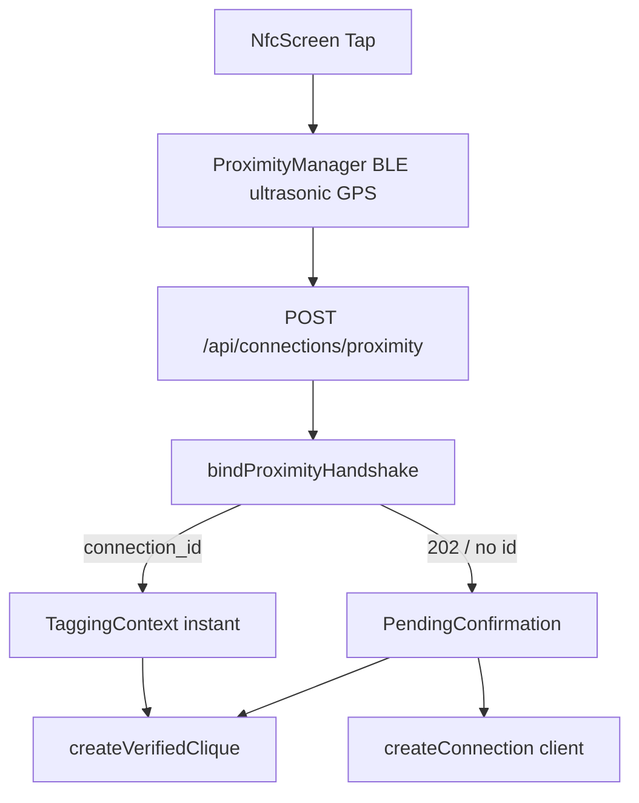

# Click — Known Issues Audit

**Date:** 2026-07-16  
**Scope:** Codebase audit against the Issue Spec Sheet (#1–11). Docs only — fixes are follow-up work.  
**Status legend:**

| Status | Meaning |
|--------|---------|
| **Confirmed** | Clear code path explains the reported failure |
| **Confirmed risk** | Failure mode is reachable; needs device/multi-phone repro to quantify |
| **Partial / misfiled** | Spec assumption incorrect; related UX/bug still exists |
| **Needs device repro** | Path exists; crash/UX not proven from static analysis alone |
| **Open** | Broad category; use checklist to discover specifics |

Regression annotations: checklist rows tagged `[KNOWN-N]` link here.

---

## Summary

| # | Title | Type | Status | Priority |
|---|--------|------|--------|----------|
| 1 | Incomplete group registration (Bluetooth handshake) | Bug | Confirmed risk | P0 |
| 2 | Duplicate connections | Bug | Confirmed risk | P0 |
| 3 | Handshake limited to groups (no 1:1 DM) | Feature / UX | Partial / misfiled | P1 |
| 4 | Events missing from list view | Bug | Confirmed | P1 |
| 5 | Map not rendering in color | Bug / design ambiguity | Confirmed | P2 |
| 6 | Android calls not working | Bug | Confirmed | P0 |
| 7 | Voice message crashes Android | Bug | Confirmed risk | P0 |
| 8 | Group chat creation crashes app | Bug | Needs device repro | P0 |
| 9 | Hazard beacon icon oversized | UI bug | Confirmed inconsistency | P2 |
| 10 | General visual bugs | UI | Open | P2 |
| 11 | Android-specific bugs (roll-up) | Bug | Open (see #6–7 + matrix) | P0–P2 |

---

## 1. Bluetooth handshake: incomplete group registration

| Field | Detail |
|-------|--------|
| **Type** | Bug |
| **Area** | Connections / Bluetooth (Tri-Factor: BLE + ultrasonic + GPS) |
| **Status** | Confirmed risk |
| **Priority** | P0 |

### Expected

Every participant present during a group handshake is registered on the group connection.

### Evidence

1. **Pending handshakes marked matched even when connection creation fails**  
   In [`click-web/lib/server/proximity/bindProximityHandshake.ts`](../../../click-web/lib/server/proximity/bindProximityHandshake.ts), after `ensureConnectionForMemberSet` fails (connection unavailable path), `markPendingHandshakesMatched` still runs. GET poll recovery then returns **404 “Matched connection not found”** ([`app/api/connections/proximity/route.ts`](../../../click-web/app/api/connections/proximity/route.ts)).

2. **1.5s group coalesce**  
   Two-user matches without direct token evidence return HTTP 202 for `PROXIMITY_GROUP_COALESCE_MIN_MS` (~1.5s) to wait for a third tapper — can drop/split membership under timing races.

3. **Incomplete match on poll**  
   GET recovery returns **409** when `memberIds` does not include the caller or length &lt; 2.

4. **Client BLE window**  
   Android/iOS proximity managers use a short listen window (~3s); late joiners may miss mutual token hear.

### Suspected root cause

Server marks handshake rows matched without a durable connection for the full BFS component; coalesce + evidence graph can exclude a phone that was physically present but lacked mutual BLE/ultrasonic evidence within the window.

### Suggested regression cases

- [ ] 3 phones tap within 2s with BLE on → one group connection containing all three user IDs
- [ ] 4 phones, one with Bluetooth off → document who is included; no silent “matched but missing” state
- [ ] Force connection-create failure (e.g. DB constraint) → pending rows not stuck as matched without connection
- [ ] After 202 pending, poll until success → all members present on returned connection

### Repro steps

TBD on device: 3+ Android/iOS phones, same room, Tap-to-Connect simultaneously; inspect `connections.user_ids` / Groups tab membership.

---

## 2. Duplicate connections created

| Field | Detail |
|-------|--------|
| **Type** | Bug |
| **Area** | Connections / Bluetooth |
| **Status** | Confirmed risk |
| **Priority** | P0 |

### Expected

A connection between two users is created exactly once (for that member set), regardless of how many handshake events occur.

### Evidence

1. **Dual create paths**  
   - Happy path: server `bindProximityHandshake` → `ensureConnectionForMemberSet`  
   - Fallback: client `ConnectionViewModel.confirmProximityConnection` → `ConnectionRepository.createConnection`  
   Race: server creates connection but client still shows `PendingConfirmation` and creates again (dedup usually wins, but encounters/tags can double-apply).

2. **Intentional multi-row for groups**  
   For 3+ users, server creates **1 group row + all pairwise 1:1 edges** (verified-clique E2EE prerequisite). Tests assert `1 + n*(n-1)/2` rows. Inbox may look like “duplicates” if UI does not distinguish group vs pair.

3. **Pair lookup matches group rows**  
   [`ConnectionRepository.findConnectionRowForUserPair`](../../composeApp/src/commonMain/kotlin/compose/project/click/click/data/repository/ConnectionRepository.kt) checks `userId1 in conn.user_ids && userId2 in conn.user_ids` **without requiring cardinality == 2**. A 3-person group can be treated as the existing “pair” connection.

### Suspected root cause

Dedup is incomplete across server/client paths and group-vs-pair cardinality; group taps produce multiple legitimate rows that may be reported as duplicates.

### Suggested regression cases

- [ ] 1:1 tap twice → still one Active 1:1 row for that pair
- [ ] 3-person tap → exactly one group chat + expected pairwise edges (document expected count) — not two group chats
- [ ] Confirm fallback path after 202 → no second distinct 1:1 with same two members

### Repro steps

TBD: tap same two phones twice; query connections for `user_ids` containing both; check Clicks inbox for duplicate rows.

---

## 3. Bluetooth handshake limited to groups (no 1:1 DM)

| Field | Detail |
|-------|--------|
| **Type** | Feature request / UX gap (partially misfiled as “groups only”) |
| **Area** | Connections / Bluetooth |
| **Status** | Partial / misfiled |
| **Priority** | P1 |

### Expected (from issue sheet)

Handshake flow should let users create a direct message connection, not just a group.

### Audit finding

**Server already supports 1:1 DMs:** for two matched users, `ensureConnectionForMemberSet` creates `is_group=false`. Client instant path uses `TaggingContext` when `!isGroup && users.size == 1`.

### Why it may feel “groups only”

1. Coalesce delays 2-user GPS-only matches (waiting for a third).  
2. After context save, [`ConnectionViewModel.saveContextTags`](../../composeApp/src/commonMain/kotlin/compose/project/click/click/viewmodel/ConnectionViewModel.kt) runs `createVerifiedClique` when `memberUserIds.size >= 2` — **including 1:1** — which can create a 2-person group row alongside the DM.  
3. Multi-phone rooms bias toward group clique UX.

### Suggested regression cases

- [ ] Exactly two phones tap → Active shows a **1:1** thread; chat is DM-shaped
- [ ] No unexpected “Groups” membership for a pure 1:1 tap (or document if 2-person clique is intentional)
- [ ] Three phones → group path as designed

### Product clarification

Treat as **UX/product fix**: keep server 1:1; stop auto-clique for size==2 unless `tagging.isGroup`; optionally add explicit “Create DM vs Group” if product wants a chooser.

---

## 4. Events missing from list view

| Field | Detail |
|-------|--------|
| **Type** | Bug |
| **Area** | Map / Events |
| **Status** | Confirmed |
| **Priority** | P1 |

### Expected

Any event visible on the map appears in the list (discovery feed).

### Evidence

1. **Map clustering** — [`MapUtils.determineMapRenderData`](../../composeApp/src/commonMain/kotlin/compose/project/click/click/ui/utils/MapUtils.kt): at zoom &lt; 12, `standaloneKinds` includes `SOUNDTRACK`, `HAZARD`, `UTILITY` but **not `EVENT`**. Events cluster with connections on the map while the feed lists them individually — counts/visibility diverge.

2. **Feed section gap** — [`MapDiscoveryLayout`](../../composeApp/src/commonMain/kotlin/compose/project/click/click/ui/screens/MapDiscoveryLayout.kt): `buildDiscoveryFeedItems` includes connections, but Connections section in `groupDiscoveryFeedIntoSections` is commented out (dead path; not events directly, but feed/map parity debt).

3. **Visibility rules** — Events use `isVisible` until `endEpochMs` ([`EventSchedule`](../../composeApp/src/commonMain/kotlin/compose/project/click/click/events/EventSchedule.kt)); layer filters apply to both paths via `discoveryFeedBeacons` — so pure filter mismatch is less likely than clustering / stale viewport cache.

### Suggested regression cases

- [ ] Drop event beacon → appears in list immediately and as pin (or cluster) on map
- [ ] Zoom out below 12 → event still findable in list; opening list item focuses map
- [ ] Layer filter Events off → hidden on **both** map and list

---

## 5. Map not rendering in color

| Field | Detail |
|-------|--------|
| **Type** | Bug / design ambiguity |
| **Area** | Map |
| **Status** | Confirmed |
| **Priority** | P2 |

### Expected

Map renders with full color styling as designed.

### Evidence

1. **Android normal mode** — [`MapView.android.kt`](../../composeApp/src/androidMain/kotlin/compose/project/click/click/ui/components/MapView.android.kt) always applies `DARK_MAP_STYLE` (zinc blacks/grays — “Glass & Neon”), not colorful Google basemap tiles.  
2. **Ghost mode** — switches to `GRAYSCALE_MAP_STYLE`; [`MapScreen`](../../composeApp/src/commonMain/kotlin/compose/project/click/click/ui/screens/MapScreen.kt) also applies alpha overlay.  
3. **iOS asymmetry** — ghost mode only hides user location; no grayscale JSON style parity.

### Suspected root cause

Either product expects colorful tiles and dark style is wrong, or “not in color” is users comparing to Google Maps default / ghost stuck on. Clarify design intent, then either ship a color style JSON or document dark-as-designed.

### Suggested regression cases

- [ ] Ghost **off** → map matches design reference (document expected palette)
- [ ] Ghost **on** → desaturated; user location hidden
- [ ] iOS and Android ghost visuals roughly match

---

## 6. Android calls not working

| Field | Detail |
|-------|--------|
| **Type** | Bug / feature gap |
| **Area** | Calls (Android) |
| **Status** | Confirmed |
| **Priority** | P0 |

### Expected

Users can place and receive voice and video calls on Android.

### Evidence

[`CallManager.android.kt`](../../composeApp/src/androidMain/kotlin/compose/project/click/click/calls/CallManager.android.kt):

```kotlin
if (missingPermissions.isNotEmpty()) {
    activity.runOnUiThread {
        ActivityCompat.requestPermissions(..., CALL_PERMISSION_REQUEST_CODE) // 4013
    }
    _callState.value = CallState.Ended("Camera or microphone permission required")
    return
}
```

There is **no** `onRequestPermissionsResult` / Activity Result retry that restarts the call after grant. First call after install always ends when permissions were missing.

Also: `currentActivity()` null → immediate `CallState.Ended("Call context unavailable")` (cold start from notification).

Incoming: [`PlatformIncomingCallUi.android.kt`](../../composeApp/src/androidMain/kotlin/compose/project/click/click/calls/PlatformIncomingCallUi.android.kt) depends on `POST_NOTIFICATIONS` (API 33+).

### Suggested regression cases

- [ ] Fresh install → deny then grant mic/camera → **retry call succeeds without force-kill**
- [ ] Outgoing voice + video with permissions pre-granted
- [ ] Incoming call notification → accept → media connects
- [ ] Group call ≤8 members; &gt;8 shows error (today: silent no-op in `CallSessionManager`)

### Fix direction (not in this docs pass)

Await permission result, then continue `startCall`; or use Activity Result API + queue pending invite.

---

## 7. Voice message crashes Android app

| Field | Detail |
|-------|--------|
| **Type** | Bug |
| **Area** | Messaging (Android) |
| **Status** | Confirmed risk |
| **Priority** | P0 |

### Expected

Voice messages send and play without crashing.

### Evidence

1. **Record** — [`ChatMediaPickers.android.kt`](../../composeApp/src/androidMain/kotlin/compose/project/click/click/ui/chat/ChatMediaPickers.android.kt): `MediaRecorder.start()` is **not** wrapped in try/catch. IllegalStateException / RuntimeException crashes the UI thread if mic is busy (e.g. proximity ultrasonic also using `MediaRecorder`) or prepare failed.  
2. **Playback** — [`ChatAudioPlayer.android.kt`](../../composeApp/src/androidMain/kotlin/compose/project/click/click/media/ChatAudioPlayer.android.kt): setup in `runCatching` (soft fail); WebM/Opus from web may fail on `MediaPlayer` without ExoPlayer.  
3. Rapid re-record races if previous recorder not fully released.

### Suggested regression cases

- [ ] Record → preview → send → play (happy path)
- [ ] Record immediately after Tap-to-Connect (mic contention)
- [ ] Re-record twice quickly
- [ ] Play inbound WebM voice from web client (document format support)

### Repro steps

TBD: open chat on Android → hold voice → if crash, capture Logcat stack around `MediaRecorder.start`.

---

## 8. Group chat creation crashes app

| Field | Detail |
|-------|--------|
| **Type** | Bug |
| **Area** | Messaging / Groups |
| **Status** | Needs device repro |
| **Priority** | P0 |

### Expected

Tapping group chat creation completes without crash.

### Evidence (static — no proven crash stack)

Path: Clicks FAB → `ConnectionMemberPickerSheet` → [`ChatViewModel.createVerifiedClique`](../../composeApp/src/commonMain/kotlin/compose/project/click/click/viewmodel/ChatViewModel.kt) → [`VerifiedCliqueCreation`](../../composeApp/src/commonMain/kotlin/compose/project/click/click/domain/VerifiedCliqueCreation.kt) → Supabase `create_verified_clique`.

Failure modes that are **handled as toast/null** rather than obvious crash:

- Missing 1:1 edges for key wrap (`VerifiedCliqueCreation` fails if member lacks active edge to anchor)
- Master key / `resolveChatIdForGroupId` null after create
- Eligibility race before `cliqueSheetEligibilityReady`

Proximity auto-create swallows failures via `getOrNull()`.

### Device repro protocol

1. Two+ mutual connections with completed 1:1 chats (keys warm).  
2. Tap FAB → select members → Create.  
3. If crash: save Logcat / Xcode exception + last screen.  
4. Retry with members who never chatted (crypto precondition) — expect toast, not crash.  
5. Note OS version and build flavor.

### Suggested regression cases

- [ ] Eligible clique create → group opens
- [ ] Ineligible selection disabled / toast, no crash
- [ ] Immediately after proximity multi-tap autofill create

---

## 9. Hazard beacon icon oversized

| Field | Detail |
|-------|--------|
| **Type** | Bug (UI) |
| **Area** | Visual design / Map |
| **Status** | Confirmed inconsistency |
| **Priority** | P2 |

### Expected

Hazard icon sized consistently with other UI / map icons.

### Evidence

| Surface | Behavior |
|---------|----------|
| Web | MapLibre ⚠ glyph ~13px in ~26px circle ([`ConnectionMap.tsx`](../../../click-web/components/dashboard/ConnectionMap.tsx), [`mapBeacons.ts`](../../../click-web/lib/map/mapBeacons.ts)) |
| Android | Default / labeled pin with ~10.dp radius colored dot — no fixed ⚠ |
| iOS | `MKMarkerAnnotationView`; `glyphText` = first 3 chars of **caption**, not ⚠; title has ⚠️ but callout disabled |

Also: SOS shares high z-index with HAZARD but is **not** in `standaloneKinds` (can cluster away at low zoom).

### Suggested regression cases

- [ ] Drop hazard → pin size matches event/utility pins visually
- [ ] Compare Android / iOS / web side-by-side against design asset

---

## 10. General visual bugs

| Field | Detail |
|-------|--------|
| **Type** | Bug (UI) |
| **Area** | Visual design |
| **Status** | Open |
| **Priority** | P2 |

### Expected

UI renders cleanly and consistently across screens.

### Audit seeds (use §2 of full checklist)

- Platform-native sheet/button/ripple parity ([01-full-checklist.md](01-full-checklist.md) §2)
- Ghost mode overlay asymmetry iOS vs Android ([KNOWN-5](#5-map-not-rendering-in-color))
- Hazard / SOS clustering and glyph mismatch ([KNOWN-9](#9-hazard-beacon-icon-oversized))
- Map dark style vs colorful expectation ([KNOWN-5](#5-map-not-rendering-in-color))
- Composer / Functional Clarity chrome regressions after platform UI work

Capture screenshots per tab (Home, Add Click, Clicks, Map, Settings) + chat + sheets when filing specifics.

---

## 11. Android-specific bugs (roll-up)

| Field | Detail |
|-------|--------|
| **Type** | Bug |
| **Area** | Android |
| **Status** | Open roll-up |
| **Priority** | P0–P2 |

Open-ended investigation — track concrete items here and in [04-android-focus.md](04-android-focus.md).

| Item | Link | Notes |
|------|------|-------|
| Calls permission ends call | [#6](#6-android-calls-not-working) | Confirmed |
| Voice record crash risk | [#7](#7-voice-message-crashes-android-app) | Confirmed risk |
| Activity null on call start | #6 | Cold start from notification |
| FCM / `POST_NOTIFICATIONS` | #6, checklist §18 | Incoming call UI |
| BLE GATT handshake | #1, Android focus | Device matrix |
| Map dark / grayscale | #5 | Style JSON |
| WorkManager proximity flush | checklist §19 | Offline tap sync |
| MediaRecorder mic contention | #7 vs proximity | Shared mic |

---

## Cross-cutting architecture notes



Tri-Factor is not classic NFC-only; BLE is one of three factors. Group registration and dedup live primarily on the **server** BFS + `ensureConnectionForMemberSet`; client fallbacks amplify duplicate and clique side effects.

---

## Recommended fix order (follow-up engineering)

1. **P0** Android call permission retry (#6)  
2. **P0** Guard `MediaRecorder.start` + release (#7)  
3. **P0** Device-repro and fix group create crash (#8)  
4. **P0** Handshake match/mark + pair cardinality dedup (#1, #2)  
5. **P1** Event list/map parity (#4); 1:1 vs clique UX (#3)  
6. **P2** Map color intent (#5); hazard icon (#9); visual sweep (#10)
