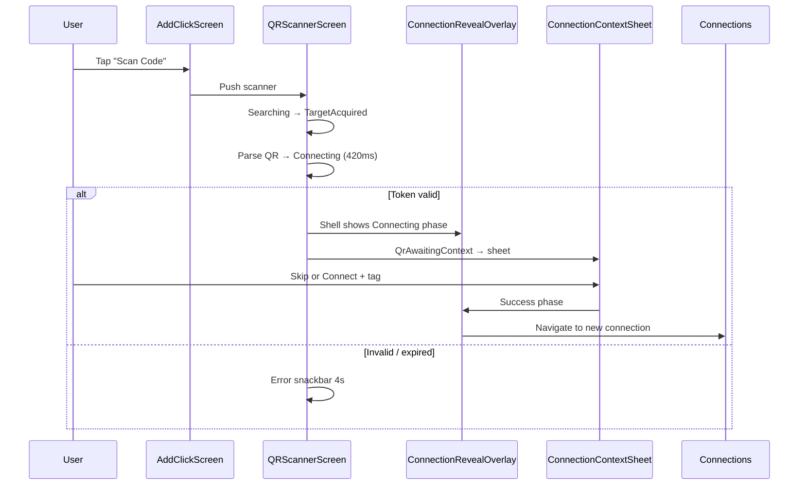
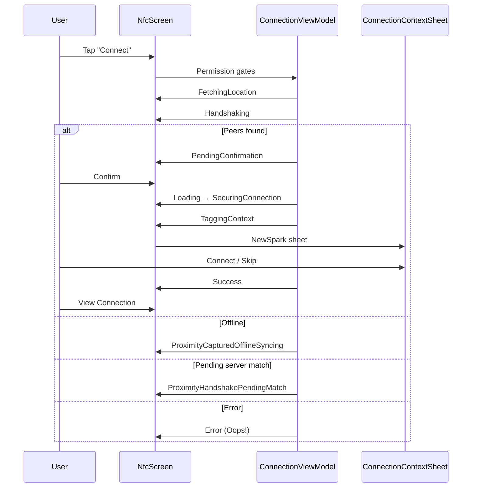
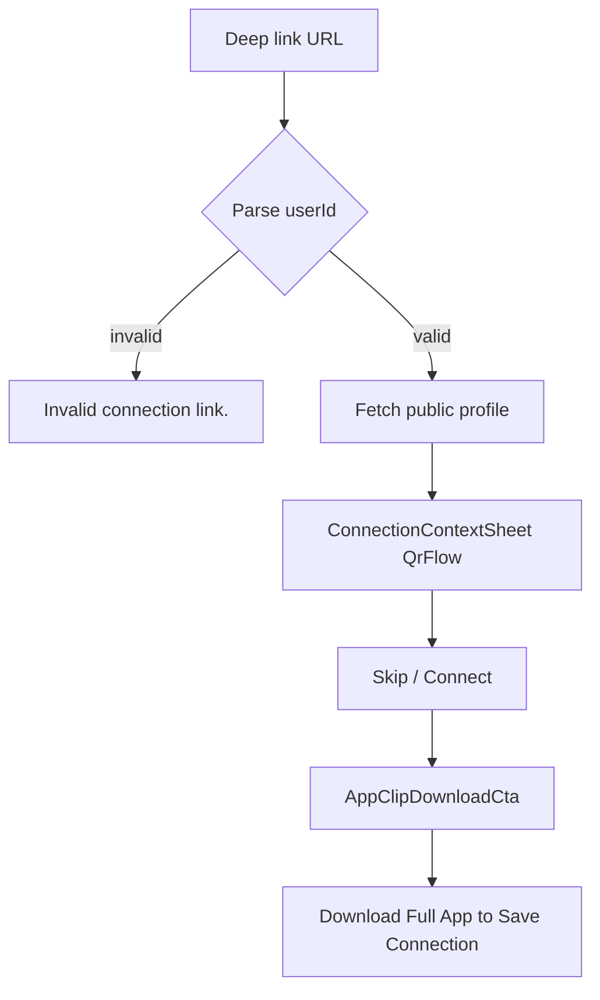

# 06 — Connect & Handshake

**Scope:** Add Click hub, QR share/scan, Tap/NFC proximity, context tagging, reveal overlay, iOS App Clip.  
**Source:** `AddClickScreen.kt`, `MyQRCodeScreen.kt`, `QRScannerScreen.kt`, `NfcScreen.kt`, `ConnectionContextSheet.kt`, `ConnectionRevealOverlay.kt`, `AppClipHandshakeScreen.kt`, `ConnectionViewModel.kt`  
**Out of scope:** Web, backend API contracts, redesign.

**Visual system:** Functional Clarity (neo-brutalist) — opaque surfaces, 2px `#000` borders, primary `#630ed4`, no glass/blur/gradients. Design-asset mock: `click/docs/design-assets/add_click_streamlined_header/`.

**Track C (landed):** `AddClickContent` order is **Tap to Connect** → My Code / Scan grid → hub links (`Create hub` / `Join hub`). Card dimensions unchanged; mock used for hierarchy only.

---

## ASCII hierarchy

```
AddClickScreen (tab organism)
├── AppScreenWithFloatingHeader
│   ├── title: "Add Click"
│   └── subtitle: "Connect with QR or Tap to Connect, or join a venue community hub"
├── AddClickContent | ClickedSuccessContent
│   ├── "Tap to Connect" card
│   ├── Row: "My Code" | "Scan Code" cards
│   ├── "Create hub" | "Join hub" text buttons
│   ├── CreateHubModal (overlay)
│   └── JoinCommunityHubSheet (overlay)
│
MyQRCodeScreen (push)
├── Back + "My QR Code"
├── UserQrCode (300dp)
└── "Scan this code to connect with {username}"

QRScannerScreen (push)
├── PageHeader "Scan QR Code" + dynamic subtitle
├── QRScanner + ScannerLensOverlay
├── Status Surface (icon + title + body)
└── Error snackbar "Invalid QR Code"

NfcScreen / Tap to Connect (push)
├── PageHeader "Tap to Connect" + "BLE + ultrasonic handshake"
├── AnimatedContent(ConnectionState machine)
│   ├── Idle → FetchingLocation → Handshaking → Resolving
│   ├── PendingConfirmation → TaggingContext + ConnectionContextSheet
│   ├── Loading / SecuringConnection → Success | Error
│   └── Offline / PendingMatch substates
└── Handshaking bottom Card + "Cancel"

ConnectionContextSheet (modal, multi-entry)
├── Avatars header
├── Title/subtitle (presentation-specific)
├── Suggested + All tag chips (ContextTagTaxonomy)
├── Custom activity field
├── Ambient noise copy
├── Calendar overlap card (ReconnectEncounter)
└── "Skip" | "Connect" | "Save Encounter"

ConnectionRevealOverlay (full-screen overlay)
└── Phase: Connecting | Success

AppClipHandshakeScreen (iOS Clip target)
├── Loading spinner
├── Error text
├── ConnectionContextSheet (QrFlow)
└── AppClipDownloadCta
```

---

## 1. Layout / Container

### AddClickScreen

| Zone | Layout |
|------|--------|
| Shell | `AdaptiveBackground` + `AppScreenWithFloatingHeader` |
| Tap card | Full-width `AdaptiveCard` first, 24dp padding |
| QR row | Two `AdaptiveCard` 1:1 weight, aspect ratio 0.85 |
| Hub links | Centered `TextButton` row, 8dp gap |
| Success | `ClickedSuccessContent` replaces content (check icon 120dp) |

### MyQRCodeScreen

Centered column: QR 300dp → 32dp spacer → instructional text. Back via header `navigationIcon`.

### QRScannerScreen

Column: header (status bar inset + 20dp horizontal) → weighted camera viewport (24dp radius border) → status surface → 24dp bottom spacer. Error banner overlays bottom.

### NfcScreen

Column: `PageHeader` → `AnimatedContent` state body (weight 1) → optional handshaking instruction card. `ConnectionContextSheet` renders when `ConnectionState.TaggingContext`.

### ConnectionRevealOverlay

Full-screen flat scrim (black @ 40%, no blur). Centered bordered card max 340dp width, 2dp `#000` border, 16dp radius.

---

## 2. Interactive Elements

### AddClickScreen

| Control | Action |
|---------|--------|
| `"Tap to Connect"` card | `onNavigateToNfc()` |
| `"My Code"` card | `onShowMyQRCode()` |
| `"Scan Code"` card | `onScanQRCode()` |
| `"Create hub"` | `showCreateHubModal = true` |
| `"Join hub"` | `showJoinHubSheet = true` |
| `"Start Chatting"` (success) | `onStartChatting()` |

### MyQRCodeScreen

| Control | Action |
|---------|--------|
| Back | `onNavigateBack()` |

### QRScannerScreen

| Control | Action |
|---------|--------|
| Back | `onNavigateBack()` |
| Camera | Continuous scan → `handleQRResult` |
| Auto error dismiss | 4s after error |

### NfcScreen

| Control | Action |
|---------|--------|
| Back | `onBackPressed()` |
| Settings (header) | `proximityManager.openRadiosSettings()` |
| `"Connect"` (idle) | Permission gates → `startTapProximityHandshake` |
| `"Open app settings"` | System settings |
| `"Open Settings"` (unsupported) | Radio settings |
| Confirm peers | `"Connect"` / `"Connect with everyone"` |
| Handshaking `"Cancel"` | `stopAll()` + `resetConnectionState()` |
| Success `"View Connection"` | `onConnectionCreated(id)` |
| Success `"Connect Another"` | `resetConnectionState()` |
| Error `"Try Again"` / `"Dismiss"` | Retry handshake or idle |

### ConnectionContextSheet

| Control | Action |
|---------|--------|
| Tag chips | Select taxonomy tag |
| `"✏️ Write your own"` | Focus custom field |
| `"Skip"` | `onSkip` / `onDismiss` |
| `"Connect"` | `onConfirm(tag, noiseOptIn)` |
| `"Save Encounter"` | `onSaveEncounter()` (ReconnectEncounter) |
| `"Lock Intent"` | Calendar overlap CTA |

---

## 3. States

### QRScannerPresentationState

| State | Header subtitle | Status title | Status body | Lens badge |
|-------|-----------------|--------------|-------------|------------|
| **Searching** | `"Point camera at a Click code"` | `"Scanning for a Click profile"` | `"Keep the full code inside the frame for a smooth lock-on."` | `"Searching"` |
| **TargetAcquired** | `"Hold steady, almost there"` | `"QR found. Hold your frame for the reveal."` | `"The camera has eyes on the code now."` | `"Target acquired"` |
| **Connecting** | `"Locking in the connection"` | `"Connection detected. Opening the handoff."` | `"This should feel immediate, not abrupt."` | `"Revealing connection"` |
| **Error** | `"That code doesn't look right"` | `"Invalid code detected"` | `errorMessage` or `"Try a valid Click QR code instead."` | hidden |

**Error snackbar (bottom):** title `"Invalid QR Code"` + dynamic `errorMessage`.

**Error strings from parse:**

| Case | `errorMessage` |
|------|----------------|
| Expired token | `"This QR code has expired. Ask them to generate a new one."` |
| Invalid format | `"Invalid Connection Code"` |
| Hub QR unsupported | `"This hub QR needs a newer version of Click."` |

**Footer hint (error):** `"Keep scanning or tap back to exit"`

**Camera:** `isActive = !isProcessingResult` during Connecting lock (420ms delay before callback).

---

### ConnectionState machine (NfcScreen / shared ViewModel)

| State | Screen content | Primary copy |
|-------|----------------|--------------|
| **Idle** | `NfcIdleContent` | `"Ready to Connect"` / `"Tap to Connect unavailable"` |
| **ProximityFetchingLocation** | GPS icon + spinner | `"Fetching Location..."` |
| **ProximityHandshaking** | Pulsing rings + BT icon | `"Handshaking…"` |
| **ProximityResolving** | Spinner | `"Matching nearby taps…"` |
| **PendingConfirmation** | Peer list + CTAs | `"Confirm your tap"` / `"Confirm this group"` |
| **TaggingContext** | `ProximityAwaitingContextContent` + sheet | `"You're connected"` / `"You're all connected"` |
| **Loading** | Spinner | `"Creating Connection..."` |
| **SecuringConnection** | Spinner | `"Securing Connection..."` |
| **Success** | `NfcSuccessContent` | `"Connection Created!"` |
| **QrAwaitingContext** | Empty box (sheet owned by App shell) | — |
| **ProximityCapturedOfflineSyncing** | Cloud-off icon | `"Saved Offline"` |
| **ProximityHandshakePendingMatch** | Schedule icon | `"Handshake Saved"` |
| **Error** | `NfcErrorContent` | `"Oops!"` + dynamic `message` |

#### Idle sub-copy

| Element | String |
|---------|--------|
| Ready headline | `"Ready to Connect"` |
| Ready body | `"Tap Connect together with someone nearby. Both phones should enable Bluetooth and microphone access for the handshake."` |
| Unavailable headline | `"Tap to Connect unavailable"` |
| Unavailable body | `capabilityNote` (platform string) |
| Info card title | `"How Tap to Connect works"` |
| Primary CTA | `"Connect"` |
| Secondary | `"Open app settings"` |
| Unsupported CTA | `"Open Settings"` |

#### Handshaking bottom card

| Element | String |
|---------|--------|
| Body | `"Stay close — broadcasting and listening for nearby taps."` |
| Button | `"Cancel"` |

#### Pending confirmation

| Element | String |
|---------|--------|
| Single peer headline | `"Confirm your tap"` |
| Group headline | `"Confirm this group"` |
| Single subtitle | `"You'll add optional context next."` |
| Group subtitle | `"You'll connect with everyone listed, then add one shared context tag."` |
| User name fallback | `"User"` |
| Primary (1) | `"Connect"` |
| Primary (N) | `"Connect with everyone"` |
| Cancel | `"Cancel"` |

#### ProximityAwaitingContext (behind sheet)

| Element | String |
|---------|--------|
| Single | `"You're connected"` |
| Group | `"You're all connected"` |
| Hint | `"Add a quick tag below (optional). It applies to this meetup."` |

#### Offline / pending match

| Screen | Title | Default message | CTAs |
|--------|-------|-----------------|------|
| Offline | `"Saved Offline"` | `"Handshake saved offline. Will sync when connected."` | `"Try sync now"`, `"Dismiss"` |
| Pending match | `"Handshake Saved"` | `"Handshake saved! Waiting for the other user to come online..."` | `"Got it"` |

#### Success (`NfcSuccessContent`)

| Element | String |
|---------|--------|
| Title | `"Connection Created!"` |
| Met line | `"You met {name}"` |
| 48h prompt | `"Say hi within 48 hours to keep this connection alive"` |
| Common Ground | `"Common Ground"` |
| Say hi placeholder | `"Say hi! 👋"` |
| Send a11y | `"Send"` |
| Sent confirmation | `"Message sent!"` |
| Primary | `"View Connection"` |
| Secondary | `"Connect Another"` |

#### Error (`NfcErrorContent`)

| Element | String |
|---------|--------|
| Title | `"Oops!"` |
| Body | `message` (dynamic) |
| Dismiss | `"Dismiss"` |
| Retry | `"Try Again"` |

**Known `ConnectionViewModel` error strings:**

| Constant / case | Message |
|-----------------|---------|
| `HARDWARE_PERMISSIONS_MISSING_MESSAGE` | `"Hardware Permissions Missing: enable Bluetooth and Microphone access to use Tap to Connect."` |
| `PROXIMITY_OFFLINE_SYNC_MESSAGE` | `"Handshake saved offline. Will sync when connected."` |
| `PROXIMITY_PENDING_MATCH_MESSAGE` | `"Handshake saved! Waiting for the other user to come online..."` |
| `RECONNECTION_ENCOUNTER_COOLDOWN_MESSAGE` | `"You recently crossed paths with this person! Wait a bit before logging another memory."` |
| No peer | `"No nearby tap detected. Try again closer together."` |
| Self-connect | `"You cannot connect with yourself!"` |
| Auth | `"User not logged in"`, `"Please sign in again."` |
| Generic | `"Proximity handshake failed"`, `"Unknown error"` |

---

### ConnectionContextPresentation modes

| Mode | Title | Subtitle (1:1) | Primary CTA |
|------|-------|----------------|-------------|
| **NewSpark** | `"Sparking a new connection…"` | `"Pick what best describes this physical encounter. You can leave it blank and keep going."` | `"Connect"` |
| **QrFlow** | Same as NewSpark | Same | `"Connect"` |
| **ReconnectEncounter** | `"Logging encounter with {name}…"` | `"Save this crossing to your shared encounter history."` | `"Save Encounter"` |
| **Group (any)** | `"Set the context for this group"` | `"This tag applies to everyone in this meetup. You can leave it blank and keep going."` | `"Connect"` |

**Sheet sections:** `"Suggested"`, `"All tags"`, `"Custom activity"`, `"Ambient noise"`.

**Custom field:**

| Element | String |
|---------|--------|
| Chip | `"✏️ Write your own"` |
| Label | `"Custom activity"` |
| Placeholder | `"Dorm lounge, coffee line, hackathon kickoff..."` |
| Error | `"Add a quick label before continuing."` |
| Char count | `"{n}/25 characters"` |
| Helper | `"If none of the presets fit, write what you were doing. Short, natural labels work best."` |

**Ambient noise copy (3 variants):** enabled+permission, enabled+no permission, disabled — see `ConnectionContextSheet.kt` lines 541–548.

**Calendar denied:** `"Calendar access is off — schedule overlap won't appear until you enable read-only calendar access in Settings."`

**Overlap card:** `"You both have a gap on {dayLabel} at {timeLabel}"` + `"Lock Intent"`

**Location hint:** `"Location hint: {locationName}"`

**Skip:** `"Skip"`

---

### Context tag taxonomy (all chips)

Preset labels (emoji + label): `"🎓 Lecture / Class"`, `"📚 Study Session"`, `"🛏️ Dorms / Residence Hall"`, `"🎉 Party"`, `"☕ Cafe / Coffee"`, `"🍻 Bar / Nightlife"`, `"🏟️ Campus Event"`, `"⚽ Sports / Rec"`, `"🤝 Club / Org Meeting"`, `"🚌 Transit / Commute"`, `"💪 Gym / Workout"`, `"🎤 Conference"`, `"🌲 Outdoors / Nature"`, `"🍽️ Dining / Food"`, `"✏️ Other..."`

---

### ConnectionRevealOverlay

| Phase | Headline | Subcopy |
|-------|----------|---------|
| **Connecting** | `"Sparking a new connection…"` | `"Hold for a beat while Click turns the scan into a real connection."` |
| **Success** | `"You and {name} are connected"` or `"Connection created"` | `"Opening your connections so the new reveal lands in context."` |

**Haptics:** repeating heavy impact while Connecting; success notification + heavy impact on Success.

---

### AppClipHandshakeScreen

| State | UI |
|-------|-----|
| Loading | Purple spinner |
| Error | `"Invalid connection link."` (or API failure copy) |
| Profile loaded | `ConnectionContextSheet` QrFlow |
| Complete | `AppClipDownloadCta` |

**Download CTA:**

| Element | String |
|---------|--------|
| Title | `"Connection started!"` |
| Body | `"Download the full Click app to save this connection and keep chatting."` |
| Button | `"Download Full App to Save Connection"` |
| Profile fallback | `"Click member"` |

---

### AddClickScreen micro-copy

| Element | String |
|---------|--------|
| Header title | `"Add Click"` |
| Header subtitle | `"Connect with QR or Tap to Connect, or join a venue community hub"` |
| My Code title | `"My Code"` |
| My Code subtitle | `"Share your QR"` |
| My Code a11y | `"My QR Code"` |
| Scan title | `"Scan Code"` |
| Scan subtitle | `"Friend or hub QR"` |
| Scan a11y | `"Scan QR"` |
| Tap title | `"Tap to Connect"` |
| Tap subtitle | `"Nearby handshake with Bluetooth and audio"` |
| Tap a11y | `"Tap to Connect"` |
| Hub create | `"Create hub"` |
| Hub join | `"Join hub"` |
| Success title | `"Clicked with {userName}!"` |
| Success body | `"You're now connected and can start chatting."` |
| Success CTA | `"Start Chatting"` |
| Success icon a11y | `"Success"` |

### MyQRCodeScreen

| Element | String |
|---------|--------|
| Title | `"My QR Code"` |
| Instruction | `"Scan this code to connect with {username ?: "me"}"` |
| Back a11y | `"Back"` |

---

## 4. Flow diagrams

### QR handshake



### Tap / NFC handshake



### App Clip (iOS)



---

## 5. A11y & Responsive

| Surface | Notes |
|---------|-------|
| QR scanner | Back button `contentDescription = "Back"`; status icons decorative (`null`) |
| Tap idle | Bluetooth icon decorative in hero; `"Connect"` button has icon+text |
| Context sheet | Filter chips are standard Material3; custom field exposes label + error |
| Reveal overlay | Icon decorative; headline/subcopy carry meaning |
| App Clip | High-contrast white on `#0A0A0A`; full-width download button |
| iOS header | `PageHeader` with status bar padding on QR/NFC |
| Android ripple | `AdaptiveCard` onClick ripples on Add Click cards |
| Bottom chrome | `bottomChromePadding()` on scanner and NFC |
| Haptics | `PlatformHapticsPolicy` on reveal phases, context confirm, calendar lock |

**Permission flows:** Location and Bluetooth/mic requested before handshake start; denied → Error state with hardware message or `capabilityNote`.

---

## Related documents

- [05-home.md](05-home.md) — post-connect home feed
- [07-connections-inbox.md](07-connections-inbox.md) — destination after `"View Connection"`
- [10-map-beacons-hubs.md](10-map-beacons-hubs.md) — ephemeral/community hub modals from Add Click
