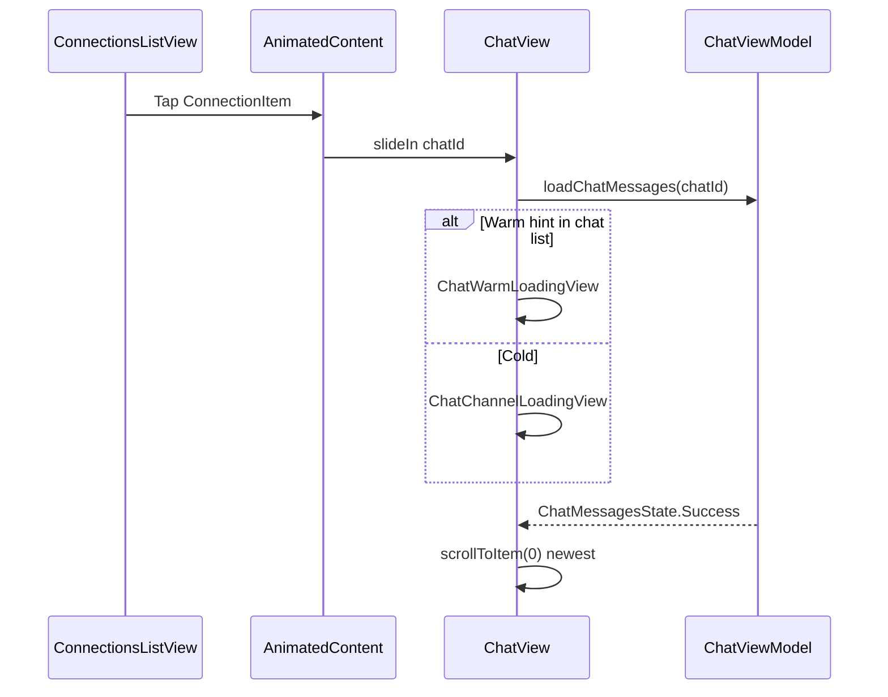
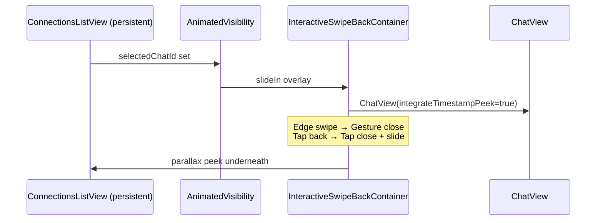

# 08 — Chat Thread (`ChatView`)

**Scope:** `ChatView.kt`, `ui/chat/*` (composer, timeline, bubbles, loading, dialogs, icebreaker, vibe check, tether toasts).  
**Source:** `ui/screens/ChatView.kt`, `ui/chat/ConnectionChatMessageComposer.kt`, `ChatMessageTimeline.kt`, `ChatMessageBubble.kt`, `ChatLoadingAndDialogs.kt`, `MessageActionSheet.kt`, `VoiceMessageRecordDialogLayout.kt`, `VibeCheckAndIcebreaker.kt`, `ConnectionActionSheet.kt`, `ConnectionSheetDialogs.kt`  
**Out of scope:** Web, backend APIs, chat thread UI (see [08-chat.md](08-chat.md)), call overlay detail (see [09-calls.md](09-calls.md)).

**Visual system:** Functional Clarity (neo-brutalist) — opaque surfaces, 2px `#000` borders, primary `#630ed4`, no glass/blur/gradients. Design-asset mock: `click/docs/design-assets/chat/`.

---

## ASCII hierarchy

```
ChatView (organism — full-screen thread)
├── ChatAmbientMeshBackground (success state only; connection-tinted radial mesh)
├── Column
│   ├── ChatMessagesState branches
│   │   ├── Loading → ChatWarmLoadingView | ChatChannelLoadingView
│   │   ├── Error → minimal header + centered error
│   │   └── Success
│   │       ├── Header plate (56dp, status-bar inset)
│   │       │   ├── Back
│   │       │   ├── Avatar (1:1 Core frame + online dot | group cluster)
│   │       │   ├── Title + subtitle (Online/Offline | member summary)
│   │       │   ├── Shared availability bolt (1:1 overlap)
│   │       │   ├── Rename group (groups)
│   │       │   ├── Call options menu
│   │       │   └── More (ConnectionActionSheet)
│   │       ├── Thread dock (keyboard lift)
│   │       │   ├── IcebreakerPanel (conditional, top overlay)
│   │       │   ├── ChatMessageTimeline (reverse LazyColumn)
│   │       │   │   ├── ConversationDaySeparator rows
│   │       │   │   ├── ChatMessageBubble / CallLogSystemRow
│   │       │   │   └── Outbound delivery receipt row
│   │       │   ├── Typing indicator (AnimatedVisibility)
│   │       │   ├── Edit strip (when editingMessageId set)
│   │       │   └── ConnectionChatMessageComposer
│   │       └── ForwardDialog (modal)
├── TetherCompassToast ×2 (receiver ping + sender ack)
├── ChatExpandedPhotoPreview (fullscreen lightbox)
├── GlassToastHost (nudge / connection / media errors)
├── MessageActionSheet (long-press)
├── ConnectionActionSheet + ConnectionSheetDialogs
└── UnifiedPopupFormDialog — Rename group
```

**Platform shell (parent `ConnectionsScreen`):**

| Platform | Navigation into `ChatView` |
|----------|---------------------------|
| **iOS** | Persistent list + `AnimatedVisibility` chat overlay inside `InteractiveSwipeBackContainer`; edge swipe dismisses chat; timestamp peek integrated with swipe-back |
| **Android** | `AnimatedContent` horizontal slide: `ConnectionsListView` ↔ `ChatView` |

---

## 1. Layout / Container

### ChatView root

| Property | Value |
|----------|-------|
| Root | `Box(fillMaxSize)` |
| Background mesh | `ChatAmbientMeshBackground` when `ChatMessagesState.Success`; `isHubNeutral = true` for verified-click groups |
| Status bar | `WindowInsets.statusBars` top padding on header only (IME does not push header past cutout) |
| Overlays z-order | Mesh (0) → thread chrome → toasts (50–61) → photo preview → sheets/dialogs |

### Header plate (`ChatGlassHeaderPlateTestTag`)

| Property | Value |
|----------|-------|
| Height | 56dp below status-bar inset |
| Surface | Transparent over mesh (no blur plate required) |
| Horizontal padding | **16dp** (`ChatChromeHorizontalPadding`) — matches composer outer edges |
| Back | `ChatHeaderIconButton(showBorder = true)` — 40dp circular, 2dp `clickBorderColor()` |
| Call / More / Rename | `ChatHeaderIconButton` borderless — plain icons so trailing actions do not stack as busy rings |
| 1:1 avatar | `AvatarWithOnlineIndicator` **outside** `CoreConnectionAvatarFrame` 36dp + online indicator 9dp (dot overlays avatar rim; ring uses background token, not near-black surface) |
| Group avatar | `GroupAvatar` 34dp cluster; tap → group members picker |
| Presence subtitle | “Online” / “Offline” uses `isPeerOnline \|\| peerId in onlineUsers` (same source as avatar dot) |
| Title | `titleMedium`, semibold, 1 line ellipsis |
| Subtitle (1:1) | Green dot + `"Online"` / `"Offline"` (`AnimatedContent`) |
| Subtitle (group) | `"{N} members: {first names…}"` up to 2 lines |
| Trailing actions | Bolt (overlap), Rename (group), Call, More |

### Thread dock

| Property | Value |
|----------|-------|
| Keyboard | `chatThreadKeyboardDock` + `graphicsLayer.translationY` on composer column (`composerLiftPx`) |
| Timeline padding bottom | `ChatComposerStripReserve` + native keyboard inset |
| Reverse layout | Newest messages at index 0 (bottom-adjacent to composer) |
| Icebreaker reserve | Measured panel height + 8dp, fallback 228dp |

### ConnectionChatMessageComposer strip

| Property | Value |
|----------|-------|
| Horizontal pad | **16dp** (`ChatChromeHorizontalPadding`) — aligns with header |
| Vertical pad | iOS 6dp / Android 8dp |
| Aux button size | iOS 44dp / Android 52dp |
| Field corner | iOS 20dp / Android 12dp |
| Field insets | Flanked by attach + send circles |
| Attach / Send | Circular fill + **2dp** `clickBorderColor()` border (same as hub composer) |

---

## 2. Interactive Elements

### Header

| Control | Action |
|---------|--------|
| Back | `onBackPressed()` |
| 1:1 avatar | `onOpenUserProfile(peerId)` |
| Group avatar | `onOpenGroupMembersPicker(context)` |
| Shared availability bolt | Decorative (no tap handler) |
| Rename (`contentDescription = "Rename group"`) | Opens rename dialog |
| Call (`contentDescription = "Call options"`) | Voice / video menu |
| More (`contentDescription = "More options"`) | `ConnectionActionSheet` |

### Call options menu

| Platform | UI | Rows |
|----------|-----|------|
| **Android** | `DropdownMenu` | `"Group voice call"` / `"Voice call"`, `"Group video call"` / `"Video call"` |
| **iOS** | `Popup` + `ChatCallOptionsIosSurface` | `"Voice call"`, `"Video call"` (no group prefix) |

Both routes call `CallSessionManager.startOutgoingCall` or `startOutgoingGroupCall`.

### Timeline

| Gesture | Target | Action |
|---------|--------|--------|
| Scroll (user) | `LazyColumn` | Dismiss IME after 16dp vertical scroll |
| Swipe toward center | `ChatMessageBubble` | `startReplyTo` (threshold ~60dp); `ReplySwipeSideIcon` behind bubble |
| Swipe left (local) | Timeline | Timestamp peek reveal (unless integrated with iOS swipe-back) |
| Long-press | Bubble | `MessageActionSheet` + `PlatformHapticsPolicy.heavyImpact()` |
| Tap photo | Image bubble | `ChatExpandedPhotoPreview` |
| Tap reaction chip | Bubble footer | Toggle reaction |
| Near list end | LazyColumn | `loadOlderMessages()` when within 3 items of oldest |

### Composer

| Control | Action |
|---------|--------|
| Attach (`"Attach"`) | Expand attachment menu |
| Text field | `updateMessageInput`; placeholders vary by mode |
| Send / Confirm edit | `sendMessage()` or confirm edit (`Check` icon) |
| Reply banner close (`"Cancel reply"`) | `clearReplyTarget()` |
| Staged photo remove (`"Remove"`) | `removeStagedMedia(id)` |
| `"Send ({N})"` | `commitStagedMediaToUpload()` |

### Attachment menu rows

| Label | Action |
|-------|--------|
| `"Click Drops"` | `onOpenDisposableRoll` / `onOpenDisposableRollForChat` |
| `"Ping Tether"` | `EncounterTetherManager.pingTether` (when enabled) |
| `"Photo library"` | `openPhotoLibrary()` |
| `"Take photo"` | `openCamera()` |
| `"Voice message"` | `openVoiceRecorder()` → `VoiceMessageRecordDialogLayout` |
| `"File"` | `openFilePicker()` |

### IcebreakerPanel

| Control | Action |
|---------|--------|
| Prompt row tap | `useIcebreakerPrompt(prompt)` → fills composer input |
| Refresh (`"Get new prompts"`) | `refreshIcebreakerPrompts()` (disabled during cooldown) |
| Dismiss (`"Dismiss"`) | `dismissIcebreakerPanel()` |

### MessageActionSheet

See [MessageActionSheet organism](#messageactionsheet) below.

### Connection chrome (from chat)

`ConnectionActionSheet` emits `ConnectionMenuAction`; destructive flows use `ConnectionSheetDialogs` after sheet dismiss (same strings as [07-connections-inbox.md](07-connections-inbox.md)).

---

## 3. States

### ChatMessagesState (thread root)

| State | UI |
|-------|-----|
| **Loading** + list row hint (last message exists) | `ChatWarmLoadingView` — header shows peer/group title + `ClickLogoPulse` |
| **Loading** + no hint | `ChatChannelLoadingView` — title `"Chat"` + pulse |
| **Loading** + success state chatId mismatch | Warm or cold loading (same rules) |
| **Error** | Header `"Chat"` + `"Error loading chat"` + `state.message` |
| **Success** | Full thread chrome |

### In-thread message fetch

| Condition | UI |
|-----------|-----|
| `isLoadingMessages && messages.isEmpty()` | Center spinner + `"Loading messages…"` |
| `messages.isEmpty()` | bordered card empty state |
| `messages.nonEmpty()` | `ChatMessageTimeline` |
| `isLoadingOlderMessages` | Top-of-list `CircularProgressIndicator` |

### Empty thread (bordered card)

| Field | 1:1 | Group |
|-------|-----|-------|
| Title | `"No messages yet"` | `"No messages yet"` |
| Body | `"Say hi to {peerName}!"` | `"Everyone here is in a verified click — say hello to the group."` |

### Header title fallbacks

| Context | String |
|---------|--------|
| 1:1 peer | `otherUser.name` or `"Unknown"` |
| Group | `groupClique.name` or `"Verified click"` |
| Warm loading | peer/group name or `"Chat"` |

### Peer presence (1:1 subtitle)

| State | Copy |
|-------|------|
| Online | Green 8dp dot + `"Online"` (green `#16A34A`) |
| Offline | `"Offline"` (muted) |

### Group member summary

Format: `"{memberCount} members: {FirstName1}, {FirstName2}, …"` — per-member fallback `"Member"`.

### Typing indicator

| Context | Label |
|---------|-------|
| 1:1 | `"{peerName} is typing"` (fallback `"Someone"`) |
| Group | `"Someone is typing"` |

Animated bubble with `ChatTypingDots`; visible when `isPeerTyping`.

### Edit mode strip

| Element | Copy |
|---------|------|
| Label | `"Editing message"` |
| Dismiss | `"Cancel edit"` |

Shown when `editingMessageId != null`; composer placeholder becomes `"Edit message…"`; send icon becomes check (`"Confirm edit"`).

### Reply composer banner

| Element | Copy |
|---------|------|
| Title | `"Replying to {senderName}"` (fallback `"message"`) |
| Snippet | `replySnippetForMetadata` (max 100 chars) |
| Close | `"Cancel reply"` |

Hidden while editing.

### Staged photos

| Element | Copy |
|---------|------|
| Send batch button | `"Send ({count})"` |
| Hint | `"Up to 10 photos per batch"` |
| Per-thumb remove | `"Remove"` |

### IcebreakerPanel visibility

Shown when: `showIcebreakerPanel && prompts.nonEmpty() && messages.size < 5`.

### VibeCheckBanner (implemented; feature-flagged)

`ChatViewModel.vibeCheckEnabled = false` — component exists in `VibeCheckAndIcebreaker.kt` but is **not mounted** in current `ChatView`. Documented as-built for when enabled.

| State | Banner copy |
|-------|-------------|
| Pending timer | Label `"Say Hi"` + `formatVibeCheckTime(remainingMs)` (`"MM:SS"`) |
| Active timer | Label `"Vibe Check"` + countdown |
| Warning | Red tint when `remainingMs ≤ 5:00` |
| Other kept | Chip `"They want to keep!"` |
| User kept button | `"Kept!"` (disabled) / `"Keep"` |
| Mutual kept | `"Connection Kept!"` + `"You both chose to continue this connection"` |
| Waiting copy | `"Waiting for them to decide…"` / `"Waiting for mutual confirmation…"` |
| CTA hint | `"Click 'Keep' if you want to continue this connection"` |
| Timer exhausted (banner) | `"Time's up!"` |
| Expired dialog title | `"Vibe Check Complete"` |
| Expired dialog bodies | `"Unfortunately, the other person didn't choose to keep this connection. The chat will be deleted."` / `"You didn't choose to keep this connection. The chat will be deleted."` / `"Neither of you chose to keep this connection. The chat will be deleted."` |
| Expired confirm | `"OK"` |
| Context tag | Dynamic `connection.context_tag` with location icon |

### Message bubbles — delivery receipt (`ChatDeliveryReceiptIcon`)

Shown once under the **newest sent** message.

| `MessageDeliveryState` / read | Icon semantics (`contentDescription`) |
|-------------------------------|---------------------------------------|
| ERROR | `"Failed to send"` |
| PENDING | `"Sending"` |
| READ / `readAt` / `isRead` | `"Read"` |
| DELIVERED | `"Delivered"` |
| else | `"Sent"` |

### Message bubbles — content

| Element | Copy |
|---------|------|
| Reply block label | `"Reply"` |
| Reply snippet fallback | `"Message"` |
| Edited marker | `"(edited)"` when `timeEdited != null` |
| Call log — missed | `"Missed Voice Call"` (missed accent) |
| Call log — declined | `"Declined Call"` |
| Call log — completed | `"Call Ended • {duration}"` (e.g. `"1m 05s"`, `"45s"`) |
| Call log — unknown | `"Call"` |
| Attachment saved | `"Saved · integrity verified"` |
| Attachment error | Dynamic `s.message` from download pipeline |
| Photo a11y | `"Photo"` |
| Group incoming avatar fallback | `"?"` |

### Voice message bubble / record dialog

| Phase | Title | Hint | Primary actions |
|-------|-------|------|-----------------|
| Idle | `"New voice message"` | `"Tap Record, speak clearly, then tap Stop when done."` | `"Record"` |
| Recording | `"Recording"` | `"Tap Stop when you're finished. You can listen before sending."` | `"Stop"` |
| Preview | `"Review voice message"` | `"Play to review, then Send or Re-record."` | `"Re-record"`, `"Send"` |
| All phases | Timer `M:SS` center; `"Cancel"` left | Preview playback: `"Pause"` / `"Play"` |

### ForwardDialog

| State | Copy |
|-------|------|
| Title | `"Forward to..."` |
| Empty | `"No other chats available"` |
| Row headline | `otherUser.name` or `"Unknown"` |
| Row supporting | `otherUser.email` or `""` |
| Loading | `AdaptiveCircularProgressIndicator` |
| Error | `"Failed to load chats"` |
| Close | `"Close"` |

### ChatExpandedPhotoPreview

| State | Copy |
|-------|------|
| Loading encrypted | `"Preparing photo…"` |
| Dismiss | `"Close"` |
| Image a11y | `"Photo"` |

### Rename group dialog

| Element | Copy |
|---------|------|
| Title | `"Rename group"` |
| Field label | `"Group name"` |
| Confirm | `"Save"` |

Toast on success (via `nudgeResult`): `"Group renamed"` / `"Could not rename group"`.

### Tether toasts

| Trigger | Message |
|---------|---------|
| Incoming ping (with location) | `"{senderName} is {distance} {direction}"` (e.g. `"Alex is 120 ft Northeast"`) |
| Incoming ping (no location) | `"{senderName} pinged their tether"` |
| Outgoing ping ack | `"Ping tether sent"` |

Directions: `"North"`, `"Northeast"`, `"East"`, `"Southeast"`, `"South"`, `"Southwest"`, `"West"`, `"Northwest"`.

### GlassToastHost (`nudgeResult` + connection actions)

Shared with inbox — see [07-connections-inbox.md §3](07-connections-inbox.md). Chat-specific examples:

| Action | Message |
|--------|---------|
| Nudge | `"Nudge sent to {name}! 👋"` / `"Failed to send nudge"` |
| Icebreaker cooldown | `"Icebreaker on cooldown — {N}s"` |
| Icebreaker sent | `"Icebreaker sent to {name}!"` / `"Failed to send icebreaker"` |
| Rename group | `"Group renamed"` / `"Could not rename group"` |

### Media permission / pick errors (toast via `onMediaAccessBlocked`)

| Platform | Example strings |
|----------|-----------------|
| Android photos | `"Couldn't read that photo. If access was denied, enable Photos & videos permission for Click in Settings."` |
| Android camera | `"Camera permission is off. To take photos in chat, enable Camera for Click in Settings."` |
| iOS photos | `"Cannot load image from iCloud. Please try a local photo."` / `"Couldn't read that photo. Enable Photos access for Click in Settings."` |
| iOS camera | `"Camera is not available on this device."` |

---

## 4. Micro-copy index

### Header & chrome

| Key | String |
|-----|--------|
| Back | `"Back"` |
| Screen title (cold load / error) | `"Chat"` |
| 1:1 unknown peer | `"Unknown"` |
| Group default name | `"Verified click"` |
| Online | `"Online"` |
| Offline | `"Offline"` |
| Shared availability | `"Shared availability"` |
| Rename group | `"Rename group"` |
| Call options | `"Call options"` |
| More | `"More options"` |
| Member fallback | `"Member"` |
| Friend fallback (tether resolver) | `"Friend"` / `"Someone"` |

### Call menu

| Key | Android (1:1) | Android (group) | iOS |
|-----|---------------|-----------------|-----|
| Voice | `"Voice call"` | `"Group voice call"` | `"Voice call"` |
| Video | `"Video call"` | `"Group video call"` | `"Video call"` |

### Loading & errors

| Key | String |
|-----|--------|
| Loading messages | `"Loading messages…"` |
| Error title | `"Error loading chat"` |
| Error body | Dynamic `state.message` |

### Composer placeholders

| Mode | String |
|------|--------|
| Default 1:1 | `"Message {peerName}…"` |
| Group | `"Message the group…"` |
| Edit | `"Edit message…"` |

### Composer actions

| Key | String |
|-----|--------|
| Attach | `"Attach"` |
| Send | `"Send"` |
| Confirm edit | `"Confirm edit"` |
| Cancel reply | `"Cancel reply"` |
| Remove staged photo | `"Remove"` |
| Staged batch send | `"Send ({N})"` |
| Staged limit hint | `"Up to 10 photos per batch"` |

### Attachment menu

`"Click Drops"`, `"Ping Tether"`, `"Photo library"`, `"Take photo"`, `"Voice message"`, `"File"`.

### IcebreakerPanel

| Key | String |
|-----|--------|
| Title | `"Conversation Starters"` |
| Refresh a11y | `"Get new prompts"` |
| Cooldown label | `"{N}s"` |
| Dismiss a11y | `"Dismiss"` |
| Footer | `"Tap a prompt to use it"` |
| Prompt body | Dynamic `prompt.text` per server prompt |

### Day separators

`"Today"`, `"Yesterday"`, weekday name (within 7 days), `"Mon D"`, `"Mon D, YYYY"`.

### MessageActionSheet

| Key | String |
|-----|--------|
| Reply | `"Reply"` |
| More emojis | `"More emojis…"` |
| Emoji picker title | `"Choose emoji"` |
| Emoji picker back | `"Back"` |
| Save image | `"Save to gallery"` |
| Share encrypted image | `"Share image"` |
| Copy (text) | `"Copy"` |
| Copy (image caption) | `"Copy caption & link"` |
| Edit | `"Edit"` |
| Delete | `"Delete"` |
| Delete confirm 1 title | `"Delete Message?"` |
| Delete confirm 1 body | `"This message will be permanently deleted. This cannot be undone."` |
| Delete confirm 1 destructive | `"Delete"` |
| Delete confirm 2 title | `"Delete Message Permanently?"` |
| Delete confirm 2 body | `"This action is permanent and cannot be undone."` |
| Delete confirm 2 destructive | `"Yes, Delete"` |
| Cancel (both dialogs) | `"Cancel"` |
| Quick reactions | `"👍"`, `"❤️"`, `"😂"`, `"😮"`, `"😢"`, `"😡"` |

### Swipe reply affordance

`"Reply"` (`ReplySwipeSideIcon`).

---

## 5. Flow Sequence

### Open thread (Android)



### Open thread (iOS overlay)



### Send text message

```
Type in composer → tap Send (light haptic)
  → viewModel.sendMessage()
  → timeline scrollToItem(0)
  → delivery receipt updates on newest sent row
```

### Reply via swipe

```
Swipe bubble toward thread center (>60dp)
  → heavy haptic at threshold
  → reply banner appears
  → compose + send attaches reply metadata
```

### Long-press message

```
Long-press bubble (heavy haptic)
  → MessageActionSheet
  → Reply | react | copy | edit | delete | save/share image
  → dismiss sheet
```

### Voice message

```
Attach → "Voice message"
  → VoiceMessageRecordDialogLayout
  → Record → Stop → Preview (play/scrub) → Send
  → audio bubble in timeline
```

### Staged photo batch

```
Attach → Photo library / Take photo (repeat ≤10)
  → thumbnails + "Send (N)"
  → commitStagedMediaToUpload
```

### Forward

```
MessageActionSheet → (forward via bubble action elsewhere) sets forwardMessageId
  → ForwardDialog list
  → tap destination → forwardMessage + dismiss
```

### Connection actions from More menu

```
Tap More → ConnectionActionSheet
  → immediate: Nudge, Archive, Core, Mark unread
  → deferred dialog: Remove, Block, Report, Leave/Delete group
  → GlassToastHost feedback
  → Archive/Remove/Block success may call onBackPressed()
```

### Icebreaker

```
Thread with <5 messages + panel flag
  → IcebreakerPanel overlays timeline top
  → tap prompt → fills composer
  → refresh (cooldown "{N}s") | dismiss
```

### Ping Tether

```
Attach → "Ping Tether" (success haptic)
  → sender toast "Ping tether sent"
  → receiver TetherCompassToast with compass string
```

---

## 6. A11y & Responsive

| Area | Behavior |
|------|----------|
| Header back | `"Back"` |
| Call / More / Rename | Quoted `contentDescription` on all header icon buttons |
| Delivery receipt | Semantic `contentDescription`: `"Failed to send"`, `"Sending"`, `"Read"`, `"Delivered"`, `"Sent"` |
| Composer send | `"Send"` or `"Confirm edit"` |
| Attach menu | `"Attach"`; rows are full-width tap targets |
| Reply swipe icon | `"Reply"` |
| Message long-press | Disabled when `enableMessageContextMenu = false` (hub preview) |
| Timestamp peek | Left swipe reveals per-message times in gutter; on iOS shares gesture with swipe-back via `InteractiveSwipeBackRightToLeftPeek` |
| IME dismiss | User scroll on timeline; interactive back swipe >8px on iOS clears focus + hides keyboard |
| Selection | `SelectionContainer` on text/caption bubbles for copy |
| Linkified text | `ChatLinkifyText` preserves readable links |
| Platform composer sizing | iOS smaller aux buttons (44dp) vs Android (52dp) |
| Group avatars in bubbles | Incoming group messages show peer avatar + initial fallback |
| Test tags | `chat_ambient_mesh_layer`, `chat_glass_header_plate`, `chat_glass_composer_plate` |

### Haptics (`PlatformHapticsPolicy`)

| Trigger | Haptic |
|---------|--------|
| Send message | `lightImpact()` |
| Long-press message / open context | `heavyImpact()` |
| Swipe-to-reply threshold | `heavyImpact()` |
| Attachment menu open (Click Drops) | `heavyImpact()` + `successNotification()` |
| Attachment rows (library, camera, voice, file) | `heavyImpact()` |
| Ping Tether | `successNotification()` |
| Staged photo send | `lightImpact()` |
| Call menu row (Android/iOS surface) | `lightImpact()` |
| MessageActionSheet open / emoji pick | `lightImpact()` |

### iOS vs Android chat shell

| Concern | iOS | Android |
|---------|-----|---------|
| Enter/exit chat | Overlay + swipe-back container | `AnimatedContent` slide |
| List under chat | Persistent with pointer blocker | Replaced in animated transition |
| Call dropdown | Custom `Popup` surface (dark-mode safe) | Material `DropdownMenu` |
| Composer chrome | 44dp aux, 20dp field radius | 52dp aux, 12dp field radius |
| Timestamp peek | Integrated with swipe-back drag | Local `chatTimestampPeekOnSwipeLeft` |

---

## Organism reference

### MessageActionSheet

Bottom sheet (`ClickActionBottomSheet`) on long-press. Two modes: action list vs full `EmojiCatalog` grid (`"Choose emoji"`). Delete is two-step `GlassAlertDialog`. Image messages add `"Save to gallery"` and encrypted `"Share image"`. Call log messages disable Reply.

### VoiceMessageRecordDialogLayout

Hosted by platform media picker wrapper; phases `Idle` → `Recording` → `Preview` with waveform (`VoiceRecordingWaveform`), timer, and action row.

### ConnectionActionSheet (in-chat)

Same organism as inbox long-press; opened from header More. Title: peer name / `"Connection"` or group name / `"Verified click"`.

---

## Related documents

- [07-connections-inbox.md](07-connections-inbox.md) — list, overlay shell, shared connection sheets
- [09-calls.md](09-calls.md) — `CallPreviewOverlay`, `ActiveCallOverlay`, native incoming UI
- [06-connect-handshake.md](06-connect-handshake.md) — vibe check / pending connection lifecycle
