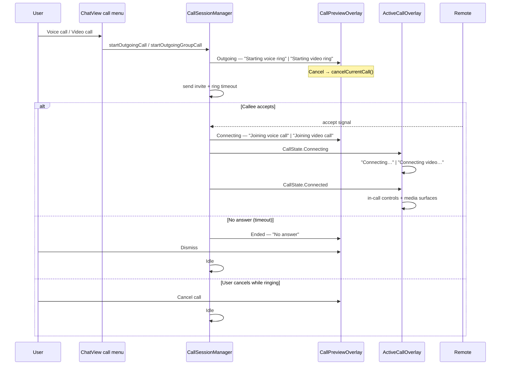
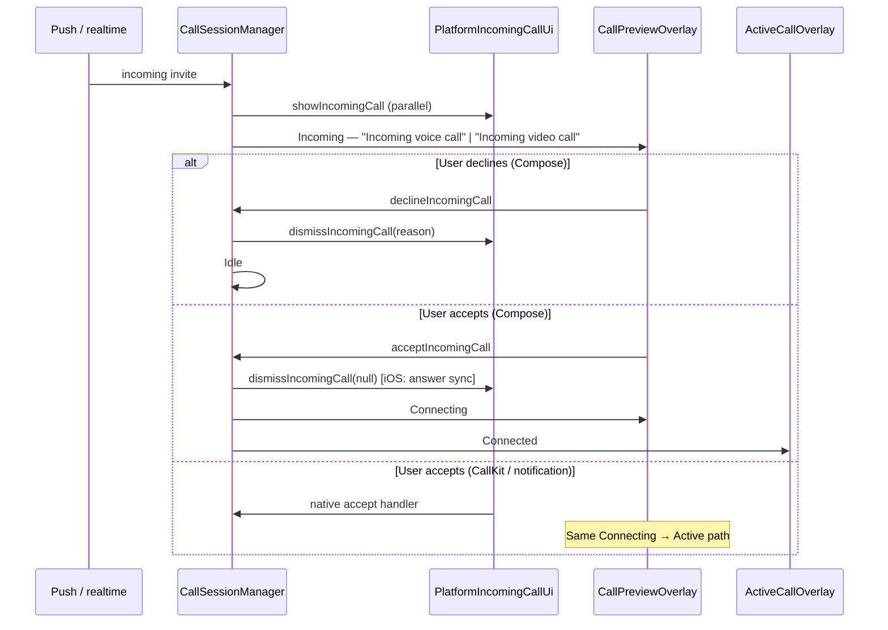

# 09 — Voice & Video Calls (Compose overlays)

**Scope:** `CallOverlays.kt`, `CallState`, `CallOverlayState`, `CallSessionManager` overlay routing, `PlatformIncomingCallUi` (iOS CallKit / Android notification).  
**Source:** `calls/CallOverlays.kt`, `calls/CallState.kt`, `calls/CallSessionManager.kt`, `calls/PlatformIncomingCallUi.kt`, `calls/PlatformIncomingCallUi.ios.kt`, `calls/PlatformIncomingCallUi.android.kt`, `App.kt` global overlay host  
**Out of scope:** Web, backend signaling, LiveKit room internals, chat thread UI (see [08-chat.md](08-chat.md)).

**Visual system:** Functional Clarity (neo-brutalist) — opaque surfaces, 2px `#000` borders, primary `#630ed4`, no glass/blur/gradients. Design-asset mock: invented from design system.

---

## ASCII hierarchy

```
App root (zIndex 11_000)
├── CallPreviewOverlay (ringing / connecting / ended card)
│   └── Surface card (max 324dp wide)
│       ├── Status label (state-specific)
│       ├── Pulsing avatar initial
│       ├── Counterpart name
│       ├── "Video call" | "Voice call"
│       ├── Connecting spinner (Connecting only)
│       └── Action button(s)
└── ActiveCallOverlay (in-call controls)
    └── Draggable Surface card (max 380dp, 94% width)
        ├── Status label
        ├── Counterpart name
        ├── Video stage OR voice status row
        └── Control row: Mute | Speaker | Camera | End

PlatformIncomingCallUi (outside Compose tree)
├── iOS: NSNotification → CallKit / PushKit native sheet
└── Android: full-screen incoming call Notification (CallStyle)
```

**Layer policy (`App.kt`):**

| Layer | Visible when |
|-------|----------------|
| `CallPreviewOverlay` | `Outgoing`, `Incoming`, `Connecting`, or `Ended` (unless suppressed after active call) |
| `ActiveCallOverlay` | `CallState.Connected` or short `CallState.Ended` tail while room tears down |
| Mutual exclusion | Preview hidden while active call visible; ended preview suppressed after connected session ends |

---

## 1. Layout / Container

### CallPreviewOverlay

| Property | Value |
|----------|-------|
| Position | Top-center `Box`, status-bar inset + 10dp top, 16dp horizontal, 20dp bottom |
| Card | `Surface`, `RoundedCornerShape(16dp)`, solid `surface` `#ffffff` / dark `#2f3131`, 2dp `#000` border, max width 324dp |
| Padding | 18dp horizontal, 16dp vertical |
| Avatar | 72dp circle, solid `primary` fill, 2dp `#000` border, pulsing outer ring (infinite animation) |
| Initial glyph | First letter of `counterpartName` uppercase, or `"?"` |
| Name | `titleLarge`, semibold, white |
| Subtitle | `"Video call"` or `"Voice call"` |
| Connecting | 24dp `AdaptiveCircularProgressIndicator` below avatar |
| Actions | Single cancel (outgoing/connecting), decline+accept row (incoming), check dismiss (ended) |

### ActiveCallOverlay

| Property | Value |
|----------|-------|
| Position | Top-center; status-bar + 12dp top; 16dp sides |
| Card | `Surface`, 16dp corners, solid `surface`, 2dp `#000` border, max 380dp, `fillMaxWidth(0.94f)` |
| Drag | `detectDragGestures` — horizontal ±`(maxWidth-220dp)/2`, vertical `0…maxHeight/2` |
| Video stage | `aspectRatio(1.2f)`, min height 180dp, 28dp corners |
| Remote video | Full stage; placeholder text when `!remoteVideoAvailable` |
| Local PiP | 96×136dp bottom-end, 20dp corners |
| Voice row | 56dp avatar circle + status line in bordered row (`surface-container`, 2dp `#000`) |
| Controls | 48dp tonal buttons + 56dp red end-call |

### CallState model

```kotlin
sealed class CallState {
    Idle
    Connecting(videoRequested: Boolean)
    Connected(videoRequested, microphoneEnabled, speakerEnabled,
              cameraEnabled, remoteVideoAvailable, localVideoAvailable)
    Ended(reason: String?)
}
```

`Connected.hasVideo` = camera OR remote OR local video available.

### CallOverlayState model

```kotlin
sealed class CallOverlayState {
    Idle
    Outgoing(invite)
    Incoming(invite)
    Connecting(invite)
    Ended(invite?, reason: String)
}
```

---

## 2. Interactive Elements

### CallPreviewOverlay actions

| State | Control | `contentDescription` | Callback |
|-------|---------|-------------------|----------|
| Outgoing | Red end icon | `"Cancel call"` | `onCancel` → `CallSessionManager.cancelCurrentCall()` |
| Connecting | Red end icon | `"Cancel call"` | `onCancel` |
| Incoming | Red end | `"Decline call"` | `onDecline` → `declineIncomingCall()` |
| Incoming | Blue gradient | `"Accept call"` | `onAccept` → `acceptIncomingCall()` |
| Ended | Blue gradient check | `"Dismiss"` | `onDismissEnded` → `dismissEndedCall()` |

Accept icon: `Videocam` when video invite, else `Call`.

### ActiveCallOverlay controls

| Button | `contentDescription` | Action |
|--------|---------------------|--------|
| Mic / MicOff | `"Unmute"` when muted, else `"Mute"` | `setMicrophoneEnabled(!isMuted)` |
| SpeakerPhone | `"Turn speaker off"` when on, else `"Turn speaker on"` | `setSpeakerEnabled(!speaker)` |
| Videocam / VideocamOff | `"Turn camera off"` when on, else `"Turn camera on"` | `setCameraEnabled(!camera)` |
| Red CallEnd | `"End call"` | `onEndCall` → `endActiveCall()` |

### Drag (active overlay only)

Entire in-call card is draggable within computed horizontal/vertical bounds (does not end call).

### Chat header entry (caller)

From `ChatView` call menu → `CallSessionManager.startOutgoingCall` / `startOutgoingGroupCall` → `CallOverlayState.Outgoing`.

### PlatformIncomingCallUi (native, outside Compose)

| Platform | Entry | Native UI |
|----------|-------|-----------|
| **iOS** | `showIncomingCall(invite)` posts `ClickNativeIncomingCall` | **CallKit** / **PushKit** system incoming UI (not Compose) |
| **iOS** | `dismissIncomingCall(callId, reason=null)` posts `ClickNativeAnswerCall` | Syncs CallKit when user accepts in-app |
| **iOS** | `dismissIncomingCall(callId, reason=…)` posts `ClickNativeEndCall` | Ends native ring |
| **Android** | `showIncomingCall` | High-priority ongoing notification with `NotificationCompat.CallStyle.forIncomingCall` |
| **Android** | `dismissIncomingCall` | Cancels notification by `callId` hash |

**Android notification strings (system UI, not Compose):**

| Element | Copy |
|---------|------|
| Content title | `invite.callerName` |
| Content text | `"Incoming video call"` or `"Incoming voice call"` |
| Channel name | `"Incoming calls"` |
| Channel description | `"Incoming call alerts"` |

---

## 3. States

### CallPreviewOverlay — status label (top line)

| `CallOverlayState` | Video invite | Voice invite |
|--------------------|--------------|--------------|
| Outgoing | `"Starting video ring"` | `"Starting voice ring"` |
| Incoming | `"Incoming video call"` | `"Incoming voice call"` |
| Connecting | `"Joining video call"` | `"Joining voice call"` |
| Ended | `overlayState.reason` (see below) | same |
| Idle | `""` (not rendered) |

### CallPreviewOverlay — subtitle (below name)

Always `"Video call"` or `"Voice call"` based on `invite.videoEnabled`.

### CallPreviewOverlay — counterpart name

`invite.counterpartName(currentUserId)` or fallback `"Connection"`.

### CallOverlayState.Ended — reason strings

| Reason | Shown label |
|--------|-------------|
| Normal hang-up / remote end | `"Call ended"` |
| Timeout / no answer | `"No answer"` |
| Other cancel paths | May map to `Idle` (no card) depending on `CallSessionManager` branch |

Set by `CallSessionManager` on: `failCall`, remote cancel (`"ended"` / `"missed"`), local `endActiveCall`, outgoing ring timeout.

### ActiveCallOverlay — status label (top line)

| `CallState` | Video requested | Label |
|-------------|-----------------|-------|
| Connecting | yes | `"Connecting video…"` |
| Connecting | no | `"Connecting…"` |
| Connected | has video | `"Video call"` |
| Connected | voice only | `"Voice call"` |
| Ended | — | `reason ?: "Call ended"` |
| Idle | — | `""` |

### ActiveCallOverlay — video stage placeholders

| Condition | Copy |
|-----------|------|
| Video call, no remote track yet | `"Waiting for remote video…"` |
| Video call, no local preview | `"Local preview"` (PiP) |

### ActiveCallOverlay — voice row (non-video connecting/connected)

| `CallState` | Copy |
|-------------|------|
| Connecting | `"Connecting audio…"` |
| Connected | `"Voice call in progress"` |

### ActiveCallOverlay — avatar initial

First character of `otherUserName` uppercase, or `"?"`.

### CallState.Ended (in-call layer)

`reason` defaults to `"Call ended"` from platform `CallManager.endCall()`.

### Overlay transition animations (`App.kt`)

| Property | Spec |
|----------|------|
| Preview fade/scale | 420ms `LinearOutSlowInEasing`, scale 0.96→1 |
| Active fade | 420ms alpha |
| Ended preview suppression | After connected call, skip ended preview card; auto `dismissEndedCall` when active alpha ≤ 0.01 |

### Busy / concurrent calls

`CallSessionManager` rejects new outgoing/incoming when overlay ≠ `Idle` or `CallState` ≠ `Idle`.

---

## 4. Micro-copy index

### CallPreviewOverlay (all user-visible)

| Key | String |
|-----|--------|
| Starting video | `"Starting video ring"` |
| Starting voice | `"Starting voice ring"` |
| Incoming video | `"Incoming video call"` |
| Incoming voice | `"Incoming voice call"` |
| Joining video | `"Joining video call"` |
| Joining voice | `"Joining voice call"` |
| Media type subtitle | `"Video call"` / `"Voice call"` |
| Ended — normal | `"Call ended"` |
| Ended — missed | `"No answer"` |
| Name fallback | `"Connection"` |
| Initial fallback | `"?"` |
| Cancel (outgoing/connecting) | `"Cancel call"` |
| Decline | `"Decline call"` |
| Accept | `"Accept call"` |
| Dismiss ended | `"Dismiss"` |

### ActiveCallOverlay (all user-visible)

| Key | String |
|-----|--------|
| Connecting video | `"Connecting video…"` |
| Connecting voice | `"Connecting…"` |
| In-call video label | `"Video call"` |
| In-call voice label | `"Voice call"` |
| Ended | `"Call ended"` (default reason) |
| Waiting remote | `"Waiting for remote video…"` |
| Local preview | `"Local preview"` |
| Connecting audio | `"Connecting audio…"` |
| Voice in progress | `"Voice call in progress"` |
| Mute | `"Mute"` |
| Unmute | `"Unmute"` |
| Speaker on | `"Turn speaker on"` |
| Speaker off | `"Turn speaker off"` |
| Camera on | `"Turn camera on"` |
| Camera off | `"Turn camera off"` |
| End | `"End call"` |
| Name fallback | `"Connection"` (from `App.kt` active invite) |
| Initial fallback | `"?"` |

### Android system notification (PlatformIncomingCallUi)

| Key | String |
|-----|--------|
| Incoming video | `"Incoming video call"` |
| Incoming voice | `"Incoming voice call"` |
| Channel | `"Incoming calls"` |
| Channel description | `"Incoming call alerts"` |

---

## 5. Flow Sequence

### Outgoing call (from chat)



### Outgoing call (ASCII)

```
Chat call menu
  → CallOverlayState.Outgoing ("Starting … ring")
  → [Cancel] → Idle
  → remote accepts
  → CallOverlayState.Connecting ("Joining … call")
  → CallState.Connecting → Connected
  → ActiveCallOverlay replaces preview
  → [End call] → CallState.Ended → overlay clears
```

### Incoming call (in-app Compose path)



### Incoming call (ASCII)

```
Push / realtime invite
  → PlatformIncomingCallUi.showIncomingCall
      iOS: CallKit native UI (outside Compose)
      Android: full-screen notification + ring/vibrate
  → CallOverlayState.Incoming (Compose card on top when app foreground)
  → [Decline] → Idle + dismiss native UI
  → [Accept] → Connecting → ActiveCallOverlay
  → missed / remote cancel → Ended "No answer" | "Call ended"
  → [Dismiss] on ended card → Idle
```

### In-call session

```
CallState.Connected
  → ActiveCallOverlay visible (draggable card)
  → Toggle mute / speaker / camera (labels flip per state)
  → Video: remote full-bleed + local PiP
  → Voice: avatar row + "Voice call in progress"
  → End call → CallState.Ended (brief) → Idle
  → Ended preview may be suppressed if user was on active overlay
```

### Ended states summary

| Path | Preview label | Active label |
|------|---------------|--------------|
| Normal hang-up | `"Call ended"` | `reason ?: "Call ended"` |
| Outgoing timeout | `"No answer"` | — |
| Remote missed | `"No answer"` | — |
| Cancel before connect | Usually `Idle` (no ended card) | — |

---

## 6. A11y & Responsive

| Area | Behavior |
|------|----------|
| Preview cancel/decline | Red 52dp circular buttons; `contentDescription` `"Cancel call"` / `"Decline call"` |
| Preview accept | Gradient 52dp; `"Accept call"` |
| Preview dismiss ended | `"Dismiss"` on check icon |
| Active mute | `"Mute"` / `"Unmute"` toggles with state |
| Active speaker | `"Turn speaker on"` / `"Turn speaker off"`; icon tint `LightBlue` when enabled |
| Active camera | `"Turn camera on"` / `"Turn camera off"` |
| Active end | `"End call"` on error-colored button |
| Card width | `widthIn(max = 324dp)` preview, `380dp` active; scales on narrow phones via horizontal padding |
| Status bar | Both overlays respect `WindowInsets.statusBars` |
| Drag | Pointer-based reposition; no spoken label (decorative affordance) |
| Video placeholders | Centered text for screen readers when video tracks absent |
| z-index | `11_000f` ensures calls appear above chat and modals |
| iOS native vs Compose | When app backgrounded, **CallKit** is primary incoming UI; Compose `CallPreviewOverlay` complements foreground state |
| Android native vs Compose | **Notification CallStyle** provides lock-screen / heads-up actions; Compose overlay when activity visible |

### CallKit / PushKit note (iOS)

`PlatformIncomingCallUi.ios.kt` does **not** render Compose UI. It posts `NSNotification` names consumed by native Swift:

- `ClickNativeIncomingCall` — present system incoming call UI (CallKit)
- `ClickNativeAnswerCall` — user accepted from in-app Compose (must answer CallKit action)
- `ClickNativeEndCall` — end native ring with optional reason

Users may answer or decline from the **system** sheet while the app is backgrounded; Compose `CallPreviewOverlay` mirrors state when foregrounded.

### Android notification channel

Channel `click_calls_v2` / `"Incoming calls"`, importance HIGH, ringtone + vibration pattern, bypass DND, public lockscreen visibility.

---

## CallState ↔ UI mapping

| CallState | CallOverlayState (typical) | Visible UI |
|-----------|---------------------------|------------|
| Idle | Idle | None |
| Idle | Outgoing / Incoming / Connecting | Preview only |
| Connecting | Connecting | Preview and/or Active (transition) |
| Connected | Idle (preview cleared) | ActiveCallOverlay |
| Ended | Ended or Idle | Active tail, then optional Ended preview |

---

## Related documents

- [08-chat.md](08-chat.md) — chat header call menu, in-thread call log rows
- [07-connections-inbox.md](07-connections-inbox.md) — navigation shell under call overlays
- [02-shell-navigation.md](02-shell-navigation.md) — global `App.kt` z-order
