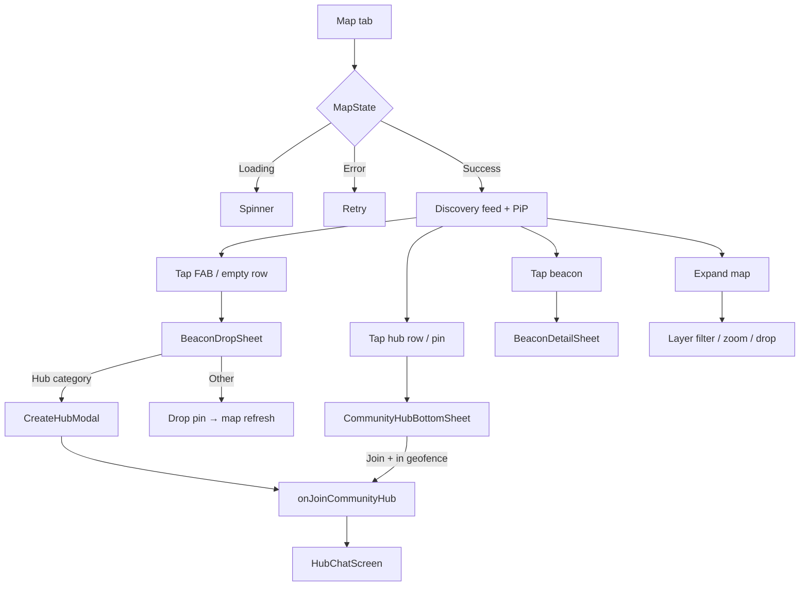

# 10 — Map, Beacons & Hubs

**Scope:** Kotlin Multiplatform mobile — `MapScreen`, `MapDiscoveryLayout` (`MapDiscoveryScreen`), `BeaconDropSheet`, `CreateHubModal`, `JoinCommunityHubSheet`, `CommunityHubBottomSheet`, `BeaconDetailSheet` (`BeaconDetailSheetContent`), `HubChatScreen`, `HubChatSettingsMenu`.  
**Source:** `ui/screens/MapScreen.kt`, `ui/screens/MapDiscoveryLayout.kt`, `ui/screens/BeaconDropSheet.kt`, `ui/components/CreateHubModal.kt`, `ui/screens/HubChatScreen.kt`, `ui/screens/HubChatSettingsMenu.kt`, `viewmodel/MapViewModel.kt`, `viewmodel/MapLayerFilter.kt`  
**Out of scope:** Web, backend APIs, redesign.

**Visual system:** Functional Clarity (neo-brutalist) — opaque surfaces, 2px `#000` borders, primary `#630ed4`, no glass/blur/gradients. Design-asset mock: `click/docs/design-assets/map_events_full_screen_map/`.

---

## ASCII hierarchy

```
MapScreen (organism)
├── MapState branches: Loading | Error | Success
├── MapDiscoveryScreen (map-first canvas) — map + chrome + peek composed as siblings
│   ├── Full-bleed interactive PlatformMap (gestures stay on; Events overlay covers touches)
│   ├── MapAlwaysOnChrome — alpha-hidden while Events open (not disposed)
│   └── Events reopen chip (alpha-hidden while list open)
├── EventsDiscoveryFullScreen (slide-up from bottom + InteractiveSwipeBackContainer) — back/swipe → map/peek
│   └── AppScreenScaffold + Liquid Glass header; search, sort, layer chips, denser event cards + RSVP
├── MapBeaconSheetRoot overlays (conditional)
│   ├── BeaconDropSheetContent
│   ├── CommunityHubBottomSheet
│   ├── BeaconDetailSheetContent
│   └── ProfileBottomSheet (connection pin)
├── CreateHubModal
└── SnackbarHost (ghost mode, nudge, beacon errors)

HubChatScreen (separate route)
├── ChatChannelLoadingView | timeline + composer
├── Hub settings DropdownMenu (HubChatSettingsMenu rules)
└── GlassAlertDialog / UnifiedPopupFormDialog (leave, delete, edit)

JoinCommunityHubSheet — mounted from AddClickScreen (not MapScreen)
CreateHubModal — also reachable from BeaconDropSheet Hub category
```

---

## 1. Layout

### MapScreen root

| Property | Value |
|----------|-------|
| Background | Flat `background` `#f9f9f9`; ghost mode adds `surface-dim` wash + 2dp dashed `#000` overlay hint |
| Scaffold | Zero content insets; `SnackbarHost` only |
| Success child | `MapDiscoveryScreen` — **full interactive map** is the primary surface |

### MapDiscoveryScreen (`MapDiscoveryLayout.kt`)

| Property | Value |
|----------|-------|
| Primary canvas | Full-bleed `PlatformMap` with gestures enabled on tab entry |
| Map chrome | `MapAlwaysOnChrome` — layer filter top-end; drop-beacon FAB + zoom docked **above** reopen chip (`mapFabAboveNav + 120.dp`) |
| Events list | **Full-screen** slide-up / slide-down (`slideInVertically` / `slideOutVertically`) + `InteractiveSwipeBackContainer` (horizontal edge swipe still dismisses). Title **Events** (peek chip same). `AppScreenScaffold` + Liquid Glass header |
| Search | Only inside full-screen list |
| Filters / sort | Distance/Recent segment + layer chips; refresh in header |
| Event cards | Title, host, schedule, description, distance, attendees, RSVP. Card tap → `EventBeaconDetail` |
| Back | Swipe / back / system back → map + peek. Map stays mounted (no marker preview wipe) |

**Pins:** Circular avatar markers (**44dp** Android / **44pt** iOS) for connections, beacons, hubs, **and cluster hubs**. All use the same diameter when scrunched — no squad size scaling on the circle (squad still raises z-index / pulse). Cluster hubs show count glyphs on the same circular chrome (not teardrop `MKMarker` / oversized hubs). Tap cluster → zoom into members (unchanged). **Reconnect:** map connections collapse to a **single pin per peer** (`collapseOneToOneConnectionsByPeer`) — no duplicate pins after Bluetooth re-tap.

### Events feed (full screen)

| Section | Source |
|---------|--------|
| `"Events for you"` | `DiscoveryFeedItem.Beacon` where `kind == EVENT` |

Other beacon/hub kinds remain on the **map** via layer filters.

### MapAlwaysOnChrome

| Control | Position | Size |
|---------|----------|------|
| Layer filter dropdown | Top-end | max 132dp trigger |
| Drop beacon (`"Drop beacon"`) | Bottom-start, above reopen chip clearance (`mapFabAboveNav + 120.dp`) | 56dp |
| Zoom in / out | Bottom-end column, same clearance | 48dp each |

### BeaconDropSheet (`BeaconDropSheetContent`)

| Property | Value |
|----------|-------|
| Container | `MapBeaconSheetRoot` + `ClickSheetDialogChrome`, opaque `surface` + 2dp border |
| Padding | 20dp horizontal, 12dp vertical |
| Category chips | Horizontal `LazyRow` |
| Hub mode | Name field + category `FlowRow` |
| Non-hub | Title / soundtrack URL / event picker / duration chips / description |
| Event extras | Start/end picker + multi-select **Categories** (`Promotional` / `Social` / `School Event`) + **Check-in area** venue scale (`Intimate` / `Neighborhood` / `Venue` / `Campus`) → metadata `event_categories`, `venue_scale`, `check_in_radius_meters` |
| Visibility | `"Who can see this"` chip row + `"Display my name"` switch |
| CTA | Full-width `Button` — `"Create hub"` or `"Drop pin"` |

### CreateHubModal / JoinCommunityHubSheet

Both use `ClickFormBottomSheet` on opaque `surface`, 2dp `#000` border, 24dp horizontal padding.

### CommunityHubBottomSheet

Headline hub name (`headlineSmall`), active count, distance/geofence row, join CTA or blocker copy, `"Close"` `TextButton`.

### BeaconDetailSheet

Creator toolbar: `"Edit beacon"` / `"Delete beacon"` icon buttons (creator only). Body varies by `MapBeaconKind`.

**Event (`EventBeaconDetail`)** — expanded hierarchy (design-asset `event_details_expanded_dark/`):

| Region | Notes |
|--------|-------|
| LIVE badge | When schedule `isLive` (`start ≤ now < end`) |
| Title + distance subtitle | `displayDynamicTitle()`; distance when known |
| Hero actions | **Share** + **Bookmark** + **Check in** + creator **⋯** last (Edit / Delete themed dropdown; bookmark/check-in **server-backed** via engagement API) |
| Start / End bento | Two bordered cells: **date** (`Jun 12`) + **time** (`7:33 PM`) from `EventSchedule` |
| Categories | Chips from metadata `event_categories`; hidden when empty |
| Host card | When `showCreatorName`; avatar from `AppDataManager` current/connected user image when available; initials fallback |
| Description | Body copy |
| Active Clicks | Overlapping avatar stack + `+N`; count in section label |
| Primary CTA | `"Join Event Route"` → HTTPS Google Maps (Apple Maps fallback). Do **not** use `geo:` as primary on iOS (NSOSStatus -10814) |
| Secondary CTA | `"RSVP / Sign Up"` / `"Cancel RSVP"` via `MapViewModel` |

Soundtrack / other kinds: creator uses the same bordered **⋯** overflow; prior card layouts otherwise.

### HubChatScreen

| Region | Height / notes |
|--------|----------------|
| Solid header | 56dp + status bar; bordered back (`ChatHeaderIconButton(showBorder = true)`), title, occupant subtitle, borderless ⋮; 2dp bottom `#000` border |
| Tap-to-connect banner | Primary blue surface, centered copy |
| Lobby banner (when `inLobby`) | `primaryContainer` tint — currently disabled (`inLobby = false`) |
| Timeline | `ChatMessageTimeline`, hub-neutral mesh |
| Composer | `HubChatInputBar` — attach + field + solid primary send button |

---

## 2. Interactive

### Discovery feed

| Gesture | Target | Action |
|---------|--------|--------|
| Tap row | Hub / beacon / connection item | Open respective bottom sheet or profile |
| Tap empty row | `"Nothing nearby yet"` | Opens beacon drop sheet |
| Pull-to-refresh | List at top | `refreshDiscoveryFeed()` |
| Tap sort segment / chip | `"Distance"` / `"Recent"` | Re-sorts sections; scrolls to top |
| Tap search (header) | Magnifier | `onOpenSearch()` → `UnifiedSearchSheet` |
| Tap refresh (header) | Refresh icon | `refreshDiscoveryFeed()` |
| Tap FAB | Drop beacon | `showBeaconDropSheet = true` |
| Tap PiP / expand icon | Map preview | `mapPipExpanded = true` |
| Back (Android) | When map expanded | Collapse PiP |

### Expanded map

| Gesture | Action |
|---------|--------|
| Pin tap | Connection → `ProfileBottomSheet`; beacon/hub → detail sheets |
| Cluster tap | Zoom to cluster |
| Layer filter item | Toggle `MapLayerFilter` union |
| Drop beacon FAB | Same as discovery FAB |
| Close | Collapse fullscreen map |

### Beacon drop flow

| Control | Action |
|---------|--------|
| Category chip | Switches form mode (including `"Hub"` → hub fields) |
| Event category chips | Multi-select → `event_categories` metadata |
| Check-in area chips | Single-select venue scale → `venue_scale` + `check_in_radius_meters` |
| `"Create hub"` (hub mode) | Closes drop sheet → `CreateHubModal` with prefilled name/category |
| `"Drop pin"` | `MapViewModel.submitBeaconDrop(...)` |
| Paste icon (soundtrack) | Paste clipboard into URL field |
| Visibility chips | Sets `BeaconVisibilityAudience` |
| Display my name switch | Toggles `showCreatorName` |

### Hub join (map sheet)

| State | Primary action |
|-------|----------------|
| `canJoinGeofence == true` | `"Join Hub"` → `onJoinCommunityHub(hubId)` |
| `false` | No button; copy only |
| `null` | Spinner + `"Verifying your location…"` |
| Always | `"Close"` dismisses |

### Beacon detail

| Action | Result |
|--------|--------|
| ⋯ overflow (creator, last hero button) | Themed dropdown (opaque surface, 2dp border, zero elevation): Edit / Delete → existing dialogs |
| Share | System text share (title, schedule, maps HTTPS link) |
| Bookmark / Check in | Server-backed (`GET/PUT` bookmark, `GET/POST/DELETE` check-in, `GET` engagement). Check-in requires location + live window (+15m early grace) + venue-scale geofence. Snackbars: “Location access is required to check in” / “Location required to check in” / “Move closer to the event to check in” / “Check-in opens when the event starts”. Impression fired on detail open. |
| Join Event Route | Opens HTTPS maps (`maps.google.com`, Apple Maps fallback). Avoid primary `geo:` on iOS |
| Event RSVP | `"RSVP / Sign Up"` or `"Cancel RSVP"` |
| Play preview | Audio player on soundtrack beacons |
| `"Play full song"` | Opens original media URL |

### Hub chat settings (`HubChatSettingsMenu`)

| Viewer | Menu items |
|--------|------------|
| Participant | `"Leave Hub"` (destructive) |
| Creator | `"Leave Hub"`, `"Edit Hub"`, `"Delete Hub"` (destructive) |

---

## 3. States

### MapScreen root (`MapState`)

| State | UI |
|-------|-----|
| **Loading** | Center `AdaptiveCircularProgressIndicator` |
| **Error** | `"Error loading map"` + dynamic `message` + `"Retry"` |
| **Success** | `MapDiscoveryScreen` + optional sheets |

### Discovery feed

| Condition | UI |
|-----------|-----|
| Empty + not pending | Single row: `"Nothing nearby yet"` / `"Drop a beacon or join a hub from the map preview."` |
| Empty + pending | Center `ClickLogoPulse` (72dp) |
| Has items + pending | Footer pulse |
| Pull refreshing | Logo indicator at top; rubber-band offset |

### Ghost mode

| Effect | Copy |
|--------|------|
| Map desaturated (0.7 alpha) | Snackbar on enable: `"You are off the grid"` |
| Memories pill (legacy component) | `"Ghost Mode"` vs `"{n} memories"` |

### Geofence join (`CommunityHubBottomSheet`)

| `canJoinGeofence` | Distance label | CTA |
|-------------------|----------------|-----|
| `null` | `"Checking location…"` or computed distance | Spinner + `"Verifying your location…"` |
| `true` | `"{n} m away"` or `"{km} km away"` | `"Join Hub"` enabled |
| `false` | Same distance rules | `"Move closer to join this hub."` |

### Beacon drop validation / errors

| Trigger | Inline / snackbar copy |
|---------|------------------------|
| Missing title | `"Please add a title."` |
| Missing music URL | `"Please add a music link."` |
| No GPS | `"Location is required to drop a community beacon. Enable location in Settings and try again."` |
| Invalid music URL | `"Enter a valid Spotify, Apple Music, or YouTube link."` |
| Title too long | `"Title must be 80 characters or less."` |
| Description too long | `"Description must be 500 characters or less."` |
| Event schedule | `"Pick event start and end times."` / `"Event end must be after start."` / `"Event start must be in the future."` / `"Events can last at most 1 month."` |
| Remote failure | Dynamic `beaconInsertError` or `beaconDropFailureToast` |
| Delete/update fail | `"Could not delete beacon"` / `"Could not update beacon"` |

### HubChat composer locks (`HubChatInputBar`)

| Condition | Placeholder | Attach / send |
|-----------|-------------|---------------|
| `inLobby` (occupantCount < 3, currently forced off) | `"Chat unlocks when 3+ join"` | Disabled |
| `outOfBounds` | `"You are no longer at this location"` | Disabled |
| Normal | `"Message the hub…"` | Enabled when draft non-empty |
| Sending | — | Send disabled; attach dimmed |

Lobby banner (when active): `"You're the first one here! We'll ping you when others join."`

### Hub dialogs

| Dialog | Title | Body | Confirm |
|--------|-------|------|---------|
| Leave | `"Leave hub?"` | `"You will leave this community hub and lose quick access from your Groups list."` | `"Leave"` |
| Delete (creator) | `"Delete hub?"` | `"Are you sure? This will kick all users and delete the history."` | `"Delete"` |
| Edit (creator) | `"Edit Hub"` | Fields: `"Hub name"`, `"Category"` | `"Save"` |

---

## 4. Micro-copy

All user-visible strings quoted below.

### Discovery header & feed

- `"Discovery"`
- `"{liveCount} live · {totalConnections} memories"` (subtitle)
- `"Distance"`, `"Recent"` (sort)
- `"Nothing nearby yet"`
- `"Drop a beacon or join a hub from the map preview."`
- Section titles: `"Community hubs"`, `"Soundtracks"`, `"SOS beacons"`, `"Hazards"`, `"Utilities"`, `"Study spots"`, `"Social vibes"`, `"Events"`, `"Beacons"`
- Hub subtitle: `"Ephemeral · {n} here"`
- Distance suffix: `"{n} m away"`, `"{km} km away"`
- Beacon TTL examples: `"Expires in {n} min"`, `"Expires in 1 hour"`, `"Expires in {n} hours"`, `"Expires in 1 day"`, `"Expires in {n} days"`, `"Active beacon"`, `"Scheduled event"`

### Map chrome & layers

- `"Drop beacon"` (FAB content description)
- `"Expand map"`, `"Minimize map"`
- `"Zoom in"`, `"Zoom out"`
- Layer menu: `"All"`, `"My Connections"`, `"Soundtracks"`, `"Alerts & Utilities"`, `"Events"`, `"Social Vibes"`, `"Community Hubs"`
- Compact trigger labels: `"All"`, `"Conn"`, `"Audio"`, `"Alerts"`, `"Social"`, `"Hubs"`, `"{n} on"`, `"—"`
- Grass nudge overlay: `"Looking for the right vibe? Try dropping a 'Looking for Coffee' intent and let the map come to you. Put your phone in your pocket and we'll vibrate when a match is nearby."`

### Ghost mode & errors

- `"You are off the grid"`
- `"Error loading map"`
- `"Retry"`
- `"Nudge sent to {name}!"`, `"Failed to send nudge"`

### BeaconDropSheet

- `"Drop a community beacon"`
- Categories: `"Soundtrack"`, `"Hazard"`, `"Utility"`, `"SOS"`, `"Study"`, `"Event"`, `"Hub"`
- `"Hub name"` (placeholder)
- Hub categories (chips): `"General"`, `"Music"`, `"Study"`, `"Sports"`, `"Food"`, `"Nightlife"`, `"Gaming"`, `"Tech"`, `"Art"`, `"Fitness"`, `"Networking"`, `"Party"`
- `"Spotify, Apple Music, or YouTube link"` (placeholder)
- `"Paste link"` (content description)
- `"Title (max 80)"`, `"Description (optional, max 500)"`
- `"Visible for"` + duration chips: `"15 min"`, `"30 min"`, `"45 min"`, `"1 hour"`, `"90 min"`, `"2 hours"`, `"3 hours"`, `"6 hours"`, `"24 hours"`, `"2 days"` … `"7 days"`
- `"Who can see this"`: `"Everyone"`, `"Connections only"`, `"Core connections only"`
- `"Display my name"` / `"Show your name on the map pin for others nearby."`
- Validation: `"Please add a title."`, `"Please add a music link."`
- CTAs: `"Create hub"`, `"Drop pin"`

### CreateHubModal

- `"Create community hub"`
- `"Ephemeral 24h space — GPS anchors the venue ring."`
- `"Hub name"` (label)
- `"Category"`, `"Custom…"`, `"Custom category"` (label)
- `"Locking GPS…"`
- `"Cancel"`, `"Create hub"`
- Errors: `"Could not read GPS for this hub."`, `"Hub created but id missing."`, `"Could not create hub ({status})"`, `"Could not create hub"`

### JoinCommunityHubSheet

- `"Join community hub"`
- `"Enter the hub code shown at the venue. You must be within range for the location check."`
- `"Hub code"` (label), `"e.g. local_point"` (placeholder)
- `"Cancel"`, `"Join hub"`

### CommunityHubBottomSheet

- `"{activeUserCount} active nearby"`
- `"Checking location…"`, `"Distance unavailable"`
- `"Join Hub"`, `"Move closer to join this hub."`, `"Verifying your location…"`, `"Close"`

### BeaconDetailSheet

- `"Edit beacon"`, `"Delete beacon"` (content descriptions)
- `"Delete beacon?"` / `"This removes the pin from the map for everyone nearby."` / `"Delete"`
- `"Edit beacon"` / `"Save"` / `"Description"` (field label)
- `"Hosted by {name}"`, `"Shared by {name}"`
- `"Created · {datetime}"`, `"Expires · {datetime}"`, `"Unknown"`
- `"No description"`
- Distance: `"{n} m away"`, `"{whole}.{frac} km away"`
- Soundtrack: `"Soundtrack"` (type header), `"Play preview"` / `"Pause preview"`, `"Play full song"`
- Event: `"Attendees"`, `"Be the first to RSVP."`, `"RSVP / Sign Up"`, `"Cancel RSVP"`, `"Saving in the background..."`, `"Could not update RSVP. Please try again."`

### HubChatScreen

- `"Back"`, `"Hub settings"` (content descriptions)
- Occupant subtitle: `"{n} person here"` / `"{n} people here"` (lobby) or `"{n} people in this hub"`
- Banner: `"See someone interesting? Go tap phones to make a permanent connection."`
- Lobby: `"You're the first one here! We'll ping you when others join."`
- Composer placeholders: `"Chat unlocks when 3+ join"`, `"You are no longer at this location"`, `"Message the hub…"`
- Attach menu: `"Attach"`, `"Photo library"`, `"Take photo"`, `"Send"`
- Settings: `"Leave Hub"`, `"Edit Hub"`, `"Delete Hub"`
- Download failure: `"Download not available in hub chat."`

### Profile sheet from map pin (badges)

- `"Live now"`, `"Recent"`, `"Memory"`
- Fallback name: `"Connection"`

---

## 5. Flow



**Join hub alternate path:** Add Click → `JoinCommunityHubSheet` → enter hub code → geofence gate → `HubChatScreen`.

**Leave / delete hub:** HubChat ⋮ menu → confirm dialog → pop to Connections or hub removed.

---

## 6. A11y

| Element | Behavior |
|---------|----------|
| Drop beacon FAB | `contentDescription = "Drop beacon"` |
| Map expand / minimize | `"Expand map"`, `"Minimize map"` |
| Zoom controls | `"Zoom in"`, `"Zoom out"` |
| Soundtrack preview | `"Play preview"` / `"Pause preview"` toggle |
| Beacon creator actions | `"More actions"` ⋯ → `"Edit"` / `"Delete"` in themed menu |
| Hub chat back / menu | `"Back"`, `"Hub settings"` |
| Layer filter | Chip shows selected state via check icon in menu items |
| Discovery rows | Title + subtitle + distance line; icon decorative (`contentDescription = null`) |
| Ghost mode snackbar | Short duration; map still operable but visually muted |
| Geofence blocked join | Error copy exposed as text (not icon-only) |
| Dialogs | `GlassAlertDialog` / `AnimatedClickDialog` — title + body + labeled buttons |
| Join hub sheet | Single-line code field with `"Hub code"` label |

**Gaps:** Discovery feed rows do not merge title/subtitle into a single semantics node. Layer filter trigger uses truncated label (`"Conn"`) which may be unclear to screen readers — full labels exist only in the dropdown menu.

---

## 7. Event ↔ encounter integration

When two users connect (Tap / QR / connection create / encounter log) while GPS is inside a **live** map event geofence **and every participant has RSVPed** (`beacon_attendees`) **and an active check-in** (`event_check_ins`, `checked_out_at IS NULL`), attach that event to the encounter.

| Concern | Intent |
|---------|--------|
| Trigger | Successful connect while device GPS is inside the event beacon radius **and** live window (`isEventLiveForCheckIn`) **and** all participants RSVPed **and** actively checked in |
| Persist | `event_beacon_id` + denorm title/schedule; merge context tag `at_event` |
| Surface | Profile **Timeline** — event title, schedule, “View on map”; `at_event` chip label “At event” |
| Non-goals | Creating RSVPs or check-ins as a side effect of connecting (read-only gate) |

Cross-links: [06-connect-handshake.md](06-connect-handshake.md), [12-profile-memories.md](12-profile-memories.md).
