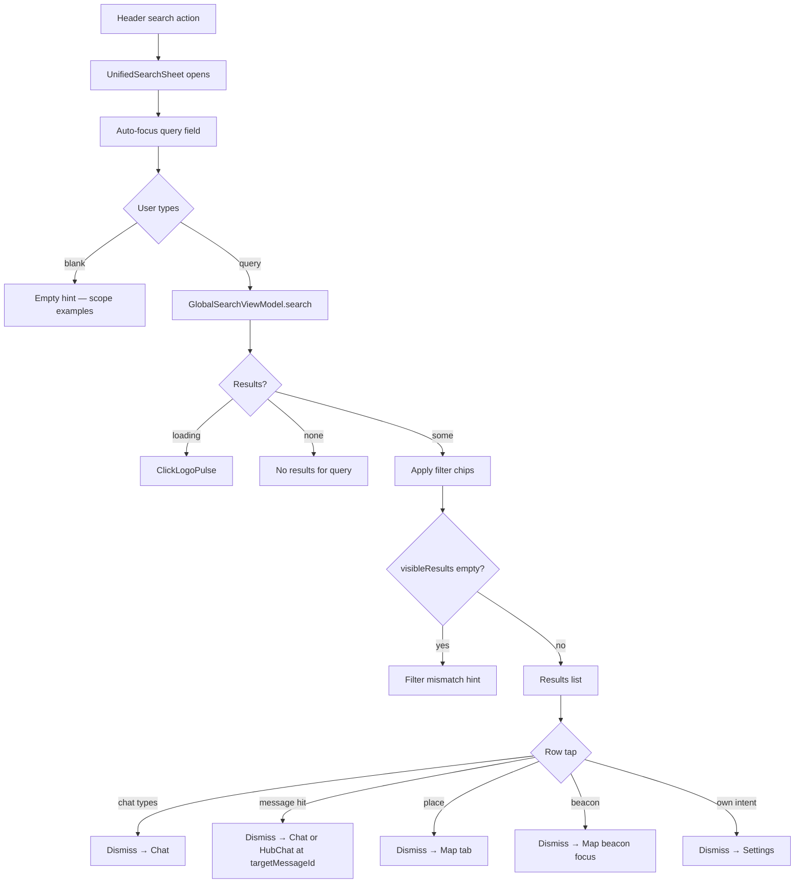

# 11 — Unified Search

**Scope:** Kotlin Multiplatform mobile — `UnifiedSearchSheet` (primary), `GlobalSearchScreen` (deprecated), shared `GlobalSearchViewModel`, `UnifiedSearchResultsList`, filter chips, row templates.  
**Source:** `ui/screens/UnifiedSearchSheet.kt`, `ui/screens/GlobalSearchScreen.kt`, `viewmodel/GlobalSearchViewModel.kt`, `viewmodel/GlobalSearchMatch.kt`  
**Out of scope:** Web, backend APIs, redesign.

**Visual system:** Functional Clarity (neo-brutalist) — opaque surfaces, 2px `#000` borders, primary `#630ed4`, no glass/blur/gradients. Design-asset mock: invented from design system.

---

## ASCII hierarchy

```
UnifiedSearchSheet (organism — glass adaptive bottom sheet)
└── UnifiedSearchSheetContent
    ├── TextField (query)
    ├── FilterChip row: All + category chips
    └── Body (one of)
        ├── ClickLogoPulse [searching]
        ├── EmptySearchHint [blank query | no results | filter mismatch]
        └── UnifiedSearchResultsList
            ├── SearchSectionHeader "Results"
            └── SearchResultRow × N
                ├── Leading avatar/icon
                ├── BadgeRow + TitleAndSubtitle
                └── ChevronRight

GlobalSearchScreen (@Deprecated — full-screen scaffold, same VM + row components)
```

---

## 1. Layout

### UnifiedSearchSheet

| Property | Value |
|----------|-------|
| Shell | `GlassAdaptiveBottomSheet` + `rememberGlassAdaptiveSheetState` (renders opaque bordered sheet) |
| Background | Solid `surface` `#ffffff` / dark `#2f3131` |
| Padding | 12dp horizontal, 8dp vertical |
| Search field | 52dp single-line `BasicTextField` in bordered `Surface` (16dp radius); normal caret; placeholder does not wrap |
| Filter row | Horizontal scroll, 8dp chip spacing, 8dp top / 4dp bottom padding |
| Results list | `LazyColumn`, 16dp horizontal padding, 10dp row spacing |
| Bottom pad | Navigation bar inset + 12dp |

### GlobalSearchScreen (deprecated)

| Property | Value |
|----------|-------|
| Root | `Scaffold` on `BackgroundDark` |
| Top bar | `SurfaceDark` with status bar inset; same field + chips pattern |
| Placeholder | Slightly different copy (see Micro-copy) |
| Results | Reuses `UnifiedSearchResultsList` from `GlobalSearchScreen.kt` |

### SearchResultRow

| Property | Value |
|----------|-------|
| Shape | 16dp `RoundedCornerShape`, solid `surface` |
| Padding | 16dp horizontal, 10dp vertical |
| Border | 2dp `#000` |
| Leading | 42dp avatar (person) or 42dp rounded icon tile |
| Trailing | `ChevronRight` 20dp, 30% white |

---

## 2. Interactive

| Gesture | Target | Action |
|---------|--------|--------|
| Type in field | Query `TextField` | `viewModel.search(query, userId)` (debounced in VM) |
| IME Search | Keyboard | `focusManager.clearFocus()` |
| Tap `"All"` chip | Filter | `selectAllFilters()` — all categories on |
| Tap category chip | Filter | `toggleCategory(cat)` — union filter |
| Tap result row | `SearchResultRow` | Navigate per result type (below) |
| Dismiss sheet | Swipe down / scrim | `onDismissRequest`; `viewModel.clear()` on dispose |

### Row tap routing

| Result type | Navigation |
|-------------|------------|
| `ActiveConnection`, `ArchivedConnection`, `Clique`, `IntentMatch`, `InterestMatch`, `MemoryContextMatch` | `onNavigateToChat(SearchChatOpenTarget(connectionId))` |
| `MessageHit` | `onNavigateToChat(SearchChatOpenTarget)` with `targetMessageId`. Hub hits also carry `hubId` / realtime channel and open `HubChatScreen`. Direct/clique hits open `ChatView`. |
| `LocationBucket` | `onNavigateToMap()` |
| `BeaconMatch` | `onNavigateToBeacon(beaconId)` |
| `OwnAvailabilityIntentMatch` | `onNavigateToSettings()` |

---

## 3. States

### Query / results body

| Condition | UI |
|-----------|-----|
| `isSearching` | Center `ClickLogoPulse` (72dp) |
| `query.isBlank()` | `EmptySearchHint` + search icon |
| `results.isEmpty` (query non-blank) | `EmptySearchHint` + search-off icon |
| `visibleResults.isEmpty` (filters exclude all) | Filter-mismatch hint |
| Else | `UnifiedSearchResultsList` |

### Filter chips

| State | Visual |
|-------|--------|
| All categories selected | `"All"` chip selected |
| Subset | Individual chips selected; `"All"` off |
| Default (VM) | All `SearchResultCategory` entries visible |

### Archived visual treatment

Rows with archived channel context render at **0.7 alpha** (`ArchivedConnection`, or `IntentMatch` / `InterestMatch` / `MemoryContextMatch` with `isArchivedChannel`).

### Focus lifecycle

- Sheet opens → 32ms delay → `sheetState.show()`
- Content mounts → 120ms delay → `focusRequester.requestFocus()` on field
- Dispose → `viewModel.clear()` resets query and results

---

## 4. Micro-copy

### UnifiedSearchSheet (primary)

**Placeholder**

- `"Search people, places, beacons…"` — single-line `BasicTextField` (52dp row); cursor is a normal caret, not a tall multi-line bar

**Filter chips**

- `"All"`
- `"Active"`
- `"Archived"`
- `"Cliques"`
- `"Nearby"`
- `"Beacons"`
- `"Intents"`

**Empty hints**

- Blank query: `"Search for people, cliques, beacons,\navailability intents, messages, or places"`
- No results: `"No results for \"{query}\""`
- Filter mismatch: `"No results match the selected filters.\nTry another pill above."`

**Results section**

- `"Results"` (gradient section header)

### GlobalSearchScreen (deprecated)

- Annotation: `"Replaced by UnifiedSearchSheet"`
- Placeholder: `"Search people, places, interests, intents…"` (note: `"interests"` not `"beacons"`)

### Badge pills (`BadgeRow`)

| Result type | Badge |
|-------------|-------|
| `ArchivedConnection` | `"Archived"` |
| `Clique` | `"Clique"` |
| `IntentMatch` | `"Intent"` |
| `InterestMatch` | `"Interest"` |
| `MemoryContextMatch` | `"Context"` |
| `MessageHit` | `"Hub"` when the hit is a community hub message; otherwise `"Message"` |
| `LocationBucket` | `"Place"` |
| `BeaconMatch` | `"Beacon"` |
| `OwnAvailabilityIntentMatch` | `"Your intent"` |
| `ActiveConnection` | (no badge) |

### Row title / subtitle templates (`TitleAndSubtitle`)

| Type | Title | Subtitle |
|------|-------|----------|
| `ActiveConnection` | `{otherUser.name}` or `"Unknown"` | Optional dynamic `subtitle` |
| `ArchivedConnection` | Same as active | Optional `subtitle` |
| `Clique` | `{groupClique.name}` or `"Clique"` | `"Group chat"` |
| `IntentMatch` | `{otherUser.name}` or `"Unknown"` | `"Looking for {intentLabel}"` + optional `" · {intentTimeframe}"` |
| `InterestMatch` | `{otherUser.name}` or `"Unknown"` | `"Shared: {tag1}, {tag2}, …"` |
| `MemoryContextMatch` | `{otherUser.name}` or `"Unknown"` | `{matchLabel}` (dynamic) |
| `MessageHit` | `{chatName}` | Highlighted snippet around the query (2 lines) + time `"{h}:{mm} {AM\|PM}"` |
| `LocationBucket` | `{location}` | `"1 connection"` or `"{n} connections"` |
| `BeaconMatch` | `beaconDisplayTitle(beacon)` (dynamic title) | `beaconDisplaySubtitle(beacon, distance)` |
| `OwnAvailabilityIntentMatch` | `{intentTag}` or `"Availability"` | `"Your availability"` + optional `" · {timeframe}"` |

### Beacon subtitle composition

Built from (joined with `" · "`):

1. Artist name (if soundtrack metadata)
2. Else description
3. Else type label (`displayTypeTitle()` — e.g. `"Soundtrack"`, `"SOS"`, `"Hazard"`, `"Utility"`, `"Study"`, `"Event"`, `"Social vibe"`, `"Beacon"`)
4. Optional distance: `"{n} m away"` or `"{whole}.{frac} km away"`

### Message search time format

- `"{displayHour}:{minute padded} {AM|PM}"` (12-hour, no leading zero on hour)

### Person avatar fallback

- Initials from first two name words, or `"?"`

---

## 5. Flow



**Entry points:** Home, Connections, Discovery (`DiscoveryFloatingHeader` search), and other shells exposing `onOpenSearch`.

**Deprecated path:** Nav graph route to `GlobalSearchScreen` — same VM and row rendering; prefer sheet to avoid losing tab context.

---

## 6. A11y

| Element | Notes |
|---------|-------|
| Query field | Single-line `BasicTextField`; placeholder `"Search people, places, beacons…"` (ellipsis if needed; never wraps) |
| Filter chips | `FilterChip` selected state conveyed visually (tint); no custom semantics merge |
| Empty hints | Centered `Text` — full string read as one block (includes `\n` line breaks) |
| Result rows | Entire row is one `clickable`; title (semibold) + subtitle read sequentially |
| Leading icons | Decorative (`contentDescription = null`) except person initials in avatar |
| Chevron | Decorative |
| Archived rows | Reduced alpha only — no alternate spoken label (badge `"Archived"` when type is `ArchivedConnection`) |
| Loading pulse | No explicit `contentDescription`; consider `"Searching"` if enhancing |

**Keyboard:** `ImeAction.Search` dismisses focus but does not close sheet.

**Focus trap:** Sheet content receives initial focus; dismiss returns to underlying screen.

---

## 7. Message deep-link

`MessageSearchResult` carries `messageId` (via `message.id`), `chatId`, `connectionId` / hub ids, `senderId` (`message.user_id`), timestamp, and a highlighted `snippet`. Hub messages from `hub_messages` are included (Nearby chip, `"Hub"` badge).

Tapping a message hit passes `SearchChatOpenTarget.targetMessageId` into `ChatView` or `HubChatScreen`. The timeline paginates (1:1/group) or loads an around-window (hub) until that id is present, scrolls it into view, and applies `ChatSearchFocusFrame` for ~1.8s.
