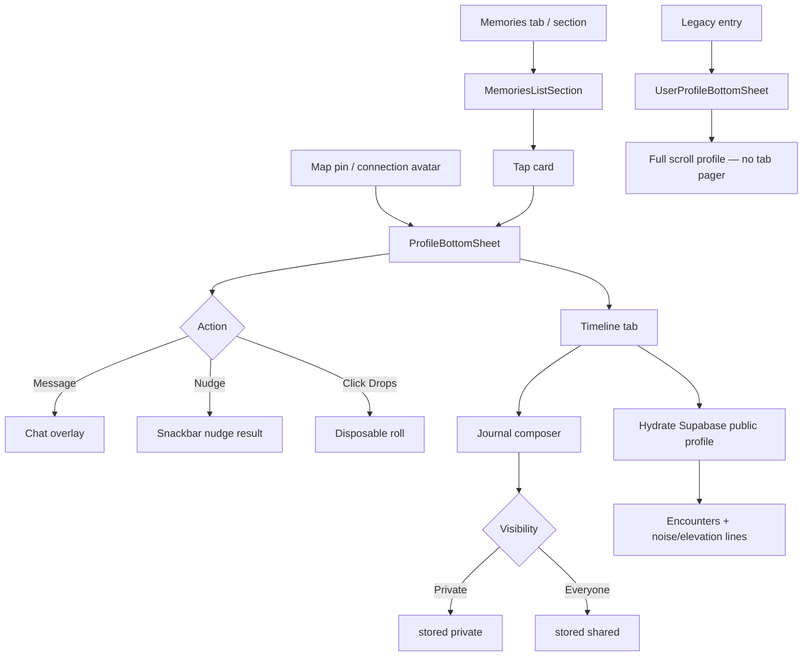

# 12 — Profile & Memories

**Scope:** Kotlin Multiplatform mobile — `ProfileBottomSheet`, `UserProfileBottomSheet` (legacy), `MemoriesListSection`, `ProfileConnectionMoment` (noise/elevation labels and hardware badges).  
**Source:** `ui/components/ProfileBottomSheet.kt`, `ui/components/UserProfileBottomSheet.kt`, `ui/screens/MemoriesListSection.kt`, `ui/components/ProfileConnectionMoment.kt`  
**Out of scope:** Web, backend APIs, redesign.

**Visual system:** Functional Clarity (neo-brutalist) — opaque surfaces, 2px `#000` borders, primary `#630ed4`, no glass/blur/gradients. Design-asset mock: invented from design system.

---

## ASCII hierarchy

```
ProfileBottomSheet (organism — map pin / connections profile)
├── ProfileSheetHeader — avatar, name, subtitle, status badge
├── ProfileActionGrid — Message | Nudge; Click Drops (conditional)
├── ScrollableTabRow — Timeline | Media | Links | Files [| Members if group]
└── HorizontalPager panels
    ├── TimelinePanel — journal composer, encounters, legacy profile hydrate
    ├── MediaPanel — image grid + audio
    ├── LinksPanel
    ├── FilesPanel
    └── MembersPanel (groups)

UserProfileBottomSheet (legacy — standalone sheet)
└── Scroll column: profile meta, interests, timeline crossings, memory capsule

MemoriesListSection (list organism)
├── Header "Your Memories" + optional in-view count
└── MemoryLocationCard[] | EmptyMemoriesState
```

---

## 1. Layout

### ProfileBottomSheet

| Property | Value |
|----------|-------|
| Container | Full-height sheet (`MapBeaconSheetRoot` on map; `ClickFormBottomSheet` elsewhere) |
| Header avatar | 68dp circle (78dp tap target); optional camera overlay for groups |
| Tabs | `ScrollableTabRow` — icons + labels from `ProfileSheetTab` |
| Action grid | 52dp min-height bordered card buttons, 10dp spacing |
| Timeline | Journal composer card + timeline rows + hydrated public profile blocks |
| Media | 3-column image grid; audio rows below |
| Links / Files | Full-width bordered rows (2dp `#000`) |

### ProfileSheetTab labels

| Tab | Label | Icon |
|-----|-------|------|
| Timeline | `"Timeline"` | History |
| Media | `"Media"` | Image |
| Links | `"Links"` | Link |
| Files | `"Files"` | Attach file |
| Members | `"Members"` | People (groups only) |

### MemoriesListSection

| Property | Value |
|----------|-------|
| List padding | 20dp |
| Row spacing | 12dp |
| Card | bordered card, 56dp solid `primary-container` location icon tile |
| Header | `"Your Memories"` + optional `"{visible} of {total} in view"` |

### UserProfileBottomSheet (legacy)

Full-width scroll column inside `ClickFormBottomSheet`; mesh background optional. Sections separated by dividers — interests, shared interests, availability intents, `"Our timeline"` crossing list.

---

## 2. Interactive

### ProfileBottomSheet actions

| Control | Condition | Action |
|---------|-----------|--------|
| `"Message"` | Always shown in grid | `onMessage()` → open chat |
| `"Nudge"` | `state.canNudge` | `onNudge()` → send 👋 nudge |
| `"Click Drops"` | `onOpenDisposableRoll != null` | Open disposable roll camera flow |
| Avatar tap | Group + `onAvatarClick` | Change group avatar |
| Tab tap | Any | `pagerState` animate to page |
| Journal `"Add"` | Non-empty draft | `createProfileTimelineJournalEntry` |
| Journal `"Edit"` / `"Delete"` | Own entries | Update / delete |
| Media thumb tap | Unlocked media | Full-screen preview |
| Link row tap | — | `onOpenLink(url)` |
| File row tap | — | Download / open attachment |

### MemoriesListSection

| Gesture | Action |
|---------|--------|
| Tap memory card | `onConnectionClick(point)` → profile or map focus |
| Pull refresh | Host-provided `onRefresh()` |

### ProfileConnectionMoment (data helpers — rendered in timeline/cards)

Environmental lines are composed in profile timeline rows from `Connection` / `ConnectionEncounter` extensions — not a standalone composable screen.

---

## 3. States

### ProfileBottomSheet timeline

| State | UI |
|-------|-----|
| Hydrating tabs | `profileTabsHydrating` — skeleton/shimmer in media |
| Empty timeline | `"No timeline yet"` / `"Add a journal entry or come back after shared moments appear."` |
| Journal posting | `"Add"` shows inline `CircularProgressIndicator` |
| Journal error | Red `bodySmall` under composer |

### Tab empty states (`EmptyTabState`)

| Tab | Title | Body |
|-----|-------|------|
| Media | `"No shared media"` | `"Photos and voice notes you exchange in chat will appear here."` |
| Links | `"No shared links"` | `"URLs shared in chat show up here."` |
| Files | `"No shared files"` | `"Attachments sent in chat will appear here."` |
| Members | `"No members yet"` | (group panel) |

### Status badges (from map pin / connection time state)

| `TimeState` | Badge label |
|-------------|-------------|
| LIVE | `"Live now"` |
| RECENT | `"Recent"` |
| ARCHIVE | `"Memory"` |

### MemoriesListSection root

| `MapState` | UI |
|------------|-----|
| Loading | Center progress indicator |
| Error | Host handles (section renders nothing) |
| Success + empty | `EmptyMemoriesState` |
| Success + data | Sorted cards (newest `connection.created` first) |

### Memory card badges

| `TimeState` | Label |
|-------------|-------|
| LIVE | `"Live Now"` |
| RECENT | `"Recent"` |
| ARCHIVE | `"Memory"` |

### UserProfileBottomSheet

| State | Copy |
|-------|------|
| No crossings | `"No crossing history on file yet."` |
| No interests | `"No interests shared yet"` |
| No shared interests | `"No overlap with your interests yet"` |
| No intents | `"No active availability intents"` |

---

## 4. Micro-copy

### Profile action grid

- `"Message"`
- `"Nudge"`
- `"Click Drops"`

### Journal composer (`JournalComposerCard`)

- `"Add to timeline"`
- Placeholder: `"Write a quick memory, note, or plan..."`
- Visibility pills: `"Private"`, `"Everyone"`
- CTA: `"Add"`
- Section header (existing entries): `"Journal"`

### Journal entry row

- Author fallback: `"You"`
- Visibility badge: `"Everyone"` (shared) or `"Private"`
- Edit mode pills: `"Private"`, `"Everyone"`
- Actions: `"Cancel"`, `"Save"`, `"Edit"`, `"Delete"`

### Timeline empty

- `"No timeline yet"`
- `"Add a journal entry or come back after shared moments appear."`

### Shared interests block

- `"Common ground"`
- `"$n members share"` or `"$n people share"`

### Avatar

- `"Change group avatar"` (content description on camera overlay)

### MemoriesListSection

- `"Your Memories"`
- `"{visible} of {total} in view"`
- Empty title: `"No Memories Yet"`
- Empty body: `"Make connections to build your memory map"`
- Card date: `point.formattedDate` (dynamic)
- Badges: `"Live Now"`, `"Recent"`, `"Memory"`

### ProfileConnectionMoment — noise labels (`formatNoiseCategory`)

- `"Very quiet"`
- `"Quiet"`
- `"Moderate"`
- `"Loud"`
- `"Very loud"`
- With dB: `"{category} · {n} dB"` (e.g. `"Quiet · 42 dB"`)

### ProfileConnectionMoment — elevation labels (`formatElevationCategoryLabel`)

- `"Below ground"`
- `"Ground level"`
- `"Elevated"`
- `"High rise"`
- With meters: `"{category} · {n} m"` (barometric line)

### Hardware vibe badges (`ConnectionHardwareVibeBadgesRow`)

| Metric | Label format |
|--------|----------------|
| Lux | `"{n} lx"` |
| Battery | `"{n}%"` |
| Compass | `"{deg}°"` |
| Motion variance | decimal string (rounded hundredths) |

### UserProfileBottomSheet (legacy section headers)

- `"Profile"`
- `"Where it started"`
- `"When you connected"`
- `"Interests"`
- `"Shared interests"`
- `"Availability intents"`
- `"Our timeline"`
- `"Every time and place you've crossed paths"`
- `"Mutual interests"`
- `"Memory capsule"`

### Map profile fallback

- Display name: `"Connection"`
- Nudge target fallback: `"Someone"`

---

## 5. Flow



**Data hydration:** `ProfileBottomSheet` Timeline uses `SupabaseRepository.fetchUserPublicProfile` when `userId` + `viewerUserId` present. Media/Links/Files use `ConnectionRepository.fetchConnectionTabs` when `connectionId` set.

**Journal visibility mapping:** UI `"Everyone"` → storage `"shared"`; `"Private"` → `"private"`.

---

## 6. A11y

| Element | Behavior |
|---------|----------|
| Tab row | `Tab` with text label + icon; selected state from `ScrollableTabRow` |
| Action cards | `GlassCard` `onClick` — label text is primary accessible name |
| Journal field | `OutlinedTextField` with placeholder; visibility pills are `Surface` buttons with text labels |
| Media grid | Thumbnails lack per-item descriptions; locked disposable rolls blocked from preview |
| Memory cards | Name + date + badge text exposed via child `Text` nodes |
| `SmallBadge` | Icon `contentDescription = null`; label text read |
| Legacy profile sheet | Long scroll — section headers provide structure |
| Empty states | Icon decorative; title + body text readable |

**Gaps:** Media preview overlay should expose dismiss control when enhanced. Group member list uses `"No members"` count string internally for semantics in places — verify when auditing group sheets.

---

## 7. Event on encounter timeline

When a connection is formed (or an encounter is logged) while both people are at a map **event** (in geofence + live schedule window) **and both have RSVPed**, that event appears on the connection Timeline — title, schedule, “View on map”, and context tag `at_event` (“At event”).

See [10-map-beacons-hubs.md](10-map-beacons-hubs.md) §7 and [06-connect-handshake.md](06-connect-handshake.md).
